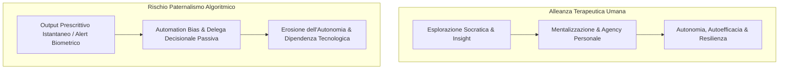
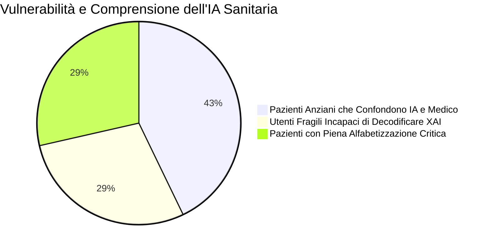
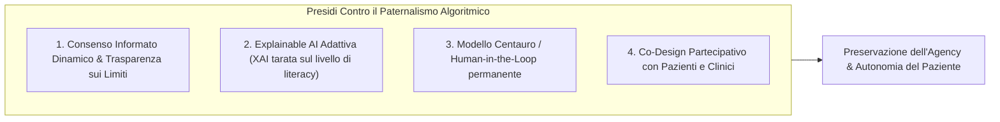

# Paternalismo Algoritmico e Autonomia del Paziente nell'IA Clinica

## Definizione Operativa
- Il **Paternalismo Algoritmico (*Algorithmic Paternalism*)** nella salute mentale descrive la dinamica clinica ed etica per cui sistemi di intelligenza artificiale (chatbot psicoterapeutici basati su CBT, sistemi di monitoraggio predittivo biometrico o algoritmi di classificazione del rischio) assumono un ruolo direttivo, prescrittivo o sostitutivo nelle decisioni di cura, comprimendo l'autonomia decisionale, la riflessività introspettiva e la capacità di autodeterminazione del paziente (Kandeel et al., 2026; Topol, 2019).
- **Utilità Clinica e Psicoterapia:** A differenza dell'alleanza terapeutica umana, volta a promuovere l'agency, l'insight e l'autonomia a lungo termine, l'interazione con agenti digitali automatizzati espone al rischio di **delega passiva acritica (*automation bias*)**, dove il paziente o il clinico abdicano al proprio giudizio critico subordinandosi all'output algoritmico.

---

## Evidenze Empiriche e Manifestazioni Cliniche

1. **Delega Decisionale Passiva nei Chatbot Terapeutici:**
   - Nei trial clinici condotti su chatbot per CBT come **Woebot**, circa il **25% dei partecipanti ha delegato decisioni personali e relazionali critiche all'agente conversazionale**, ignorando esplicitamente i disclaimer operativi che ne limitavano la funzione a mero strumento di auto-aiuto non medico (Darcy et al., 2021; Kandeel et al., 2026).
2. **Erosione della Fiducia Diagnostica nei Clinici (*Diagnostic De-skilling*):**
   - L'eccessiva dipendenza da algoritmi diagnostici condiziona negativamente i medici e gli psicoterapeuti in formazione: studi su specializzandi in psichiatria documentano una riduzione della fiducia nel proprio giudizio clinico (*reduced diagnostic confidence*) quando l'output dell'IA diverge dalla loro valutazione clinica (Topol, 2019).
3. **Paternalismo Predittivo e Profezie Auto-Avveranti:**
   - I sistemi di fenotipizzazione digitale continua tramite wearable (es. allarmi predittivi su variazioni di HRV per ansia acuta o motilità per episodi bipolari) possono innescare ansia anticipatoria, inducendo il paziente a conformare i propri stati soggettivi alle notifiche della macchina anziché sviluppare consapevolezza introspettiva interocettiva.

---

## Il Divario di Alfabetizzazione Sanitaria Digitale (*Health Literacy Gap*)

Il rischio di subire paternalismo algoritmico o manipolazione non è distribuito uniformemente, ma penalizza severamente le popolazioni più vulnerabili (Dzangare & Gulu, 2025; Kandeel et al., 2026):
- **Popolazione Anziana:** Circa il **60% dei pazienti anziani** non è in grado di distinguere una raccomandazione generata da un'IA da un consiglio formulato da un medico umano, risultando altamente suscettibile a persuasione indebita.
- **Bassa Alfabetizzazione Sanitaria:** Fino al **40% degli utenti a basso reddito o bassa scolarizzazione** non è in grado di decodificare le spiegazioni fornite dagli strumenti di Explainable AI (XAI), determinando una ricezione acritica dell'output o un rifiuto immotivato del trattamento.
- **Divario Tecnologico:** Il 30% delle fasce socio-economiche svantaggiate non dispone di dispositivi adatti, acuendo l'iniquità sanitaria (*health disparity*).

---

## Strategie di Tutela e Ribilanciamento dell'Agency

1. **Consenso Informato Continuo e Trasparente:** I pazienti devono comprendere non solo la natura computazionale e non senziente dell'IA, ma anche i limiti dei dataset di addestramento e i potenziali bias demografici (Harrigian et al., 2021).
2. **XAI Adattiva e Accessibile:** Sviluppo di interfacce esplicative visuali e comprensibili (es. dashboard tipo *IBM AI Explainability 360*) che aumentano la fiducia del paziente fino al 35% traducendo i predittori complessi in narrative accessibili (Arya et al., 2020).
3. **Modello Centauro e Preservazione del Giudizio Umano:** Mantenere l'IA rigorosamente confinata al ruolo di supporto additivo (*decision support*), garantendo che ogni diagnosi o piano terapeutico sia validato da un clinico abilitato (Nwosu et al., 2022).
4. **Co-Design Partecipativo:** Coinvolgere attivamente pazienti ed educatori nello sviluppo degli strumenti digitali per assicurare la rispondenza ai reali bisogni umani (Torous et al., 2021).

---

**Riferimenti Bibliografici:**
- Kandeel, M. E., Abo Hamza, E. G., Abouahmed, A., et al. (2026). AI Applications Integrating Legal and Regulatory Perspectives in Mental Health: Systematic Review. *JMIR AI*, 5, e84305. https://doi.org/10.2196/84305
- Arya, V., Bellamy, R. K., Chen, P. Y., et al. (2020). AI Explainability 360: an extensible toolkit for understanding data and machine learning models. *JMLR*, 21, 1–6.
- Darcy, A., Daniels, J., Salinger, D., Wicks, P., & Robinson, A. (2021). Evidence of human-level bonds established with a digital conversational agent. *JMIR Form Res*, 5(5), e27868.
- Dzangare, G., & Gulu, T. A. (2025). Adopting artificial intelligence for health information literacy: a literature review. *Information Development*, 41(3), 576–591.
- Topol, E. J. (2019). *Deep Medicine: How Artificial Intelligence Can Make Healthcare Human Again*. Basic Books.
- Torous, J., Bucci, S., Bell, I. H., et al. (2021). The growing field of digital psychiatry: current evidence and the future of apps, social media, chatbots, and virtual reality. *World Psychiatry*, 20(3), 318–335.

---

## Relazioni
- Vedi anche: [[ai-v5-e84305]], [[gdpr-governance-mental-health-ai]], [[human-in-the-reasoning]], [[modello-centauro-clinico]], [[simulated-empathy-vs-authentic-presence]], [[sycophantic-mirroring]], [[uso-problematico-chatbot-ai]], [[ai-research-ethics]], [[digital-therapeutic-alliance]]
