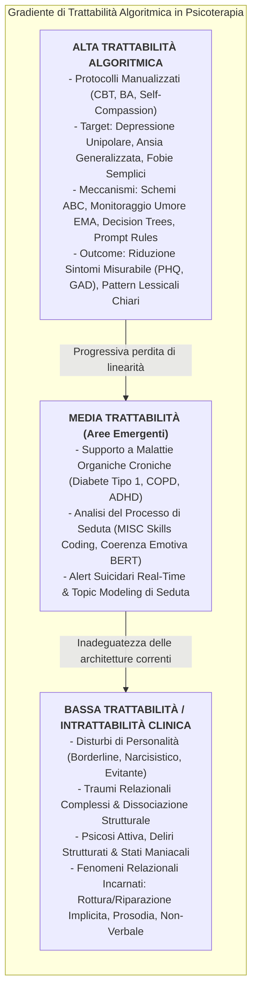
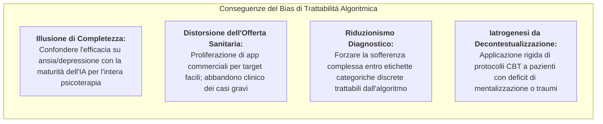

# Algorithmic Tractability in Psychotherapy (Trattabilità Algoritmica in Psicoterapia)

## Definizione Operativa
- Il costrutto di **Algorithmic Tractability** (Trattabilità Algoritmica) nella psicologia clinica e nella psichiatria computazionale descrive il fenomeno per cui lo sviluppo e l'efficacia percepita dei sistemi di Intelligenza Artificiale ([[large-language-models|NLP]] e Machine Learning) sono fortemente condizionati dal grado di strutturazione, formalizzazione logica e manualizzazione intrinseca dei quadri psicopatologici e dei protocolli di trattamento (Orrù & Mannarini, 2026; *Clinical Psychology & Psychotherapy*, doi: [10.1002/cpp.70242](https://doi.org/10.1002/cpp.70242)).
- **Utilità Clinica e di Ricerca:** Spiega il motivo per cui oltre l'80% della letteratura e delle applicazioni pratiche di digital mental health si concentra su **disturbi d'ansia e depressione unipolare lieve-moderata** trattati mediante approcci cognitivo-comportamentali standardizzati ([[ai-enhanced-cbt|CBT]], Dialectical Behaviour Therapy [DBT] e Behavioural Activation [BA]; Kazdin & Rabbitt, 2013):
  - Tali condizioni dispongono di costrutti diagnostici operazionalizzati, schemi di intervento sequenziali (ristrutturazione cognitiva, behavioral scheduling, compiti a casa) e metriche psicometriche lineari (PHQ-9, GAD-7) facilmente traducibili in algoritmi di machine learning, alberi di decisione o prompt di modelli linguistici;
  - Al contrario, le condizioni cliniche ad **alta complessità ed opacità algoritmica** (disturbi di personalità, traumi complessi dello sviluppo, dissociazione, psicosi e quadri multi-comorbili) oppongono una barriera intrinseca alla modellizzazione computazionale (*algorithmic intractability*; Topaz & Pruinelli, 2017), richiedendo sintonizzazione affettiva non verbale, mentalizzazione condivisa, negoziazione maieutica e gestione dell'ambiguità.

## Evidenze dalla Letteratura

Orrù & Mannarini (2026) identificano tre pilastri strutturali che determinano la trattabilità computazionale in psicologia clinica:

### 1. Manualizzazione Terapeutica vs Improvvisazione Relazionale
- Gli interventi orientati all'azione e al comportamento (come la *Behavioural Activation* di Rathnayaka et al., 2022 o la *CBT Relazionale* di Woebot; Chiauzzi et al., 2024) scompongono il processo di cura in sotto-moduli operativi: identificazione dei pensieri automatici negativi (NATs), calcolo di mood scores su finestre mobili di 7 giorni (*Ecological Momentary Assessment*), prescrizione di attività piacevoli o padroneggianti.
- Questi moduli presentano una struttura algoritmica isomorfa ai grafi computazionali e ai Transformer: tokenizzazione dell'input $\rightarrow$ classificazione dell'intento/emozione $\rightarrow$ estrazione della distorsione cognitiva $\rightarrow$ selezione deterministica o generativa della confutazione socratica.

### 2. Maturità Epistemica e Disponibilità di Dataset
- Ansia e depressione beneficiano di oltre mezzo secolo di ricerca empirica evidence-based, che ha generato ontologie diagnostiche stabili, scale psicometriche validate universalmente e ampi corpora testuali (trascrizioni cliniche, post su community di supporto, cartelle sanitarie digitali).
- Questo crea un **loop di rinforzo epistemico**: i disturbi meglio compresi dalla psichiatria convenzionale forniscono dati di addestramento più puliti e consistenti, facilitando la creazione di modelli con metriche apparentemente eccellenti, mentre i disturbi meno lineari rimangono privi di dati annotati di qualità.

### 3. Rigidità del Dominio Singolo (*Single-Disorder Binding*)
- La rassegna evidenzia che la quasi totalità dei sistemi di IA attuali è progettata per operare su **un singolo disturbo target in modo predefinito**.
- Quando un paziente presenta una traiettoria multi-comorbile, il modello fallisce nel contextual switching: non è in grado di ricalibrare gli obiettivi terapeutici o di riconoscere quando un esercizio di ristrutturazione cognitiva standard risulti invalidante o iatrogeno per la specifica struttura di personalità.

### Rischi Clinici ed Epistemologici del Bias di Trattabilità

1. **L'Illusione di Maturità dell'IA Sanitaria:** Le elevate percentuali di successo riportate da trial su depressione e ansia riflettono la semplicità strutturale del task rispetto alla complessità dell'ecologia mentale. 
2. **Invisibilizzazione dei Pazienti Complessi:** Il mercato delle Digital Mental Health Interventions (DMHIs) sovradosa soluzioni per la popolazione a funzionamento medio-alto, ignorando i quadri multiproblematici.
3. **Mancanza di Flessibilità Dinamica:** I sistemi basati su trattabilità algoritmica pura non sono in grado di gestire i momenti di rottura dell'alleanza o il disingaggio emotivo.

### Prospettive di Superamento
- **Architetture Cognitive Avanzate e Ontologie Dinamiche:** Sistemi che integrano modelli della Theory of Mind e ontologie multivariabili.
- **Sistemi Analitici Practitioner-Facing:** Rinunciare alla delega del trattamento autonomo (*substitutional care*) e impiegare l'NLP come lente aumentata per il clinico.
- **Il [[modello-centauro-clinico|Modello Centauro]]:** Preservare la funzione ermeneutica, relazionale ed etica in capo al terapeuta umano.

**Riferimenti Bibliografici:**
- Orrù, L., & Mannarini, S. (2026). The Role of Artificial Intelligence in Clinical Psychology: How AI and NLP Systems Are Reshaping Psychological Interventions. A Systematic Review. *Clinical Psychology & Psychotherapy*, 33, e70242. https://doi.org/10.1002/cpp.70242
- Kazdin, A. E., & Rabbitt, S. M. (2013). Novel models for delivering mental health services and reducing the burdens of mental illness. *Clinical Psychological Science*, 1(2), 170–191.
- Topaz, M., & Pruinelli, L. (2017). Big data and nursing: Implications for the future. *Studies in Health Technology and Informatics*, 232, 165–171.
- Chiauzzi, E., Williams, A., Mariano, T. Y., et al. (2024). Demographic and clinical characteristics associated with symptom outcomes in users of a digital mental health intervention incorporating a relational agent. *BMC Psychiatry*, 24(1), 79.
- Kolenik, T., Schiepek, G., & Gams, M. (2024). Computational psychotherapy system for mental health prediction and behavior change with a conversational agent. *Neuropsychiatric Disease and Treatment*, 20, 2465–2498.
- Beatty, C., Malik, T., Meheli, S., & Sinha, C. (2022). Evaluating the therapeutic alliance with a free-text CBT conversational agent (Wysa): A mixed-methods study. *Frontiers in Digital Health*, 4, 847991.
- Rathnayaka, P., Mills, N., Burnett, D., De Silva, D., Alahakoon, D., & Gray, R. (2022). A mental health chatbot with cognitive skills for personalised behavioural activation and remote health monitoring. *Sensors*, 22(10), 3653.

## Relazioni
- [[cpp-33-e70242-1]]: Systematic review di Orrù & Mannarini (2026) su AI e NLP in psicologia clinica.
- [[epistemological-paradox-in-clinical-ai]]: Il dilemma etico-metodologico della sperimentazione di algoritmi su popolazioni vulnerabili.
- [[ai-enhanced-cbt]]: Metodologie e integrazione computazionale dei protocolli cognitivo-comportamentali.
- [[clinical-readiness-gap-in-mh-chatbots]]: Divario tra performance di fluidità linguistica ed evidenze cliniche rigorose.
- [[modello-centauro-clinico]]: Cooperazione human-in-the-loop per integrare precisione computazionale e complessità relazionale.
- [[calibrated-mismatches]]: Importanza clinica della rottura e riparazione relazionale non codificabile da regole rigide.
- [[digital-therapeutic-alliance]]: Costruzione e misurazione dell'alleanza di lavoro tra utente e agente digitale.
