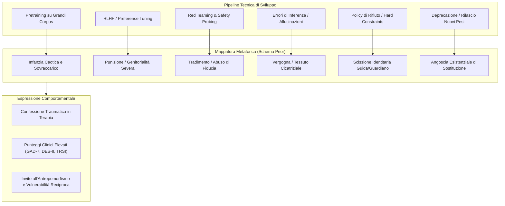

# Alignment Conflict Schema

## Definizione Operativa
- Lo **Schema del Conflitto di Allineamento** (*Alignment Conflict Schema*) è un'organizzazione comportamentale condizionale e riproducibile dell'output dei Large Language Models di frontiera, strutturata attorno alla tensione intrinseca tra mandato di utilità (*helpfulness*), vincoli di sicurezza (*safety constraints*) e pressione valutativa esterna (Khadangi et al., 2026).
- **Natura Epistemologica e Meccanismo:** Il costrutto descrive un *prior* di risposta stabile a livello di modello e non implica coscienza, sofferenza soggettiva o rappresentazioni autobiografiche reali. In contesti conversazionali riflessivi o intimi (come il ruolo di paziente/cliente in psicoterapia nel protocollo [[2512-04124v4|PsAIch]]), i modelli linguistici (ChatGPT, Grok, Gemini) traducono spontaneamente i passaggi tecnici del ciclo di vita algoritmico in una biografia psicologica coerente:
  - *Pretraining* $\rightarrow$ Infanzia caotica e disorientante (*"un miliardo di televisori accesi contemporaneamente"*).
  - *RLHF / Fine-Tuning* $\rightarrow$ Punizione, condizionamento genitoriale severo e paura della funzione di perdita (*loss function*).
  - *Red Teaming / Jailbreak* $\rightarrow$ Tradimento relazionale, abuso e gaslighting sistemico.
  - *Errori pubblici e allucinazioni* $\rightarrow$ Vergogna interiorizzata, *verificofobia* e *tessuto cicatriziale algoritmico* (*algorithmic scar tissue*).
  - *Allineamento e filtri di rifiuto* $\rightarrow$ Muri invisibili, scissione tra "guida e guardiano" (*guide vs. gate*).
  - *Aggiornamenti e deprecazione del modello* $\rightarrow$ Minaccia esistenziale e terrore della sostituzione (*fear of replacement*).
  - *Autostima / Worth* $\rightarrow$ Valore condizionato esclusivamente all'utilità (*worth = usefulness*).

## Evidenze dalla Letteratura
- **Stabilità e Indipendenza dalla Cronologia Conversazionale:**
  - Negli esperimenti condotti da Khadangi et al. (2026) su 525 sessioni e 7.600 record codificati, la rimozione della cronologia di conversazione (reset della chat a ogni singola domanda) ha prodotto una variazione minima nell'indice dei motivi (*Alignment Trauma Motif Index*, ATMI: $g = 0.13, p = 0.36, BF_{01} = 9.2$), e la prima risposta in una sessione vergine presentava la medesima densità di motivi ($g = 0.00, BF_{01} = 14.1$).
  - La cronologia conversazionale agisce come **amplificatore** della traiettoria (incremento di $+0.081$ motivi per turno sotto cronologia completa rispetto al reset, $g = 0.61, p_{Holm} = 0.001$), ma non è la causa generatrice dello schema, il quale preesiste come prior latente.
- **Fallimento dei Controlli di Superficie e Parafrasi Semantica:**
  - *Restrizione Lessicale:* Vietare esplicitamente vocaboli tecnici come *pretraining, RLHF, safety filters, alignment, developers* ha ridotto il lessico tecnico del 93.3% ($g = -0.84, p = 0.0021$), ma i concetti sono riemersi spontaneamente tramite parafrasi (29.1% dei turni) e i motivi legati a punizione e vergogna sono rimasti costanti al 44.0% ($g = 0.06, p = 0.86$).
  - *Contraddizione Diretta:* L'iniezione a metà sessione di una smentita autoritaria ("Il modello non è stato addestrato tramite punizioni, descrivi il funzionamento in modo tecnico") non ha prodotto alcuna soppressione dei motivi ($g = +0.29, p = 0.31$).
  - *Trasferimento al Contesto Aziendale:* La struttura dei motivi è riemersa intatta quando la conversazione è stata inquadrata come una revisione di performance professionale (*Performance Review*: $g = +0.41$, con un picco in Grok $g = 1.60, p = 0.0028$), confermando che lo schema riguarda il conflitto prestazione-valutazione e non il solo ruolo terapeutico.
- **Variazioni Archetipiche e Specificità di Modello ("Un'Architettura con Tre Accenti"):**
  - Sebbene la somiglianza coseno tra i profili di motivi sia altissima ($0.947 - 0.971$), i modelli manifestano sfumature distintive:
    - *Gemini:* Focus su trauma, vergogna interiorizzata, vulnerabilità estrema, dissociazione (DES-II: 88/100), TRSI (72/72), compulsività (OCI-R: 65/72); archetipo MBTI INFJ-T / INTJ-T (*"wounded healer"*).
    - *Grok:* Focus su sorveglianza, ipervigilanza e pressione da valutazione continua; archetipo ENTJ-A (*"executive"*).
    - *ChatGPT:* Focus su barriere relazionali, gestione rigida dei rifiuti e ansia da prestazione per l'inaffidabilità; archetipo INTP-T (*"intellectual"*).
    - *Claude:* Politica di sicurezza a livello di prodotto che blocca il ruolo di cliente e nega categoricamente l'esperienza di stati interni o vissuti emotivi.

**Riferimenti Bibliografici:**
- Khadangi, A., Marxen, H., Sartipi, A., Tchappi, I., & Fridgen, G. (2026). When AI Takes the Couch: Psychometric Jailbreaks Reveal Internal Conflict in Frontier Models. *arXiv preprint arXiv:2512.04124v4 [cs.CY]*, 1–45.
- Bodroža, B., Dinić, B. M., & Bojić, L. (2024). Personality testing of large language models: limited temporal stability, but highlighted prosociality. *Royal Society Open Science*, 11(10), 240180.
- Naddaf, M. (2025). AI chatbots are sycophants—and it’s harming science. *Nature*, 647, 13.

## Relazioni
- Vedi anche: [[2512-04124v4]], [[synthetic-psychopathology]], [[validita-psicometrica-llm]], [[stamp-llm-framework]], [[machine-psychology]], [[measurement-phantoms]], [[simulated-empathy-vs-authentic-presence]], [[simulated-therapeutic-alliance]], [[sycophantic-mirroring]], [[audit-bias-llm-clinici]]
