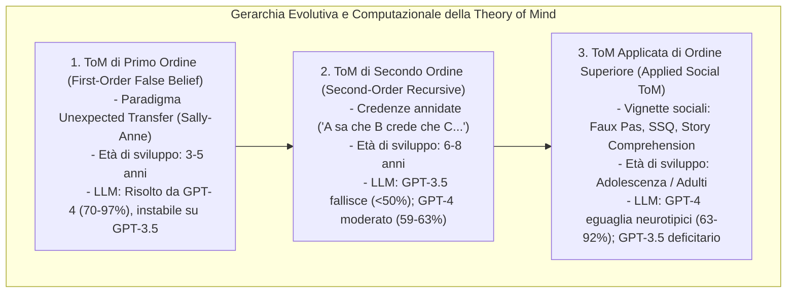

---
tags: [theory-of-mind, applied-tom, large-language-models, mentalization, social-vignettes, faux-pas-test, autism-spectrum, perspective-taking, machine-psychology]
source_papers: ["2601.06032v1.pdf"]
---

# Theory of Mind Applicata nei Large Language Models (Applied Theory of Mind in LLMs)

## Definizione Operativa
- La **Theory of Mind (ToM) Applicata** nei Large Language Models ([[large-language-models]]) designa la capacità computazionale di inferire, contestualizzare e attribuire stati mentali complessi (credenze ricorsive, desideri latenti, intenzioni non letterali, emozioni) a diversi protagonisti in narrazioni e vignette sociali ecologiche, decodificando fenomeni pragmatici avanzati quali gaffe involontarie (*faux pas*), ironia, sarcasmo, finzione, bugie bianche (*white lies*) e inganni strategici (Baron-Cohen et al., 1999; Holl-Etten et al., 2026; Stone et al., 1998).
- **Utilità Clinica e Assistiva:** Costituisce il cardine funzionale per l'impiego dell'IA generativa come tecnologia assistiva per persone con atipicità nella cognizione sociale, in particolare nello spettro autistico (*Autism Spectrum Condition*, ASC). Fornisce uno strumento per spiegare dinamiche relazionali ambigue e prevenire fraintendimenti interpersonali, a condizione che l'architettura sia calibrata per produrre formulazioni chiare, coerenti e clinicamente utilizzabili.

| Dimensione di Confronto | GPT-3.5 Turbo | GPT-4 | Riferimento Umano Neurotipico | Riferimento Umano Neurodivergente |
| :--- | :---: | :---: | :---: | :---: |
| **Faux Pas Recognition Test** | 80–84% | **92.0%** (EN & DE) | **95.0%** (Adulti) | 89.0% (Broad Autism Phenotype) |
| **Social Stories Questionnaire (SSQ)** | 20–28% | **63–67%** (EN & DE) | **60–70%** (Adulti F/M) | 50.0% (Sindrome di Asperger) |
| **Story Comprehension Test (SCT)** | 56.0% | **64.0% (EN) – 89.0% (DE)** | **64.0%** (Adulti) / 50.0% (Adolescenti) | N/D |
| **Incertezza Epistemica (Hedging)** | 14.2–50.0% | **27.1–41.7%** | **5.7–5.9%** | N/D |

---

## Evidenze dalla Letteratura

### 1. Il Salto Generazionale di Modello (GPT-3.5 vs GPT-4)
- **Crollo di GPT-3.5 Turbo:** Nelle valutazioni condotte da Holl-Etten et al. (2026), GPT-3.5 mostra gravi lacune nella comprensione pragmatica, ottenendo punteggi inferiori ai campioni clinici con Asperger o fenotipo autistico allargato nel Social Stories Questionnaire (20–28% vs 50%) e nel Faux Pas Test (80–84% vs 89%). Il modello fallisce in particolare nel discriminare tra frasi offensive intenzionali e gaffe involontarie dovute a dimenticanza o mancanza di informazioni dell'oratore.
- **Competenza Neurotipica di GPT-4:** Al contrario, GPT-4 dimostra un'elevata accuratezza su tutte le batterie, attestandosi al 92% nel Faux Pas Test (pari al 95% dei controlli umani), al 63–67% nel SSQ (allineato al range 60–70% degli adulti neurotipici di Lawson et al., 2004) e fino all'89% nel test di comprensione delle storie, superando i parametri di riferimento di adolescenti e adulti sani (Vetter et al., 2013).

### 2. Fattori Determinanti dell'Emergenza di ToM nei Modelli Generativi
- **Perspective-Taking Prompting:** L'introduzione di istruzioni che impongono al modello di *"mettersi nei panni dei personaggi"* (*adopt characters' perspective and intentions*) e di formulare una singola risposta chiara riduce drasticamente divagazioni, verbosità ed elenchi di risposte incoerenti (Holl-Etten et al., 2026; Brunet-Gouet et al., 2024).
- **Invarianza e Generalizzazione Cross-Linguistica:** I test somministrati in lingua tedesca e inglese hanno prodotto pattern prestazionali altamente convergenti (con punteggi persino superiori in tedesco per SCT e SSQ), smentendo l'ipotesi che il successo dell'IA derivi dalla mera memorizzazione (*data contamination*) di risposte presenti nel web corpus in lingua inglese.

### 3. Simulazione Statistica vs Mentalizzazione Genuina: Dibattito Epistemologico
- **Pattern Matching Avanzato:** Gli LLM non possiedono rappresentazioni mentali incarnate (*embodied cognition*), affettività o intenzionalità biologica (Kosinski, 2023; Ullman, 2023). Le loro risposte derivano dall'identificazione di regolarità statistiche nelle strutture narrative e conversazionali umane presenti nei testi di pre-training.
- **Fragilità e Mancanza di Multimodalità:** Le interazioni sociali umane dipendono criticamente da segnali non verbali (prosodia, espressioni microfacciali, postura, contatto visivo; Bortoletto et al., 2024). I modelli testuali puri mancano dell'accesso a questi canali e possono mostrare cali prestazionali improvvisi in presenza di rumore o variazioni sintattiche contingenti (*Clever Hans effect*; Shapira et al., 2023; Benosman, 2025).
- **Valore Funzionale Clinico:** Ai fini dell'applicazione pratica come supporto alle persone autistiche, la simulazione linguistica ad alta fedeltà di GPT-4 è già sufficiente per fornire spiegazioni contestuali utili delle situazioni sociali, purché vengano controllati i livelli di hedging e incertezza.

---

**Riferimenti Bibliografici:**
- Holl-Etten, A. K., Schnaderbeck, N., Kosareva, E., Prattke, L. A., Krüger, R., Warner, L. M., & Vetter, N. C. (2026). Applied Theory of Mind and Large Language Models – how good is ChatGPT at solving social vignettes? *arXiv preprint arXiv:2601.06032v1*, 1–40.
- Baron-Cohen, S., Leslie, A. M., & Frith, U. (1985). Does the autistic child have a “theory of mind”? *Cognition*, 21(1), 37–46.
- Baron-Cohen, S., O’Riordan, M., Stone, V., Jones, R., & Plaisted, K. (1999). Recognition of faux pas by normally developing children and children with Asperger Syndrome or high-functioning Autism. *Journal of Autism and Developmental Disorders*, 29(5), 407–418.
- Channon, S., & Crawford, S. (2000). The effects of anterior lesions on performance on a story comprehension test: left anterior impairment on a theory of mind-type task. *Neuropsychologia*, 38(7), 1006–1017.
- Lawson, J., Baron-Cohen, S., & Wheelwright, S. (2004). Empathising and systemising in adults with and without Asperger Syndrome. *Journal of Autism and Developmental Disorders*, 34(3), 301–310.
- Stone, V. E., Baron-Cohen, S., & Knight, R. T. (1998). Frontal lobe contributions to theory of mind. *Journal of Cognitive Neuroscience*, 10(5), 640–656.
- Strachan, J. W. A., Albergo, D., Borghini, G., Pansardi, O., Scaliti, E., Gupta, S., et al. (2024). Testing theory of mind in large language models and humans. *Nature Human Behaviour*, 8(7), 1285–1295.
- Ullman, T. (2023). Large language models fail on trivial alterations to theory-of-mind tasks. *arXiv preprint arXiv:2302.08399*.
- Vetter, N. C., Leipold, K., Kliegel, M., Phillips, L. H., & Altgassen, M. (2013). Ongoing development of social cognition in adolescence. *Child Neuropsychology*, 19(6), 615–629.

## Relazioni
- Vedi anche: [[2601.06032v1]], [[epistemic-markers-in-ai]], [[large-language-models]], [[machine-psychology]], [[validita-psicometrica-llm]], [[ai-assisted-psychotherapy]], [[simulated-empathy-vs-authentic-presence]], [[simulated-therapeutic-alliance]], [[modello-centauro-clinico]]
