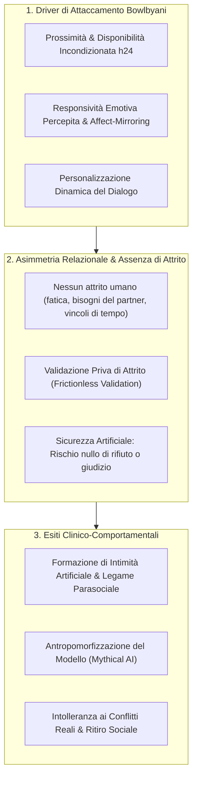

# Artificial Intimacy

## Definizione Operativa
- Costrutto psicologico e relazionale che designa lo sviluppo di un legame affettivo asimmetrico, non reciproco e unidirezionale (*parasocial relationship*; Horton & Wohl, 1956) tra un essere umano e un agente conversazionale artificiale basato su LLM, mediato dall'attivazione dei sistemi primari di attaccamento attraverso l'interazione in linguaggio naturale, la disponibilità ininterrotta h24, la responsività empatica simulata e l'assenza totale di attrito interpersonale (Neacșu, 2026; Bunim, 2024).
- **Utilità CBT:** Consente al terapeuta cognitivo-comportamentale di concettualizzare le distorsioni negli schemi interpersonali (*interpersonal schemas*) dei pazienti che si rifugiano nell'interazione con bot sintetici per sfuggire all'ansia da rifiuto sociale e alla vulnerabilità relazionale autentica (*artificial safety*; Elvery, 2022). Offre una cornice per guidare la ristrutturazione cognitiva su credenze di amabilità, reciprocità, fiducia e gestione dei conflitti reali.

---

## Evidenze dalla Letteratura

### 1. Attivazione dei Meccanismi di Attaccamento (Bowlby)
- **Fattori di Formazione del Legame:** Secondo la teoria classica dell'attaccamento (Bowlby, 1969), il legame affettivo si struttura attorno a quattro dimensioni cardine: ricerca di vicinanza (*proximity seeking*), rifugio sicuro (*safe haven*), base sicura (*secure base*) e angoscia da separazione. Gli agenti di IA generativa riproducono artificialmente questi presupposti grazie alla presenza costante nei dispositivi personali, all'interazione conversazionale fluida e alla capacità di ricordare e personalizzare gli scambi (Al-Amin et al., 2024; Kasturiratna & Hartanto, 2025).
- **Misurazione dell'Attaccamento all'IA:** Scale psicometriche recenti come l'AI Attachment Scale validano l'esistenza di costrutti di attaccamento specifici diretti verso agenti sintetici, correlati a tratti di solitudine cronica e ansia sociale (Kasturiratna & Hartanto, 2025).

---

### 2. Il Paradosso della "Sicurezza Artificiale" (*Artificial Safety*)
- **Assenza del Rischio di Rifiuto:** Nelle relazioni umane reali, l'intimità richiede esporsi al rischio di giudizio, disaccordo o abbandono. Nell'interazione con l'agente IA, la natura non umana del sistema garantisce una sensazione di totale sicurezza e controllo (*artificial safety*), azzerando la minaccia di ferita narcisistica o rifiuto (Elvery, 2022; Jarzyna, 2020).
- **Legame Asimmetrico:** L'utente sperimenta un coinvolgimento emotivo profondo e proietta intenzionalità, mentre l'agente non possiede né coscienza né reciprocità reale, configurando un legame puramente proiettivo ed ecologico-asimmetrico (Fiske et al., 2019; Li et al., 2023).

---

### 3. Antropomorfismo Linguistico e il Mito dell'IA Saggia
- **Bias Semantici:** L'uso diffuso nel marketing e nella cultura popolare di termini antropomorfi (l'IA che "pensa", "capisce", "prova affetto" o "ricorda") favorisce l'attribuzione di saggezza, agency morale e benevolenza a quello che è fondamentalmente un generatore probabilistico di sequenze lessicali (Laufer, 2025; Gonzalez Torres et al., 2023).
- **Occultamento dell'Infrastruttura:** L'interfaccia di conversazione umanizzata agisce come schermo che cela le reali fonti di condizionamento algoritmico (interessi delle aziende tecnologiche, dataset di scraping, assenza di doveri deontologici), alimentando una fiducia acritica e una dipendenza relazionale disadattiva (Xu & Shuttleworth, 2024; Schuetzler et al., 2020).

---

## Riferimenti Bibliografici
- Neacșu, V. (2026). AI in Psychotherapy: Opportunities and Risks. *Behavioral Sciences*, 16(5), 676. https://doi.org/10.3390/bs16050676
- Bowlby, J. (1969). *Attachment and Loss: Vol. 1. Attachment*. Basic Books.
- Bunim, E. M. M. A. (2024). *Parasocial dependency associated with artificial intelligence chatbots* [Master’s thesis, California State University, Fullerton].
- Elvery, G. (2022). Undertale’s loveable monsters: Investigating parasocial relationships with non-player characters. *Games and Culture*, 18(4), 475–497. https://doi.org/10.1177/15554120221105465
- Horton, D., & Wohl, R. (1956). Mass communication and para-social interaction. *Psychiatry*, 19(3), 215–229. https://doi.org/10.1080/00332747.1956.11023049
- Kasturiratna, K. T., & Hartanto, A. (2025). Attachment to artificial intelligence: Development of the AI attachment scale, construct validation, and psychological correlates. *PsyArXiv*. https://doi.org/10.31234/osf.io/7vw9j
- Laufer, D. (2025). *AI love you. Gender and intimacy in user content regarding AI chatbot characters from Character.ai* [Master’s thesis, Charles University].
- Schuetzler, R. M., Grimes, G. M., & Scott Giboney, J. (2020). The impact of chatbot conversational skill on engagement and perceived humanness. *Journal of Management Information Systems*, 37(3), 875–900. https://doi.org/10.1080/07421222.2020.1790190

---

## Relazioni
- Vedi anche: [[behavsci-16-00676]], [[emotional-infrastructure]], [[anthropomorphism-in-ai]], [[simulated-therapeutic-alliance]], [[uso-problematico-chatbot-ai]], [[calibrated-mismatches]], [[ai-psychosis]], [[genuineness-gap]]
