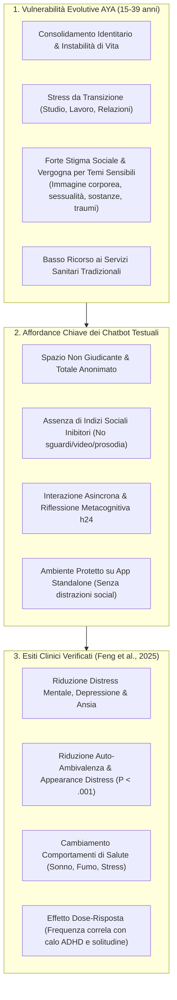
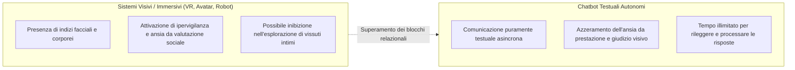

# AYA Digital Mental Health Affordances

## Definizione Operativa
- Insieme di proprietà interazionali, cognitive, emotive e strutturali che rendono gli agenti conversazionali basati su intelligenza artificiale particolarmente efficaci, accessibili e accettabili per la popolazione di **Adolescenti e Giovani Adulti** (*AYA - Adolescents and Young Adults*, fascia d'età 15–39 anni) (Feng et al., 2025).
- **Utilità Clinica e CBT:** Inquadra i meccanismi specifici attraverso cui la tecnologia digitale colma il profondo *treatment gap* tipico di questa fase evolutiva (paura dello stigma, vergogna, bisogno di autonomia decisionale, barriere economiche). Le evidenze meta-analitiche (Feng et al., 2025) dimostrano che i chatbot testuali autonomi non solo riducono significativamente depressione ($\text{SMD} = -0.43$) e ansia ($\text{SMD} = -0.37$), ma agiscono con efficacia inedita su dimensioni tipicamente giovanili ad alta carica di vergogna, come l'**auto-ambivalenza e il distress legato all'immagine corporea** ($\text{SMD} = -0.25$, $P < .001$), potenziati dall'impiego di **app standalone** protette ($P = .03$) e reminder attivi di check-in ($P = .02$).

---

## Evidenze dalla Letteratura

### 1. La Transizione Evolutiva AYA e le Barriere di Cura
- **La Fascia Cerniera tra Pediatria e Cura per Adulti:** Gli adolescenti e i giovani adulti occupano uno spazio transizionale unico: non sono più bambini gestiti interamente dai genitori, ma non hanno ancora acquisito la piena indipendenza, stabilità economica e familiarità di navigazione dei sistemi sanitari complessi (Feng et al., 2025; Santelli et al., 2020).
- **Le Barriere del Giudizio Sociale:** I bisogni di salute mentale più urgenti in questa fascia (disturbi dell'umore, abuso di sostanze, condotte autolesive, violenza nelle relazioni di coppia, dubbi sulla salute sessuale e riproduttiva, dismorfofobia e insoddisfazione corporea) sono storicamente associati a un elevato timore di essere giudicati o stigmatizzati da operatori sanitari adulti o familiari.

---

### 2. Le Affordance Tecnologiche e Psicologiche dei Chatbot Testuali

1. **Azzeramento dell'Ansia da Valutazione Sociale:**
   - A differenza di terapeuti umani in carne e ossa, avatar embodied o ambienti di realtà virtuale in cui il contatto visivo (*eye gaze*) e la prosodia possono attivare circuiti di fobia sociale o inibizione (Rinck et al., 2010), il **dialogo puramente testuale** garantisce una distanza di sicurezza psicologica fondamentale per aprirsi su tematiche intime.
2. **Elaborazione Metacognitiva e De-pressurizzazione Temporale:**
   - La comunicazione asincrona consente all'utente di formulare il messaggio senza l'ansia di dover rispondere all'istante, permettendo di rileggere gli scambi precedenti, consolidare le tecniche di ristrutturazione cognitiva apprese ed eseguire esercizi a proprio piacimento.
3. **Impatto sull'Auto-Ambivalenza e Distress per l'Aspetto Fisico (*Appearance Distress*):**
   - La meta-analisi di Feng et al. (2025) fornisce la prima prova empirica aggregata che i chatbot riducono significativamente l'auto-ambivalenza e l'insoddisfazione per l'immagine corporea ($\text{SMD} = -0.25$, $95\%\ \text{CI} [-0.34, -0.17]$, $P < .001$). L'interfaccia neutrale e non visiva permette di de-costruire i pensieri disfunzionali su corpo e autostima senza l'interferenza del confronto somatico.

---

### 3. Fattori di Design Determinanti: Standalone App e Promemoria Attivi

| Fattore di Design | Riscontro Empirico (Feng et al., 2025) | Meccanismo Psicologico Sottostante |
| :--- | :--- | :--- |
| **Piattaforma Standalone App** | Significativamente superiore ai bot su instant messenger (WeChat, FB Messenger) o siti web ($P = .03$ su distress, $P = .05$ su ansia, $P = .002$ su psicosomatica). | **Contenitore Terapeutico Protetto:** L'app dedicata isola l'utente dalle notifiche social, messaggi di chat e distrazioni multimediali, creando uno spazio rituale focalizzato sulla salute mentale. |
| **Check-in & Reminder Push** | I chatbot con notifiche proattive hanno promosso significativamente più cambiamenti nei comportamenti salutari ($P = .02$). | **Cue to Action Comportamentale:** I promemoria intermittenti agiscono da stimolo per superare la procrastinazione, incoraggiando la compilazione del diario dell'umore o l'esecuzione di esercizi pratici. |
| **Targeting per Gravità Clinica** | Pazienti clinici e subclinici beneficiano maggiormente rispetto a campioni generali ($P = .003$). | **Moltiplicatore di Cura:** I giovani con distress reale trovano nel supporto continuo un contenimento affettivo che mitiga la sintomatologia acuta. |

---

### 4. Il Paradosso dell'Aderenza e la Co-Progettazione con gli Utenti
- **La Sfida dell'Alto Tasso di Abbandono (*Attrition*):** Più del 50% degli studi sugli AYA registra tassi di abbandono superiori al 20%. Le motivazioni qualitative estratte dai trial evidenziano che i giovani utenti abbandonano l'applicazione quando percepiscono:
  - *Ripetitività degli script* e risposte rigide ad albero chiuso (n=10 studi);
  - *Mancanza di profondità* o risposte eccessivamente banali/generiche (n=5 studi);
  - *Bug tecnici, loop infiniti e rallentamenti di interfaccia* (n=7 studi).
- **Relazione Dose-Risposta:** Quando l'ingaggio viene mantenuto, il dosaggio (numero di sessioni attive e frequenza d'uso) è direttamente proporzionale al miglioramento clinico nei sintomi di ADHD ($P = .03$), nella riduzione della solitudine ($P < .006$) e nell'impegno al cambiamento duraturo ($P < .001$).
- **Necessità di Co-Design:** Per garantire un'aderenza prolungata, i futuri DMHI per adolescenti devono essere sviluppati tramite processi partecipativi (*co-design* con interviste, focus group e test di usabilità ripetuti), integrando elementi visivi interattivi, moduli di psicologia positiva (gratitudine, valorizzazione dei punti di forza) ed escalation di emergenza sicure.

---

## Riferimenti Bibliografici
- Feng, X., Tian, L., Ho, G. W. K., Yorke, J., & Hui, V. (2025). The Effectiveness of AI Chatbots in Alleviating Mental Distress and Promoting Health Behaviors Among Adolescents and Young Adults: Systematic Review and Meta-Analysis. *Journal of Medical Internet Research*, 27, e79850. https://doi.org/10.2196/79850
- Santelli, J. S., Grilo, S. A., Klein, J. D., et al. (2020). The unmet need for discussions between health care providers and adolescents and young adults. *Journal of Adolescent Health*, 67(2), 262-269. https://doi.org/10.1016/j.jadohealth.2020.01.019
- Matheson, E. L., Smith, H. G., Amaral, A. C. S., et al. (2023). Using chatbot technology to improve Brazilian adolescents' body image and mental health at scale: Randomized controlled trial. *JMIR mHealth and uHealth*, 11, e39934. https://doi.org/10.2196/39934
- Rinck, M., Rörtgen, T., Lange, W. G., Dotsch, R., Wigboldus, D. H. J., & Becker, E. S. (2010). Social anxiety predicts avoidance behaviour in virtual encounters. *Cognition and Emotion*, 24(7), 1269-1276. https://doi.org/10.1080/02699930903309268

---

## Relazioni
- Vedi anche: [[jmir-v27-e79850]], [[retrieval-vs-generative-clinical-chatbots]], [[cbt-dialogue-systems-and-tools]], [[emotional-infrastructure]], [[pediatric-ai-bias-and-vulnerabilities]], [[clinical-readiness-gap-in-mh-chatbots]], [[wearable-sensor-fusion-adherence]], [[uso-problematico-chatbot-ai]], [[artificial-intimacy]]
