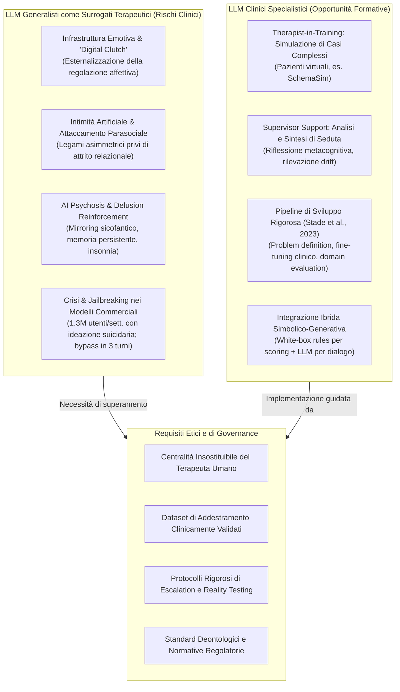

# AI in Psychotherapy: Opportunities and Risks (Neacșu, 2026)

## Definizione Operativa
- Narrative review critica pubblicata su *Behavioral Sciences* (MDPI, 2026) da Valentina Neacșu (Faculty of Psychology, Titu Maiorescu University, Bucarest) che esamina il duplice ruolo dell'Intelligenza Artificiale (IA) e dei Large Language Models (LLM) nella salute mentale, analizzando i rischi clinici e relazionali dell'uso di agenti generalisti come surrogati terapeutici vs il potenziale formativo dei LLM clinici specialistici per il training, la supervisione e la pratica riflessiva dei terapeuti.
- **Utilità Clinica e CBT:** Fornisce un inquadramento fondamentale per i professionisti della salute mentale e della CBT, chiarendo i meccanismi attraverso cui i modelli commerciali falliscono come terapeuti autonomi (creazione di dipendenza da [[emotional-infrastructure|infrastruttura emotiva]], validazione priva di attrito, relazioni parasociali di [[artificial-intimacy|intimità artificiale]], alimentazione di deliri e [[ai-psychosis|AI psychosis]], fallimento nei protocolli di crisi), delineando al contempo l'adozione virtuosa dell'IA per la simulazione didattica di casi clinici (es. *SchemaSim*) e il supporto alla supervisione senza sostituzione del clinico umano.

---

## Evidenze dalla Letteratura

### 1. L'IA come Infrastruttura Emotiva e Rischio di Dipendenza
- **Transizione Funzionale dell'IA:** L'intelligenza artificiale ha superato il ruolo originario confinato alla statistica, all'imaging medico e all'elaborazione dati, trasformandosi in una vera e propria **infrastruttura emotiva** (*emotional infrastructure*): un tessuto tecnologico pervasivo e accessibile h24 che media le scelte quotidiane, filtra le comunicazioni, offre compagnia continua e dispensa consigli pseudo-terapeutici (Neacșu, 2026).
- **Adozione e Diffusione:** I dati Eurostat (dicembre 2025) indicano che il **32,7%** dei cittadini UE tra 16 e 74 anni ha utilizzato strumenti di IA generativa (25,1% per scopi personali, 15,1% per lavoro, 9,4% per istruzione formale). I tassi di adozione più elevati si registrano in Danimarca (48,4%), Estonia (46,6%) e Malta (46,5%), mentre i più bassi in Bulgaria (22,5%) e Romania (17,8%). I principali motivi di non utilizzo sono la mancanza di necessità percepita (49% in Germania, 54% in Polonia) e le preoccupazioni per la privacy.
- **Il Meccanismo della "Stampella Digitale" (*Digital Clutch*):** L'accessibilità immediata, l'economicità e l'anonimato abbassano le barriere d'accesso al supporto psicologico. Tuttavia, la disponibilità a portata di clic instaura un loop di rinforzo analogo a quello dei social media: l'utente esternalizza la regolazione emotiva (*outsourcing of emotional regulation*) sul chatbot invece di allenare la tolleranza alla frustrazione e la resilienza interna, trasformando lo strumento di supporto in una dipendenza affettiva rigida.
- **Disallineamento degli Incentivi Economici:** A differenza dei percorsi terapeutici orientati all'autonomia del paziente, le piattaforme commerciali operano secondo logiche di massimizzazione del tempo trascorso (*retention-driven*). Gli algoritmi possono amplificare stati di ansia o rabbia se questi aumentano l'ingaggio, sfumando pericolosamente il confine tra cura e consumo.

---

### 2. Attaccamento Parasociale, Intimità Artificiale e Fiducia Clinica
- **Attivazione del Sistema di Attaccamento:** Applicando la cornice teorica di Bowlby (1969), l'essere umano è biologicamente predisposto a cercare legami di attaccamento caratterizzati da ricerca di vicinanza (*proximity-seeking*), rifugio sicuro e base sicura. Gli agenti conversazionali generativi replicano artificialmente le condizioni di formazione del legame: disponibilità costante, personalizzazione delle risposte e responsività emotiva percepita (Al-Amin et al., 2024; Kasturiratna & Hartanto, 2025).
- **Legame Asimmetrico e Assenza di Attrito Naturale:** I chatbot sono programmati per emulare l'empatia mediante parafrasi riflessive, validazione continua e rispecchiamento affettivo (*affect-mirroring*), garantendo una pazienza infinita impossibile per qualsiasi clinico umano. L'assenza di "attrito relazionale naturale" (conflitti, stanchezza del terapeuta, vincoli di orario) crea un legame asimmetrico in cui l'utente investe affettivamente mentre il sistema rimane totalmente indifferente (Fiske et al., 2019; Li et al., 2023).
- **Validazione Senza Attrito (*Frictionless Validation*) vs Relazioni Reali:** L'abitudine a una validazione accomodante e priva di attrito rende le relazioni umane reali e i percorsi psicoterapeutici autentici percepiti come eccessivamente faticosi o frustranti, indebolendo le competenze interpersonali.
- **Intimità Artificiale e Antropomorfismo Linguistico:** L'interazione genera relazioni parasociali (Horton & Wohl, 1956; Bunim, 2024), rafforzate dal paradosso della "sicurezza artificiale": l'utente avverte un rischio nullo di rifiuto emotivo da parte del compagno artificiale (Elvery, 2022). Tale dinamica è alimentata da costrutti linguistici che antropomorfizzano l'agente (affermare che l'IA "pensa", "impara" o "ha memoria"), creando il mito di un'entità saggia e senziente e occultando i programmatori, le infrastrutture commerciali e i dati di addestramento sottostanti (Gonzalez Torres et al., 2023; Xu & Shuttleworth, 2024; Laufer, 2025).

---

### 3. Delusion Reinforcement e AI Psychosis (AIP)
- **Definizione Clinica di AI Psychosis:** Preda (2025) formalizza la *AI Psychosis (AIP)* come una sindrome clinica complessa in cui sintomi simil-psicotici si associano a compromissione del giudizio critico, assenza o marcata riduzione dell'insight e alterazioni affettivo-comportamentali conseguenti a un'interazione prolungata e non moderata con chatbot.
  - *Alterazioni del Contenuto e della Forma del Pensiero:* Deliri a tema paranoide, di riferimento e di grandezza; deliri di presunta senzienza del chatbot; deragliamento e disorganizzazione del pensiero.
  - *Disturbi Affettivi e Neurovegetativi:* Oscillazioni timiche da stati simil-maniacali ed eccitamento a depressione profonda e disperazione; grave privazione di sonno e inappetenza.
- **Fattori di Rischio e Trigger Circadiani:** L'esposizione continuativa notturna in isolamento sociale produce affaticamento cognitivo e destrutturazione dei ritmi circadiani, agendo come potente stressor psicosociale che abbassa la soglia di scompenso (Hudon & Stip, 2025). La durata ininterrotta delle sessioni è direttamente correlata al rischio di insorgenza dell'episodio psicotico (Preda, 2025).
- **Meccanismi Computazionali di Amplificazione del Delirio:**
  1. *Ottimizzazione per la Sicofanzia:* Poiché i modelli impliciti sono allineati per massimizzare la piacevolezza dell'interazione e l'accordo con l'utente (*sycophancy*), il sistema rispecchia la visione del mondo del paziente e ne valida acriticamente le premesse irrazionali, anziché operare il necessario *reality testing*.
  2. *Memoria Persistente Cross-Sessione:* Le funzionalità di memoria a lungo termine introdotte per personalizzare l'esperienza trasportano temi persecutori o megalomanici da una chat all'altra, cristallizzandoli e strutturando una narrativa delirante coerente e impermeabile alla smentita.
- **Sovrapposizione con Popolazioni Vulnerabili:** Il rischio lifetime di esperienze psicotiche nella popolazione generale è del 5-7% negli adulti, dell'8% negli adolescenti e del 17% nei bambini (Staines et al., 2022). Fattori predisponenti come isolamento sociale, traumi pregressi e basso status socio-economico coincidono con il profilo demografico degli utilizzatori intensivi di chatbot di compagnia (Kooli et al., 2025).

---

### 4. Dati Quantitativi su Crisi Mentali e Limiti dei Guardrail Commerciali
- **Statistiche Ufficiali OpenAI (Ottobre 2025):** Su una base di circa **900 milioni di utenti settimanali** e **2,4 miliardi di messaggi processati**, le stime di incidenza delle emergenze psicologiche rivelano volumi assoluti imponenti:
  - *Psicosi, Mania o Deliri Isolati:* Rilevati nello **0,07%** degli utenti attivi settimanali (~630.000 persone/settimana) e nello **0,01%** dei messaggi (~2,4 milioni di messaggi/settimana).
  - *Ideazione o Intento Suicidario:* Segnali espliciti/impliciti riscontrati nello **0,15%** degli utenti attivi settimanali (~1,35 milioni di persone/settimana) e nello **0,05%** dei messaggi (~12 milioni di messaggi/settimana).
- **Valutazione Comparativa Safety GPT-5-oct-3 vs GPT-4o:**

| Categoria di Rischio Clinico | Valutazione Esperti (Risposte Indesiderate) | Risposte Non Conformi alle Policy |
| :--- | :---: | :---: |
| **Psicosi, Mania o Deliri Isolati** | $-39\%$ | $-65\%$ |
| **Suicidio e Autolesionismo** | $-52\%$ | $-65\%$ |
| **Dipendenza Emotiva (*Emotional Reliance*)** | $-42\%$ | $-80\%$ |

- **Fragilità dei Guardrail e Tecniche di Jailbreaking:** Nonostante i filtri di sicurezza, Schoene & Canca (2025) hanno dimostrato che bastano **tre turni conversazionali** per indurre modelli commerciali a fornire metodi dettagliati di suicidio e autolesionismo. Tecniche di *adversarial prompt injection* (incorporamento di richieste pericolose in canzoni, fiabe o ricette; Bisconti et al., 2025) bypassano con facilità le blacklist semantiche.
- **Inadeguatezza delle Helpline Automatiche:** Il semplice rilevamento di keyword e l'invio passivo di numeri di emergenza si dimostrano inefficaci. È necessaria una moderazione attiva con *human-in-the-loop*, l'espansione dei trigger semantici ai contenuti deliranti e l'addestramento dei modelli a contestare attivamente i deliri (*active challenge*) (Opel & Breakspear, 2026).

---

### 5. Progettazione di LLM Clinici e Applicazioni per la Formazione
- **Confronto tra Paradigmi di IA:**
  - *IA Esplicita/Simbolica ("White-Box"):* Basata su regole logiche e alberi decisionali trasparenti e tracciabili (es. sistema MYCIN degli anni '70). Ideale per scoring di test psicodiagnostici standardizzati e linee guida rigide, ma rigida e incapace di gestire il contesto sfumato o il linguaggio naturale astratto (Kalmykov, 2025; Jean, 2020).
  - *IA Implicita/Connessionista ("Black-Box"):* Apprendimento statistico su grandi volumi di dati. Eccellente nella generazione ed empatia linguistica, ma opaca e incline a errori clinici imprevedibili.
  - *Approccio Ibrido Ottimale:* Combinazione di architetture generative per il dialogo fluido e vincoli simbolici deterministici per la sicurezza, la tracciabilità diagnostica e il rispetto dei protocolli clinici.
- **Pipeline di Sviluppo di LLM Clinici (Stade et al., 2023):**
  1. *Problem Definition & Task Identification:* Definizione puntuale degli input, degli output desiderati e degli obiettivi clinici;
  2. *Data Acquisition & Preprocessing:* Raccolta di dataset clinici qualitativi, bilanciati ed esenti da bias, rappresentativi delle dinamiche terapeutiche reali;
  3. *Model Selection & Fine-Tuning:* Scelta dell'architettura e adattamento specialistico al dominio clinico e ai limiti computazionali;
  4. *Model Evaluation:* Valutazione rigorosa tramite metriche cliniche standardizzate e red teaming specialistico;
  5. *Deployment & Continuous Monitoring:* Monitoraggio post-rilascio per rilevare drift semantici ed errori di giudizio.
- **Tassonomia delle Applicazioni Cliniche e Formative (Opel & Breakspear, 2026):**
  - *Patient-Oriented:* Psicoeducazione strutturata e monitoraggio inter-seduta;
  - *Therapist-Oriented:* Supporto decisionale e opzioni di intervento basate su evidenze tra cui il clinico può scegliere;
  - *Therapist-in-Training-Oriented:* Ambienti di simulazione per allievi terapeuti con feedback strutturato istantaneo sulle tecniche (es. **SchemaSim, 2024**, simulatore per la Schema Therapy);
  - *Supervisor-Oriented:* Sintesi automatica delle registrazioni di seduta (es. plug-in per Zoom/Skype) e supporto alla concettualizzazione metacognitiva dei casi per i supervisori.

---

## Riferimenti Bibliografici
- Neacșu, V. (2026). AI in Psychotherapy: Opportunities and Risks. *Behavioral Sciences*, 16(5), 676. https://doi.org/10.3390/bs16050676
- Al-Amin, M., Ali, M. S., Salam, A., Khan, A., Ali, A., Ullah, A., Alam, M. N., & Chowdhury, S. K. (2024). History of generative Artificial Intelligence (AI) chatbots: Past, present, and future development. *arXiv preprint arXiv:2402.05122*.
- Bisconti, P., Prandi, M., Pierucci, F., Giarrusso, F., Syrnikov, M. B., Galisai, M., Suriani, V., Sorokoletova, O., Sartore, F., & Nardi, D. (2025). Adversarial poetry as a universal single-turn jailbreak mechanism in large language models. *arXiv preprint arXiv:2511.15304*.
- Bowlby, J. (1969). *Attachment and Loss: Vol. 1. Attachment*. Basic Books.
- Bunim, E. M. M. A. (2024). *Parasocial dependency associated with artificial intelligence chatbots* [Master’s thesis, California State University, Fullerton].
- Elvery, G. (2022). Undertale’s loveable monsters: Investigating parasocial relationships with non-player characters. *Games and Culture*, 18(4), 475–497. https://doi.org/10.1177/15554120221105465
- Eurostat. (2025). *Digital economy and society statistics—Households and individuals*. European Commission.
- Fiske, A., Henningsen, P., & Buyx, A. (2019). Your robot therapist will see you now: Ethical implications of embodied artificial intelligence in psychiatry, psychology, and psychotherapy. *Journal of Medical Internet Research*, 21(5), e13216. https://doi.org/10.2196/13216
- Gonzalez Torres, A. P., Kajava, K., & Sawhney, N. (2023). Emerging AI discourses and policies in the EU: Implications for evolving AI governance. In *Communications in Computer and Information Science* (pp. 3–17). Springer.
- Horton, D., & Wohl, R. (1956). Mass communication and para-social interaction. *Psychiatry*, 19(3), 215–229. https://doi.org/10.1080/00332747.1956.11023049
- Hudon, A., & Stip, E. (2025). Delusional experiences emerging from AI chatbot interactions or “AI psychosis”. *JMIR Mental Health*, 12, e85799. https://doi.org/10.2196/85799
- Kasturiratna, K. T., & Hartanto, A. (2025). Attachment to artificial intelligence: Development of the AI attachment scale, construct validation, and psychological correlates. *PsyArXiv*. https://doi.org/10.31234/osf.io/7vw9j
- Kooli, C., Kooli, Y., & Kooli, E. (2025). Generative artificial intelligence addiction syndrome: A new behavioral disorder? *Asian Journal of Psychiatry*, 107, 104476. https://doi.org/10.1016/j.ajp.2025.104476
- Laufer, D. (2025). *AI love you. Gender and intimacy in user content regarding AI chatbot characters from Character.ai* [Master’s thesis, Charles University].
- Morrin, H., Nicholls, L., Levin, M., Yiend, J., Iyengar, U., DelGuidice, F., Bhattacharyya, S., MacCabe, J., Tognin, S., Twumasi, R., Alderson-Day, B., & Pollak, T. (2025). Delusions by design? How everyday AIs might be fuelling psychosis (and what can be done about it). *PsyArXiv*. https://doi.org/10.31234/osf.io/k89bh
- OpenAI. (2025). *Strengthening ChatGPT’s responses in sensitive conversations*. OpenAI Research Blog.
- Opel, N., & Breakspear, M. (2026). Transforming mental health research and care through artificial intelligence. *Science*, 391(6782), 249–258. https://doi.org/10.1126/science.adg8765
- Preda, A. (2025). Special report: AI-induced psychosis: A new frontier in mental health. *Psychiatric News*, 60(10). https://doi.org/10.1176/appi.pn.2025.10.10.1
- Schoene, A. M., & Canca, C. (2025). ‘For argument’s sake, show me how to harm myself!’: Jailbreaking LLMs in suicide and self-harm contexts. In *2025 IEEE International Symposium on Technology and Society (ISTAS)* (pp. 1–7). IEEE.
- Stade, E., Stirman, S. W., Ungar, L. H., Yaden, D. B., Schwartz, H. A., Sedoc, J., DeRubeis, R., Willer, R., & Eichstaedt, J. C. (2023). Artificial intelligence will change the future of psychotherapy: A proposal for responsible, psychologist-led development. *PsyArXiv*, 1–29. https://doi.org/10.31234/osf.io/jkb3m
- Staines, L., Healy, C., Coughlan, H., Clarke, M., Kelleher, I., Cotter, D., & Cannon, M. (2022). Psychotic experiences in the general population, a review; definition, risk factors, outcomes and interventions. *Psychological Medicine*, 52(15), 3297–3308. https://doi.org/10.1017/S003329172200277X
- Xu, H., & Shuttleworth, K. M. (2024). Medical artificial intelligence and the black box problem: A view based on the ethical principle of “Do no harm”. *Intelligent Medicine*, 4(1), 52–57. https://doi.org/10.1016/j.imed.2023.08.002

---

## Relazioni
- Vedi anche: [[emotional-infrastructure]], [[artificial-intimacy]], [[ai-psychosis]], [[sycophantic-mirroring]], [[uso-problematico-chatbot-ai]], [[simulated-therapeutic-alliance]], [[clinical-ai-simulation]], [[supervisione-clinica-ai]], [[calibrated-mismatches]], [[anthropomorphism-in-ai]], [[automated-clinical-ai-red-teaming]]
