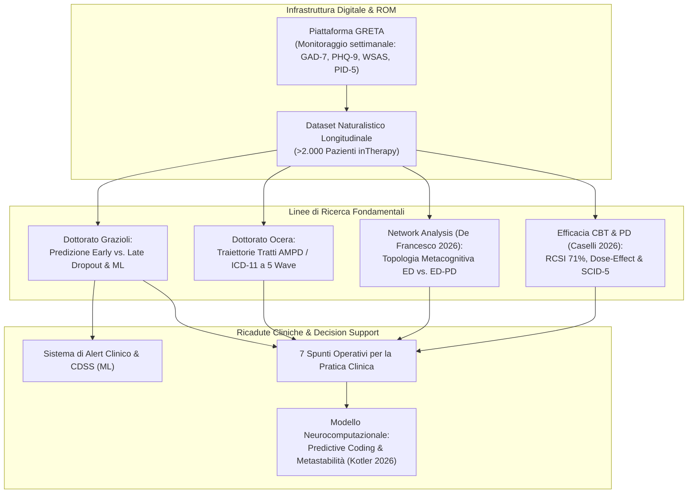

# Bollettino di Ricerca IPER Lab × inTherapy — N° 01 (Giugno 2026): Tra Ricerca e Clinica

## Definizione Operativa
- **Inquadramento Generale:** Primo numero del bollettino scientifico semestrale curato dall'**IPER Lab** (*Innovation in Psychotherapy Efficacy Research*, Sigmund Freud University, Milano; Direzione Scientifica: Prof. Gabriele Caselli, Dott.ssa Rossana Piron, Prof. Giovanni Maria Ruggiero, Prof.ssa Sandra Sassaroli) per la comunità clinica del servizio **inTherapy**.
- **Missione e Infrastruttura:** Rendicontare i progetti di ricerca, le pubblicazioni *peer-reviewed*, le pre-registrazioni e i risultati empirici generati sui dati naturalistici raccolti in modo continuativo tramite la piattaforma digitale **GRETA** (*Routine Outcome Monitoring* - ROM). L'infrastruttura connette l'attività clinica quotidiana alla ricerca quantitativa evidence-based, alimentando un ciclo continuo in cui il dato clinico genera ipotesi di ricerca che ritornano alla pratica sotto forma di linee guida tattiche, strumenti prognostici e sistemi di *clinical decision support*.
- **Assi Portanti del Semestre (Gennaio–Giugno 2026):**
  1. **Predizione e Tassonomia del Dropout nella CBT Online (Progetto Silvia Grazioli):** Distinzione fenomenologica e predittiva tra *dropout precoce* (≤ 5ª seduta) e *dropout tardivo* (> 5ª seduta) su $N = 1.729$ pazienti tramite profili anamnestici latenti (*Latent Class Analysis* - LCA) e tratti maladattivi di personalità (**PID-5**), propedeutica allo sviluppo di modelli predittivi di *Machine Learning* e alert clinici.
  2. **Traiettorie Longitudinale dei Tratti di Personalità in CBT (Progetto Alessandro Ocera):** Monitoraggio multidimensionale basato sui modelli **AMPD (DSM-5)** e **ICD-11** ($N = 660$ baseline, $N = 153$ a 3 mesi), volto a mappare se e come i tratti maladattivi si modifichino nel tempo rispetto alla remissione dei sintomi acuti.
  3. **Topologia di Rete e Comorbidità (De Francesco et al., 2026):** *Network analysis* su $N = 962$ pazienti con disturbi emotivi con e senza comorbidità di personalità, che documenta baricentri disfunzionali distinti (credenze metacognitive di pericolo vs. ruminazione depressiva ego-sintonica).
  4. **Efficacia della CBT nei Disturbi di Personalità (Caselli et al., 2026):** Studio naturalistico su $N = 1.782$ pazienti con diagnosi **SCID-5**, che dimostra come i protocolli CBT standard disturbo-specifici mantengano un tasso di *Reliable and Clinically Significant Improvement* (**RCSI = 71%**) anche in presenza di disturbi di personalità, a patto di adeguare dosaggio (22 vs. 17 sedute) e prevenire il dropout tardivo.
  5. **Neurocomputazione del Trauma e Metastabilità (Kotler et al., 2026):** Revisione critica del paradigma di van der Kolk (*"The Body Keeps the Score"*) alla luce del *predictive coding* e della riduzione della metastabilità neurale.

## Evidenze dalla Letteratura
*(Sintesi basata sul bollettino corrente)*
- **Dropout in CBT:** Il dropout in psicoterapia cognitivo-comportamentale raggiunge in letteratura tassi fino al **35%**, e nei trattamenti online circa il **50% delle interruzioni si concentra entro le prime 4 sedute**. 
- **Modificabilità dei Tratti:** La letteratura storica (es. meta-analisi di Roberts et al., 2017) ha documentato la modificabilità dei tratti generali con la psicoterapia, ma è quasi interamente basata sul modello dei Big Five e su disegni pre-post a due punti, lasciando inesplorata la dinamica longitudinale fine dei domini maladattivi specifici (AMPD/ICD-11).
- **Validazione GRETA:** Grazioli et al. (2025) hanno dimostrato riduzioni pre-post significative e clinicamente rilevanti per sintomi ansiosi (GAD-7, $\xi = 0.76$), depressivi (PHQ-9, $\xi = 0.72$) e compromissione del funzionamento psicosociale (WSAS, $\xi = 0.54$).
- **Network Analysis:** De Francesco et al. (2026) evidenziano che nei pazienti con disturbo di personalità la ruminazione si struttura come un processo **ego-sintonico**. 
- **Trauma e Metastabilità:** Kotler et al. (2026) propongono che la patologia derivi da una drammatica perdita di metastabilità, dove il cervello collassa in stati attrattori rigidi e iper-stabili di difesa.

**Riferimenti Bibliografici:**
- Caselli, G., Grazioli, S., Piron, R., Fanfoni, M., Giuri, S., Scaini, S., Ruggiero, G.M., Sassaroli, S. (2026). *Effectiveness of Cognitive Behavioral Therapy on anxiety and depression symptoms in naturalistic settings for patients with and without personality disorders*. British Journal of Clinical Psychology.
- De Francesco, S., Caselli, G., Giani, L., Ocera, A., Scaini, S., Buattini, M., Piron, R., Fanfoni, M., Giuri, S., Nordahl, H.M., Sassaroli, S., Ruggiero, G.M. (2026). *Network analysis of emotional disorders with and without comorbid personality disorders: Symptom, metacognition, and repetitive thinking patterns*. Journal of Affective Disorders, Vol. 398, 121062.
- Grazioli, S., Ocera, A., Notaristefano, I., Piron, R., Fanfoni, M., Terrazzan, L., Ruggiero, G.M., Sassaroli, S., Caselli, G. (2025). *Advancing Cognitive Behavioural Therapy Progress Tracking: A Study on the Design and Implementation of the Online Platform GRETA*. Psychological Reports.
- Kotler, S., Mannino, M., Fox, G., & Friston, K. (2026). *The body does not keep the score: trauma, predictive coding, and the restoration of metastability*. Frontiers in Systems Neuroscience, 20, 1812957.
- van der Kolk, B. (2014). *The Body Keeps the Score*.
- Roberts, B. W., et al. (2017). Meta-analisi sulla modificabilità dei tratti.

## Relazioni
- [[early-vs-late-dropout-cbt]]
- [[metastabilita-predictive-coding-trauma]]
- [[treatment-outcome-and-relapse-prediction]]
- [[clinical-fidelity-assessment]]
- [[personalized-networks-in-psychotherapy]]
- [[processes-of-change-in-psychotherapy]]
- [[process-based-therapy]]
- [[software-as-a-medical-device-salute-mentale]]
- [[modello-centauro-clinico]]