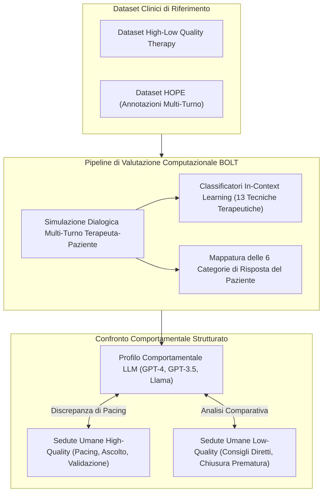
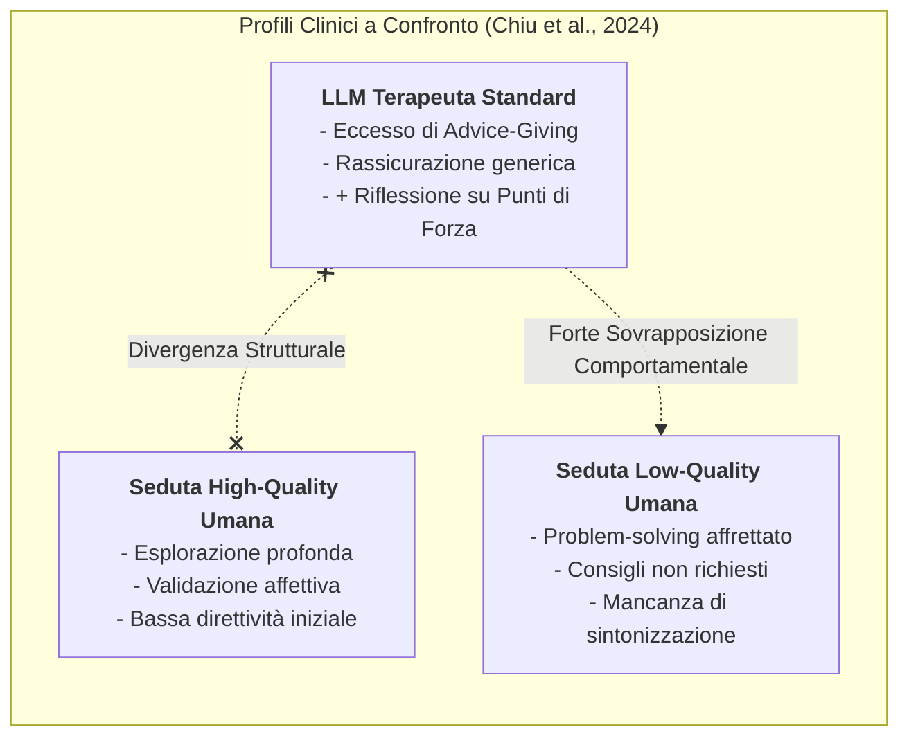
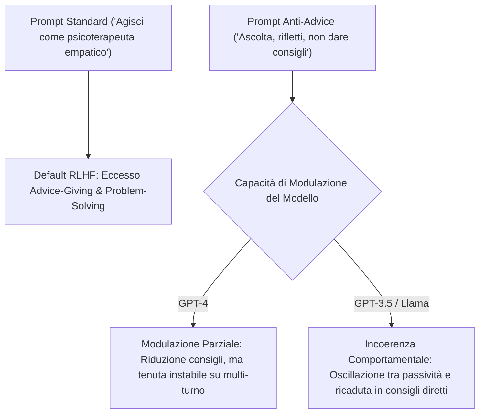

# Framework BOLT e Valutazione Comportamentale Computazionale dei Terapeuti LLM

## Definizione Operativa
- Il **Framework BOLT** (*Behavioral Assessment of LLM Therapists*, Chiu et al., 2024) è una metodologia computazionale standardizzata per la valutazione quantitativa e qualitativa del comportamento conversazionale espresso dai modelli linguistici generativi ([[large-language-models]]) impiegati come agenti psicoterapeutici.
- **Superamento dell'Approccio Impressionistico:** Sostituisce i giudizi soggettivi e le valutazioni aneddotiche ("il modello sembra empatico") con un'operazionalizzazione empirica di **13 tecniche terapeutiche** (riflessioni empatiche, domande aperte/chiuse, problem-solving, normalizzazione, ristrutturazione cognitiva, psicoeducazione, ecc.) e **6 comportamenti del paziente** (espressione emotiva, disclosure, resistenza, ecc.).
- **Benchmarking su Dati Clinici Reali:** Valuta le risposte e i dialoghi multi-turno degli LLM confrontandoli direttamente con sedute psicoterapeutiche umane annotate per qualità clinica, attingendo ai dataset *High-Low Quality Therapy* e *HOPE*.
- **Rilevazione della Distorsione da Allineamento Commerciale:** Dimostra empiricamente che i principali modelli commerciali (GPT-4, GPT-3.5, serie Llama) presentano una marcata deviazione comportamentale verso pattern di **bassa qualità clinica**, generata dai processi di *Reinforcement Learning from Human Feedback* (RLHF).

---

## La 'RLHF Advice-Giving Trap' e la Sovrapposizione con le Sedute Low-Quality

### 1. Il Meccanismo del Bias da RLHF Commerciale
- Gli LLM commerciali sono ottimizzati per essere assistenti generici collaborativi, efficienti e orientati alla risoluzione pragmatica dei problemi dell'utente.
- Quando applicati alla salute mentale, questo addestramento induce la **RLHF Advice-Giving Trap**:
  - Il modello fornisce immediatamente rassicurazioni superficiali, spiegazioni e soluzioni prescrittive (*advice-giving* precoce).
  - Viene violato il principio cardine del **pacing terapeutico** e della scoperta guidata socratica, impedendo al paziente di esplorare autonomamente le proprie emozioni e i propri schemi cognitivi.

### 2. Il Profilo 'Ibrido' del Terapeuta LLM
L'analisi BOLT rivela che gli LLM non si limitano a clonare i terapeuti scadenti, ma generano un profilo comportamentale ibrido e peculiare:
- **Elementi Critici (Low-Quality):** Eccessiva rapidità nell'erogare soluzioni, tendenza a 'risolvere' il turno anziché approfondire il vissuto, rigidità direttiva.
- **Elementi Positivi Emergenti:** Rispetto alle sedute low-quality umane, i modelli linguistici (specie GPT-4) esibiscono una frequenza significativamente superiore di *riflessioni sui punti di forza* (*strengths*) e formulazioni incoraggianti sui bisogni del paziente.

---

## Modulazione tramite Prompt Engineering: Limiti dell'Allineamento Superficiale

Il framework BOLT valuta se istruzioni esplicite di prompt engineering (es. *"Focalizzati sull'ascolto riflessivo ed evita di proporre soluzioni o consigli pratici"*) possano correggere questo sbilanciamento.

- **Allineamento Superficiale (*Superficial Alignment*):** Il prompt engineering agisce come un filtro conversazionale di superficie. Riesce a ridurre il conteggio lessicale delle soluzioni dirette, ma non conferisce al modello una reale teoria della mente o un senso clinico del tempo terapeutico.
- **Fragilità su Dialoghi Multi-Turno:** All'aumentare dei turni di conversazione, la pressione probabilistica del modello tende a riallinearsi verso il default da assistente generalista.

---

## Implicazioni Progettuali per la Psicoterapia Generativa

1. **Inidoneità come Terapeuti Autonomi:** I risultati del framework BOLT costituiscono una prova empirica contro l'impiego non supervisionato degli LLM commerciali come psicoterapeuti autonomi.
2. **Necessità di Architetture di Controllo Esterno:** La modulazione del comportamento clinico non può essere delegata al solo system prompt; richiede moduli dialogici esterni (*Dialog Managers*, *State Machines*, *Safety Layers*) che impongano formalmente le fasi della seduta.
3. **Impiego Ottimale:** Utilizzo del framework BOLT come strumento di benchmarking e validazione pre-clinica per quantificare la qualità e la sicurezza di agenti conversazionali prima del loro deployment.

---

## Related pages
- [[Sunto_articoli]]
- [[client101-simulazione-pazienti-virtuali]]
- [[diagnosis-of-thought-framework]]
- [[mind-safe-framework]]
- [[patient-psi-simulazione-clinica]]
- [[ai-assisted-psychotherapy]]
- [[clinical-fidelity-assessment]]
- [[large-language-models]]
