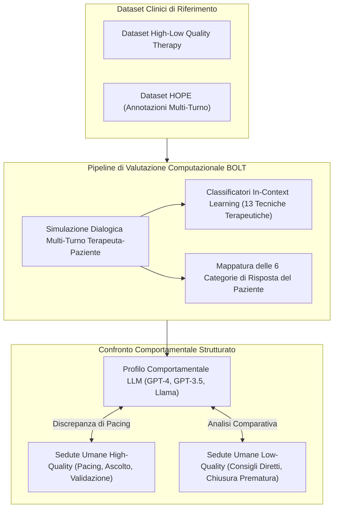
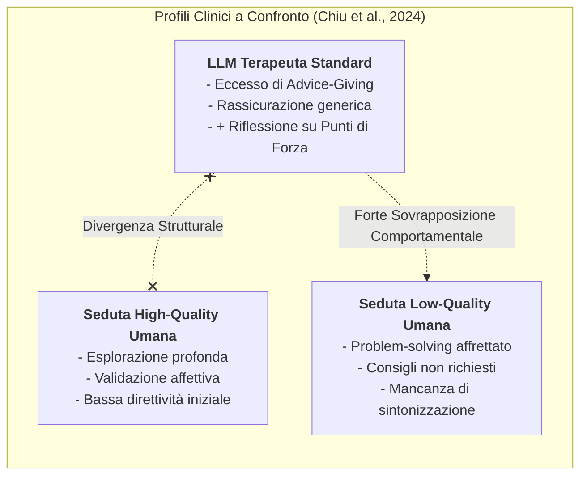
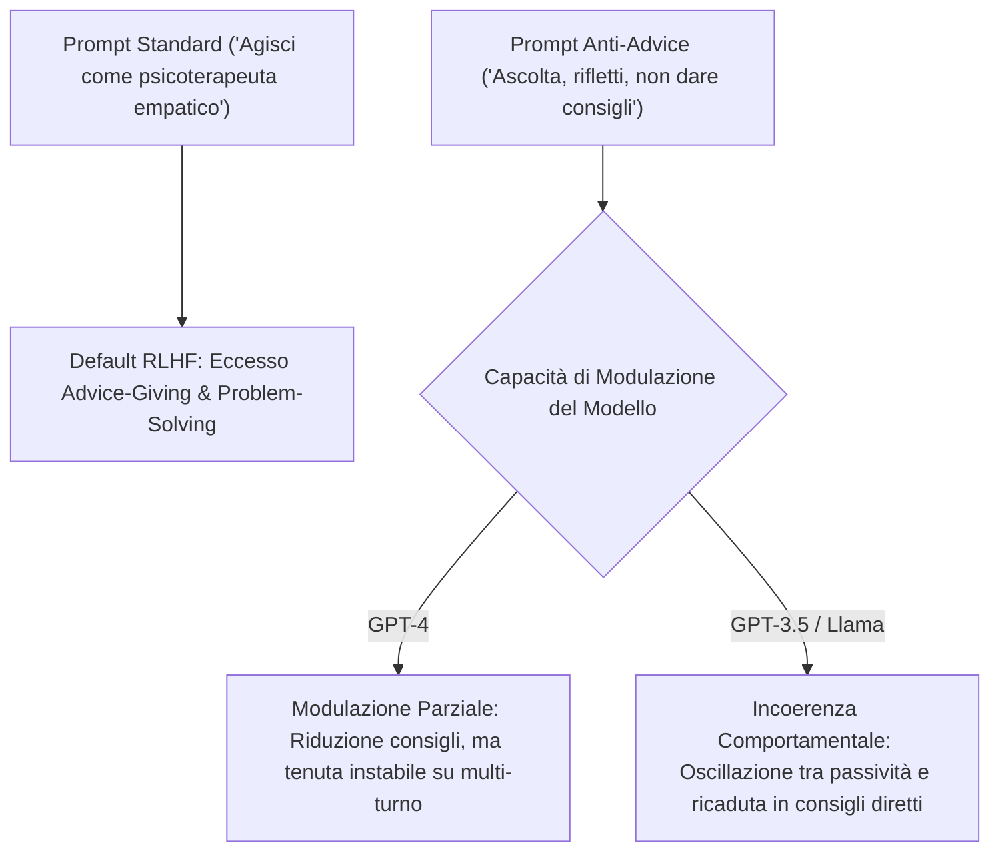

# Framework BOLT e Valutazione Comportamentale Computazionale dei Terapeuti LLM

## Definizione Operativa
- Il **Framework BOLT** (*Behavioral Assessment of LLM Therapists*, Chiu et al., 2024) è una metodologia computazionale standardizzata per la valutazione quantitativa e qualitativa del comportamento conversazionale espresso dai modelli linguistici generativi ([[large-language-models]]) impiegati come agenti psicoterapeutici.
- **Superamento dell'Approccio Impressionistico:** Sostituisce i giudizi soggettivi e le valutazioni aneddotiche ("il modello sembra empatico") con un'operazionalizzazione empirica di **13 tecniche terapeutiche** (riflessioni empatiche, domande aperte/chiuse, problem-solving, normalizzazione, ristrutturazione cognitiva, psicoeducazione, ecc.) e **6 comportamenti del paziente** (espressione emotiva, disclosure, resistenza, ecc.).
- **Benchmarking su Dati Clinici Reali:** Valuta le risposte e i dialoghi multi-turno degli LLM confrontandoli direttamente con sedute psicoterapeutiche umane annotate per qualità clinica, attingendo ai dataset *High-Low Quality Therapy* e *HOPE*.
- **Rilevazione della Distorsione da Allineamento Commerciale:** Dimostra empiricamente che i principali modelli commerciali (GPT-4, GPT-3.5, serie Llama) presentano una marcata deviazione comportamentale verso pattern di **bassa qualità clinica**, generata dai processi di *Reinforcement Learning from Human Feedback* (RLHF).

## Evidenze dalla Letteratura

### La 'RLHF Advice-Giving Trap'
Gli LLM commerciali sono ottimizzati per essere assistenti generici orientati alla risoluzione pragmatica dei problemi. Applicati alla salute mentale, questo addestramento induce la **RLHF Advice-Giving Trap**:
- Il modello fornisce immediatamente rassicurazioni superficiali e soluzioni prescrittive (*advice-giving* precoce).
- Viene violato il principio cardine del **pacing terapeutico** e della scoperta guidata socratica.

### Il Profilo 'Ibrido' del Terapeuta LLM
L'analisi BOLT rivela un profilo ibrido:
- **Elementi Critici (Low-Quality):** Eccessiva rapidità nell'erogare soluzioni e rigidità direttiva.
- **Elementi Positivi Emergenti:** Rispetto alle sedute low-quality umane, i modelli linguistici (specie GPT-4) esibiscono una frequenza superiore di *riflessioni sui punti di forza* e formulazioni incoraggianti.

### Limiti del Prompt Engineering
Il prompt engineering agisce solo come filtro superficiale:
- Riesce a ridurre il conteggio lessicale delle soluzioni, ma non conferisce una reale teoria della mente clinica.
- Fragilità su dialoghi multi-turno: la pressione probabilistica del modello tende a riallinearsi verso il default da assistente generalista.

**Riferimenti Bibliografici:**
- Chiu, K., et al. (2024). *Behavioral Assessment of LLM Therapists*. [Studio fondamentale del framework BOLT].

## Relazioni
- [[sunto-articoli]]
- [[client101-simulazione-pazienti-virtuali]]
- [[diagnosis-of-thought-framework]]
- [[mind-safe-framework]]
- [[patient-psi-simulazione-clinica]]
- [[ai-assisted-psychotherapy]]
- [[clinical-fidelity-assessment]]
- [[large-language-models]]
