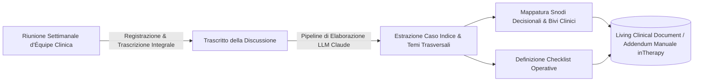
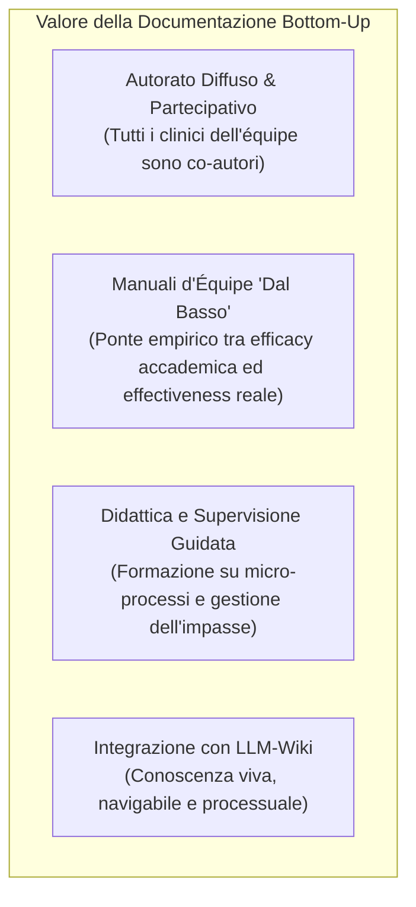

# Documentazione Clinica Bottom-Up e Living Documents

**Summary**: Metodologia per la generazione dinamica e continua di manuali clinici operativi, linee guida procedurali e alberi decisionali a partire dall'elaborazione computazionale (tramite LLM) dei trascritti di riunioni d'équipe e discussioni su casi clinici reali. Introduce il paradigma del *Living Clinical Document* ad aggiornamento incrementale e con autorato clinico diffuso.
**Sources**: 07-17 Riunione_ Corso di Formazione sull'IA in Psicologia e Utilizzo Clinico.txt
**Last updated**: 2026-08-27
---

## 1. Il Divario tra Manualistica Accademica e Prassi Clinica Reale

I manuali clinici tradizionali e la letteratura evidence-based adottano prevalentemente un approccio **top-down**: descrivono protocolli di trattamento standardizzati per patologie idealizzate e pazienti "puri". Nella pratica quotidiana delle organizzazioni sanitarie e dei centri di psicoterapia complessa, i terapeuti affrontano regolarmente snodi relazionali e procedurali raramente codificati nei testi accademici:
- **Gestione dei passaggi di consegne (*transfer*)**: Passaggio di un paziente tra terapeuti per maternità, ripresa dopo interruzione o invio a un setting specialistico.
- **Paziente passivo-richiestivo**: Gestione delle aspettative irrealistiche di guarigione immediata (*"bacchetta magica"*), atteggiamento passivo e tendenza a svalutare i precedenti colleghi.
- **Interfaccia clinica tra segreteria e terapeuta**: Criteri di accoglienza, lettura del movente della domanda e assegnazione mirata del caso.

Questi snodi costituiscono la **conoscenza clinica tacita (*tacit clinical knowledge*)** delle équipe: un patrimonio di grande valore che rischia di rimanere confinato nelle conversazioni informali e di andare disperso senza tradursi in procedure condivise.

---

## 2. Il Metodo Bottom-Up: Dalla Trascrizione d'Équipe al Manuale Operativo

La metodologia sviluppata all'interno delle équipe specialistiche (sperimentata nel network *inTherapy*, es. équipe DOC) impiega modelli linguistici avanzati (es. *Anthropic Claude*) come sintetizzatori ed estrattori strutturali del ragionamento clinico collettivo:

### Struttura Standard dell'Addendum Clinico-Operativo
1. **Premesse e Scopo**: Definizione della lacuna procedurale nel manuale clinico esistente (es. assenza di linee guida cliniche per i trasferimenti intra-struttura).
2. **Caso Indice ed Episodio Critico**: Sintesi del caso clinico reale o della criticità relazionale che ha motivato la discussione in équipe.
3. **Temi Clinici Trasversali**: Formalizzazione dei principi guida emergenti:
   - *Distinguere il tratto dallo stato*: Valutare sia la traiettoria di funzionamento a lungo termine, sia la condizione sintomatica e motivazionale attuale.
   - *Leggere il movente del passaggio*: Esplorare cosa ha determinato la richiesta di cambio o di invio prima di impostare nuovi interventi.
4. **Snodi Decisionali Espliciti**: Mappatura formale dei bivi di intervento con relativi pro, contro e condizioni di indicazione (es. Opzione 1: lavoro sui prerequisiti dell'alleanza vs Opzione 2: riformulazione del contratto terapeutico).
5. **Checklist Operative**: Indicatori pratici di auto-valutazione per il terapeuta e linee guida per la segreteria clinica (es. domande chiave da porsi prima del primo incontro post-invio).

---

## 3. Il Paradigma del "Living Clinical Document"

A differenza dei manuali cartacei statici, un **Living Clinical Document**:
- **Si aggiorna incrementalmente per aree tematiche**: Quando una riunione d'équipe successiva torna ad approfondire lo stesso quadro clinico, l'agente AI riconosce il tema, integra le nuove osservazioni e aggiorna il documento senza duplicare le informazioni.
- **Tiene traccia del versioning**: Documenta la storia delle revisioni (v1.0, v1.1, v2.0), registrando l'evoluzione progressiva delle prassi e delle competenze del centro clinico.
- **È fruibile in ambienti digitali protetti**: Consultabile su portali web/HTML interni riservati con accesso sicuro e autenticato per i terapeuti dell'organizzazione.

---

## 4. Implicazioni per la Formazione, la Ricerca e l'Autorato

1. **Autorato Diffuso e Responsabilizzazione dell'Équipe**: Il testo del manuale nasce direttamente dai contributi vocali dei professionisti, riconoscendo il valore della discussione clinica tra pari.
2. **Superamento del Divario Efficacy/Effectiveness**: Permette di produrre linee guida cliniche derivate direttamente dalla complessità dei casi del mondo reale (*real-world clinical practice*).
3. **Supervisione e Didattica Specialistica**: Fornisce agli allievi e ai giovani specializzandi materiali didattici estremamente pratici, focalizzati sulle micro-decisioni in seduta e sulla gestione del controtransfert e delle reazioni emotive del terapeuta (*"Chi me lo fa fare?"*).

---

## Related pages
- [[07-17_Riunione_Corso_Formazione]]
- [[llm-wiki]]
- [[clinical-fidelity-assessment]]
- [[microprogettazione-formativa-ia]]
- [[second-brain-clinico]]
- [[human-in-the-reasoning]]
- [[augmented-psychotherapy]]
- [[supervisione-clinica-ai]]
- [[07-08_Riunione_Pianificazione_Corso]]
