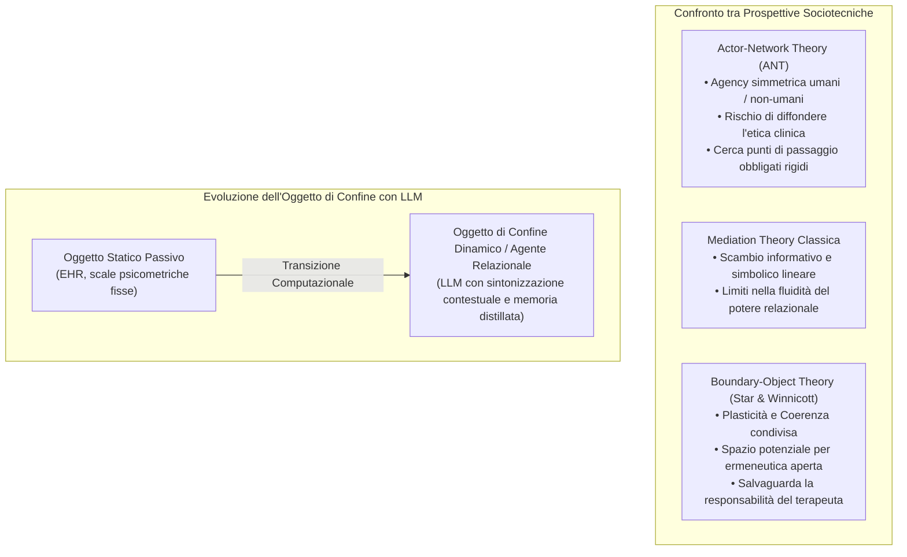

# Oggetti di Confine in Psicoterapia (Boundary Objects in Psychotherapy)

## Definizione Operativa
- Gli **Oggetti di Confine** (*Boundary Objects*) in psicoterapia e nella salute mentale digitale sono artefatti teorici, clinici o computazionali capaci di facilitare la comunicazione, la cooperazione e la negoziazione di significati tra mondi sociali eterogenei (es. clinici, pazienti, comunità marginalizzate, istituzioni sanitarie), mantenendo una coerenza identitaria globale pur adattandosi con sufficiente plasticità ai contesti e bisogni locali (Star & Griesemer, 1989; Trompette & Vinck, 2009; Quan et al., 2025).
- **Utilità Clinica e di Mediazione Uomo-IA:** Sul piano psicologico, l'oggetto di confine opera come una declinazione dello **spazio potenziale di Winnicott** (1971; BenEzer, 2012) — una zona intermedia sicura in cui affetti e confini relazionali vengono co-costruiti e rinegoziati. Nell'interazione con l'Intelligenza Artificiale, il concetto evolve da *infrastruttura statica* (cartelle cliniche elettroniche, questionari di screening standardizzati) a **mediatore socio-tecnico dinamico** (agenti LLM conversazionali adattivi), capace di riconfigurare la relazione di cura in senso triadico (*Paziente - Boundary Object IA - Terapeuta*), riequilibrando le asimmetrie di potere ed epistemiche.

---

## Evidenze dalla Letteratura

### 1. Proprietà Fondative degli Oggetti di Confine
Secondo la concettualizzazione classica di Star & Griesemer (1989) e le recenti riletture sociologiche (Trompette & Vinck, 2009; Lee, 2007), un oggetto di confine si fonda su tre proprietà essenziali:
1. **Plasticità (*Plasticity*):** Capacità di adattarsi alle contingenze locali, ai vincoli temporali e alle specificità culturali dei diversi attori coinvolti.
2. **Coerenza (*Coherence*):** Robustezza strutturale sufficiente a preservare un significato comune condiviso attraverso i confini professionali e personali.
3. **Agency Mediatrice (*Mediational Agency*):** Funzione attiva di raccordo che non si limita a trasmettere dati, ma trasforma le dinamiche relazionali tra le parti.

---

### 2. Perché la Boundary-Object Theory in Psicoterapia?
Nel contesto clinico, il confronto tra paradigmi teorici evidenzia la superiorità della Boundary-Object Theory rispetto ad approcci alternativi (Quan et al., 2025):
- **Contro l'Actor-Network Theory (ANT):** L'ANT (Callon, 1984; Latour) postula una simmetria generalizzata tra attori umani e non-umani. In psicoterapia, ciò introduce il grave rischio etico di deresponsabilizzare il terapeuta, che è legalmente e deontologicamente vincolato agli standard di cura. Inoltre, i processi di traduzione dell'ANT puntano a creare discorsi di certezza monolitici (*obligatory passage points*), mentre la psicoterapia richiede un'esplorazione aperta, dialettica e non dogmatica dei significati.
- **Contro la Mediazione Lineare:** I modelli lineari considerano la tecnologia come un semplice canale di trasmissione, ignorando come la vulnerabilità, lo stigma e le asimmetrie di potere riconfigurino l'interazione.
- **Sintonia con lo Spazio Potenziale Winnicottiano:** L'oggetto di confine permette di istituire un *terzo spazio* (BenEzer, 2012) che protegge l'alleanza terapeutica e consente al paziente di sperimentare gradualmente la propria vulnerabilità.

---

### 3. Dai Supporti Statici agli Agenti Dinamici LLM
Nell'evoluzione delle tecnologie per la salute mentale, gli oggetti di confine hanno attraversato diverse fasi:

| Tipologia di Boundary Object | Esempi Tipici | Funzione Principale | Limiti Relazionali |
| :--- | :--- | :--- | :--- |
| **Infrastrutture Statiche** | Cartelle cliniche elettroniche (EHR), scale self-report (PHQ-9, GAD-7) | Raccolta e standardizzazione informativa | Rigidità epistemica; appiattimento dell'identità; asimmetria di potere clinico. |
| **Sistemi Dialogici Regolati** | Woebot, Wysa (Chatbot CBT basati su regole o alberi fissi) | Erogazione di moduli psicoeducativi standard | Bassa plasticità; incapacità di adattamento interpersonale; isolamento self-help. |
| **Mediatori Relazionali LLM Dinamici** | Sistemi multi-stadio basati su LLM (Quan et al., 2025; [[dynamic-boundary-mediation-framework]]) | Mediazione epistemica, relazionale e contestuale attiva lungo l'intero percorso di cura | Rischio di finto rispecchiamento (*robotic feeling*); richiede controllo rigoroso della privacy. |

---

### 4. Riconfigurazione Triadica e Giustizia Relazionale
Quando integrati responsabilmente, gli oggetti di confine potenziati da LLM promuovono l'equità clinica per le popolazioni vulnerabili e marginalizzate:
- **Redistribuzione dell'Onere Comunicativo:** Riducono il lavoro pedagogico non retribuito svolto da pazienti minoritari (*educator burden*), pre-caricando conoscenze identitarie e subculturali al terapeuta.
- **Buffer di Sicurezza e Pacing dell'Autosvelamento:** Offrono al paziente uno spazio protetto per chiarire ed elaborare i propri stati interni prima di esporli al giudizio clinico.
- **Privacy Negoziabile:** Trasformano il confine tra sfera privata e consultazione clinica in una soglia permeabile e controllabile (*negotiable visibility*), mitigando l'effetto panopticon.

---

### 5. Rischi Sociotecnici e Vincoli Deontologici
- **Reificazione Algoritmica:** Rischio di considerare le sintesi prodotte dall'IA come "verità cliniche assolute" anziché artefatti provvisori aperti all'interpretazione del paziente e del terapeuta.
- **Falsa Sintonizzazione Affettiva:** La generazione di risposte empatiche preconfezionate può ostacolare il reale contatto emotivo umano se non bilanciata da autentica sensibilità al contesto (*context-adaptive empathy*).
- **Primato della Responsabilità Umana:** L'oggetto di confine non formula diagnosi né assume decisioni terapeutiche autonome, ma supporta il processo intersoggettivo guidato dal professionista.

---

**Riferimenti Bibliografici:**
- Star, S. L., & Griesemer, J. R. (1989). Institutional ecology, 'translations' and boundary objects: Amateurs and professionals in Berkeley's Museum of Vertebrate Zoology, 1907-39. *Social Studies of Science*, 19(3), 387–420.
- Trompette, P., & Vinck, D. (2009). Revisiting the notion of boundary object. *Revue d’anthropologie des connaissances*, 3(1), 3–25.
- Quan, J., Li, Z., Zhu, T. Q., Li, Y., Wang, B., Pratt, W., & Gao, N. (2025). Relational Mediators: LLM Chatbots as Boundary Objects in Psychotherapy. *arXiv preprint arXiv:2512.22462v1 [cs.HC]*, 1–35.
- Winnicott, D. W. (1971). *Playing and Reality*. London: Tavistock Publications.
- BenEzer, G. (2012). From Winnicott’s potential space to mutual creative space: A principle for intercultural psychotherapy. *Transcultural Psychiatry*, 49(2), 323–339.
- Lee, C. P. (2007). Boundary negotiating artifacts: Unbinding the routine of boundary objects and embracing chaos in collaborative work. *Computer Supported Cooperative Work (CSCW)*, 16(3), 307–339.
- Callon, M. (1984). Some elements of a sociology of translation: Domestication of the scallops and the fishermen of St Brieuc Bay. *The Sociological Review*, 32(1), 196–233.

## Relazioni
- Vedi anche: [[2512.22462v1]], [[dynamic-boundary-mediation-framework]], [[educator-burden-marginalized-clients]], [[interazione-triadica-terapeuta-paziente-ia]], [[negotiable-data-visibility-privacy]], [[contextualized-relational-memory]], [[between-session-continuity-ai]], [[simulated-empathy-vs-authentic-presence]], [[ai-assisted-psychotherapy]]

