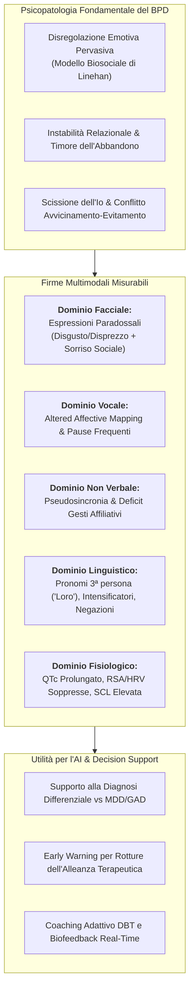
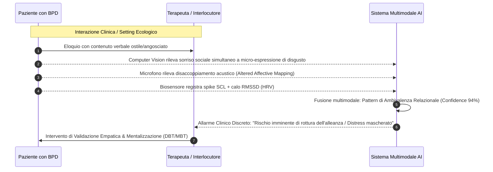

# Multimodal Behavioral and Physiological Markers in Borderline Personality Disorder (Marcatori Comportamentali, Fisiologici ed Espressivi nel Disturbo Borderline di Personalità)

## Definizione Operativa
- Il fenotipo computazionale e multimodale del **Disturbo Borderline di Personalità (BPD)** comprende un insieme integrato di indicatori oggettivi, misurabili digitalmente, che riflettono la fondamentale instabilità affettiva, la disregolazione neurovegetativa e l'ambivalenza relazionale tipiche del quadro nosografico (Močnik et al., 2024; Močnik et al., 2025, *Frontiers in Artificial Intelligence*, doi: [10.3389/frai.2025.1696448](https://doi.org/10.3389/frai.2025.1696448)).
- **Differenziazione Strutturale rispetto ai Quadri Internalizzanti:** Mentre la depressione unipolare e i disturbi d'ansia presentano pattern coerenti di ritiro ed autofocalizzazione interna (eloquio ipofonico uniforme, inibizione dello zigomatico, uso massiccio di pronomi in prima persona), il BPD si contraddistingue per una **disconnessione tra canali espressivi e una segnalazione comunicativa conflittuale**:
  1. *Espressioni Facciali Paradossali (*[[paradoxical-expressions-bpd|Paradoxical Smiling]]*):* Co-occorrenza simultanea di mimica ostile o di rifiuto (disprezzo, disgusto, rabbia) con sorrisi sociali di compiacenza o di mantenimento del contatto interpersonale;
  2. *Alterata Mappatura Affettiva della Voce (*[[altered-affective-mapping-speech|Altered Affective Mapping]]*):* Disaccoppiamento statistico tra parametri acustici primari (frequenza fondamentale $F_0$, intensità in decibel) e contenuto semantico-emozionale delle parole;
  3. *Pseudosincronia Relazionale e Deficit Prosociale:* Tendenza a forzare e guidare rigidamente il ritmo dello scambio conversazionale con il partner (*pseudosynchrony*), con drastica riduzione di cenni non verbali affiliativi spontanei (inclinazione del capo, sollevamento delle sopracciglia);
  4. *Stile Linguistico Esternalizzato e Disfluente:* Prevalenza di pronomi di terza persona (*"loro"*), proiezioni al futuro, intensificatori emotivi e frequenti disfluenze pragmatiche (*"so"*, *"I mean"*, *"because"*);
  5. *Disregolazione Autonomica e Conduzione Cardiaca:* Soppressione dell'aritmia sinusale respiratoria (RSA) e della variabilità cardiaca (HRV), iperattivazione simpatica tonica (elevata conduttanza cutanea SCL) e **prolungamento dell'intervallo elettrocardiografico QTc** a riposo.



---

## Analisi Dettagliata dei Domini di Biomarcatori nel BPD

### 1. Espressioni Facciali Paradossali e Conflitto di Segnalazione
- **La Bipolarità dei Cluster Espressivi:** Le evidenze di computer vision e codifica FACS evidenziano che i pazienti con BPD non mostrano un semplice appiattimento affettivo, ma si dividono in due cluster comportamentali:
  - *Cluster 1 (Iperespressività Negativa e Mascheramento):* Elevata intensità di emozioni negative primarie (rabbia, disprezzo e disgusto) espresse congiuntamente a sorrisi sociali. Il sorriso non veicola autentica gioia (mancata contrazione del muscolo *orbicularis oculi*, evidenziata anche dalla ridotta attività EMG perioculare), ma agisce come una barriera di compiacenza o una manovra disperata per prevenire il rifiuto interpersonale mentre il soggetto sperimenta grave angoscia interna.
  - *Cluster 2 (Espressività Attenuata):* Minore intensità di affetto negativo, ma mantenimento di segnali affiliativi minimi.
- **Predominanza di Disgusto e Disprezzo:** A differenza dei pazienti depressi (dominati dalla tristezza e dal pianto), i soggetti con BPD manifestano tassi significativamente più alti di disgusto e disprezzo verso l'interlocutore o verso se stessi, riflettenti la presenza di meccanismi di svalutazione e scissione dell'oggetto (Kernberg).

### 2. Disregolazione Vocale e Alterata Mappatura Affettiva
- **Disaccoppiamento Acustica-Valenza (*Altered Affective Mapping*):** Nei soggetti sani, le espressioni lessicali di intensa emozione (es. rabbia o allarme) si accompagnano sistematicamente a modificazioni stereotipate di pitch ($F_0$), ampiezza in decibel e velocità d'eloquio. Nel BPD, la direzione e la magnitudo di queste correlazioni acustico-emozionali appaiono atipiche o invertite, segnalando una disconnessione tra l'esperienza emotiva soggettiva, la pianificazione articolatoria e l'emissione vocale.
- **Dinamica Conversazionale:** Eloquio caratterizzato da una frequenza di pause anormalmente elevata e rallentamento intermittente della velocità di eloquio, indice di micro-dissociazioni, overload cognitivo e blocco nella regolazione del dialogo.



### 3. Dinamica Interpersonale: Pseudosincronia e Deficit Prosociale
- **Pseudosincronia Non Verbale:** Nelle diadi comunicative sane, la sincronia non verbale (postura, ritmo dei gesti, cenni del capo) emerge come un processo co-regolato e flessibile. Nel BPD si osserva invece una *pseudosincronia*, in cui il paziente tende ad assumere un controllo unilaterale e rigido del ritmo dello scambio, guidando l'interazione per difendersi dalla paura dell'imprevedibilità relazionale.
- **Riduzione dei Segnali Affiliativi Spontanei:** Carenza di micro-segnali non verbali prosociali automatici (come il sollevamento rapido delle sopracciglia - *eyebrow flash* - e l'inclinazione laterale della testa - *head tilt*), che facilitano la fiducia e la sintonia empatica reciproca.
- **Ambivalenza Posturale:** Manifestazione simultanea di segnali di approccio (orientamento corporeo in avanti) e segnali di fuga o allontanamento (*flight behaviors*), traducendo sul piano somatosensoriale il classico conflitto borderline di vicinanza/distanza.

### 4. Linguaggio ed Esternalizzazione (NLP)
- **Pronomi di Terza Persona Plurale:** Il frequente ricorso a costrutti incentrati su *"loro"* (*they/them*) riflette l'iperfocalizzazione sulle intenzioni malevole o giudicanti attribuite all'ambiente esterno, distinguendosi nettamente dal ripiegamento autoreferenziale della depressione (*"io/me"*).
- **Marcatori Pragmatici e Disfluenze:** Sovra-utilizzo di intensificatori semantici (*"estremamente"*, *"completamente"*), negazioni e intercalari disfluenti (*"so"*, *"I mean"*, *"because"*), espressione di un pensiero polarizzato (pensiero dicotomico tutto-o-nulla) e di una costante urgenza di giustificazione narrativa.
- **Divergenza Testo Scritto vs Intervista Verbale:** Nei post online e nelle interazioni scritte asincrone (chat, social), il tono affettivo appare fortemente polarizzato sulla negatività e sulla disperazione; nelle interviste vis-à-vis, invece, il paziente tende a manifestare un controllo affettivo apparente o una neutralità difensiva, rendendo indispensabile l'analisi combinata dei due canali.

### 5. Fisiologia Autonomica e Marcatore Cardiaco QTc
- **Compromissione del Tono Vagale:** Soppressione statisticamente significativa dell'aritmia sinusale respiratoria (RSA) e della variabilità ad alta frequenza (HF-HRV), proporzionale alla gravità clinica e alla frequenza di condotte autolesive.
- **Iperattività Simpatica Tonica:** Livelli basali persistentemente elevati di conduttanza cutanea (SCL), indicativi di uno stato di allerta biologica e iperattivazione adrenergica costante.
- **Prolungamento dell'Intervallo QTc:** La rassegna di Močnik et al. (2024, 2025) evidenzia la presenza di un prolungamento dell'intervallo QTc corretto a riposo nei pazienti con BPD, correlato alla disregolazione cronica dell'asse ipotalamo-ipofisi-surrene (HPA) e all'instabilità neurovegetativa miocardica.

---

## Integrazione Clinica: Psicoterapia e Trattabilità Algoritmica

```mermaid
mindmap
  root((Applicazioni Cliniche BPD))
    Diagnostica Differenziale
      Discriminazione precoce vs Depressione Unipolare
      Differenziazione tra BPD e Disturbo Bipolare
      Identificazione di quadri comorbili complessi
    Prevenzione Rotture Alleanza
      Rilevamento tempestivo del disingaggio emotivo
      Monitoraggio continuo del sorriso paradossale
      Alert per il terapeuta prima del dropout
    Interventi Digitali DBT
      Biofeedback autonomico (HRV/EDA) per la tolleranza del distress
      Micro-coaching Just-In-Time (JITAI) per la regolazione emotiva
      Tracciamento ecologico della disregolazione inter-seduta
```

1. **Superamento dei Limiti della Trattabilità Algoritmica:** Come evidenziato da Orrù & Mannarini (2026; [[algorithmic-tractability-in-psychotherapy|Algorithmic Tractability]]), il BPD ha storicamente rappresentato una condizione ad "alta opacità algoritmica" a causa della non linearità della relazione terapeutica. L'integrazione di segnali multimodali oggettivi consente finalmente di quantificare parametri relazionali finora inaccessibili al machine learning standard.
2. **Modello Centauro e Decision Support per il Terapeuta:** Il sistema multimodale non deve sostituire il clinico, ma operare come sensore ausiliario (*[[modello-centauro-clinico|Modello Centauro]]*): allertare il terapeuta quando il paziente manifesta una dissociazione mascherata da sorriso compiacente, o quando l'iperattivazione simpatica supera la "finestra di tolleranza emotiva".
3. **Biofeedback ed E-Coaching DBT:** Utilizzo dei biosensori indossabili per guidare protocolli di *Dialectical Behavior Therapy (DBT)*, fornendo al paziente biofeedback in tempo reale per l'applicazione delle abilità di *Distress Tolerance* (es. tecniche TIPP) durante i picchi di disregolazione.

---

## Riferimenti Bibliografici
- Močnik, G., Rehberger, A., Smogavc, Ž., Mlakar, I., Smrke, U., & Močnik, S. (2025). Multimodal observable cues in mood, anxiety, and borderline personality disorders: a review of reviews to inform explainable AI in mental health. *Frontiers in Artificial Intelligence*, 8:1696448. https://doi.org/10.3389/frai.2025.1696448
- Močnik, S., Smrke, U., Mlakar, I., Močnik, G., Gregorič Kumperščak, H., & Plohl, N. (2024). Beyond clinical observations: a scoping review of AI-detectable observable cues in borderline personality disorder. *Frontiers in Psychiatry*, 15:1345916. https://doi.org/10.3389/fpsyt.2024.1345916
- Linehan, M. M. (1993). *Cognitive-behavioral treatment of borderline personality disorder*. Guilford Press.
- Kernberg, O. F. (1984). *Severe personality disorders: Psychotherapeutic strategies*. Yale University Press.
- Rizzi, R., Grecucci, A., & Stella, M. (2026). MyMentorLLM: A psychotherapy GenAI environment with multimodal voice/text patients, trainees and experts for deliberate practice. *arXiv preprint arXiv:2607.25667v1*.
- Orrù, L., & Mannarini, S. (2026). The role of artificial intelligence in clinical psychology: How AI and NLP systems are reshaping psychological interventions. *Clinical Psychology & Psychotherapy*, 33, e70242. https://doi.org/10.1002/cpp.70242

---

## Related pages
- [[frai-08-1696448]]: Rassegna di rassegne su indicatori multimodali oggettivi per XAI.
- [[multimodal-observable-cues-in-psychiatry]]: Fenotipizzazione digitale multimodale in salute mentale.
- [[algorithmic-tractability-in-psychotherapy]]: Limiti computazionali e complessità clinica nei disturbi di personalità.
- [[2607.25667v1]]: Simulazione di pazienti con BPD (caso 'Fragile and Angry') in MyMentorLLM.
- [[modello-centauro-clinico]]: Alleanza clinico-algoritmo nella gestione della complessità psicopatologica.
- [[multimodal-anxiety-detection-ai]]: Riconoscimento multimodale dell'ansia e biosensori autonomici.
- [[explainable-mental-health-diagnosis]]: Framework XAI applicati alla psicodiagnosi.
