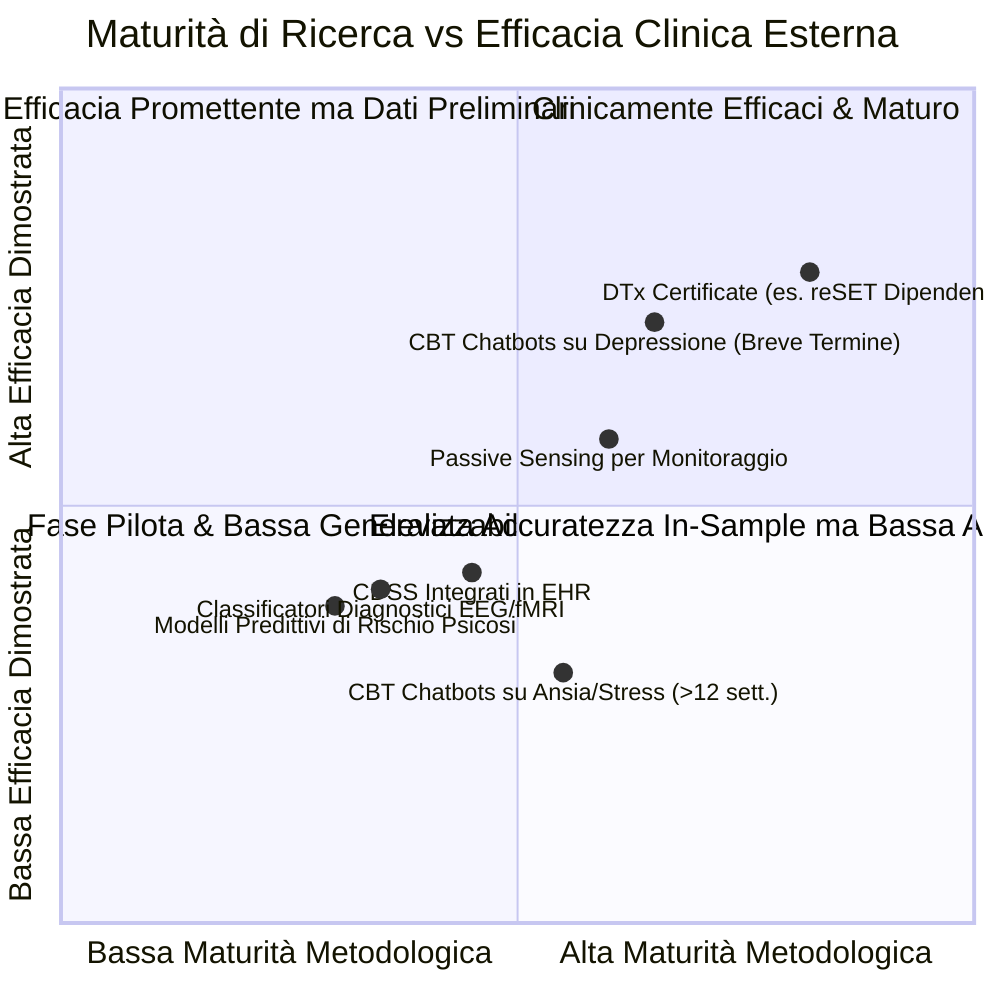

```mermaid
flowchart LR
    subgraph Stage1 ["1. Screening & Rilevazione Precoce"]
        direction TB
        S1["NLP su cartelle cliniche & social media"]
        S2["Computer Vision su micro-espressioni facciali"]
        S3["Analisi acustica e prosodica vocale"]
    end

    subgraph Stage2 ["2. Diagnosi & Classificazione"]
        direction TB
        D1["Neuroimaging: fMRI, sMRI strutturale"]
        D2["Elettrofisiologia: Tracciati EEG, potenziali ERP"]
        D3["Classificatori ML (SVM, RF, CNN)"]
    end

    subgraph Stage3 ["3. Modellazione Predittiva"]
        direction TB
        P1["Predizione Esordio Psicotico / Bipolare"]
        P2["Stima Rischio Recidiva (Relapse) & Suicidio"]
        P3["Integrazione Multimodale (EHR + Genomica + Wearable)"]
    end

    subgraph Stage4 ["4. Monitoraggio Continuo"]
        direction TB
        M1["Digital Phenotyping passivo su smartphone"]
        M2["Biosensori indossabili (HRV, EDA, sonno, actigrafia)"]
        M3["Tracciamento ecologico continuo (EMA)"]
    end

    subgraph Stage5 ["5. Interventi & CDSS"]
        direction TB
        T1["Chatbot CBT interattivi (Woebot, Wysa, Youper)"]
        T2["Realtà Virtuale (VR) & Neurofeedback (DecNef)"]
        T3["CDSS integrati in EHR per raccomandazioni di cura"]
    end

    Stage1 --> Stage2 --> Stage3 --> Stage4 --> Stage5
```

# Care-Continuum AI Functions in Mental Health (Funzioni di IA lungo il Continuum di Cura in Salute Mentale)

## Definizione Operativa
- Il modello delle **Care-Continuum AI Functions** formalizza la tassonomia funzionale emersa dalla scoping review di 31 revisioni della letteratura condotta da Abu-Mahfouz et al. (2026; *Frontiers in Psychiatry*, doi: 10.3389/fpsyt.2026.1688043), mappando l'insieme delle tecnologie di intelligenza artificiale, machine learning e deep learning lungo le cinque fasi sequenziali e interdipendenti del percorso assistenziale in psichiatria e psicologia clinica:
  1. **Screening e Rilevazione Precoce (*Screening & Early Detection*)**
  2. **Diagnosi e Classificazione Nosografica (*Diagnosis & Classification*)**
  3. **Modellazione Predittiva e Stratificazione del Rischio (*Predictive Modelling & Risk Stratification*)**
  4. **Monitoraggio Continuo e Telemedicina (*Continuous Monitoring & Telehealth Augmentation*)**
  5. **Interventi Digitali Terapeutici e Supporto Decisionale (*Therapeutic Interventions & Clinical Decision Support Systems - CDSS*)**
- **Utilità Clinica e per la Ricerca:** Permette di disaggregare i livelli di maturità tecnologica (*Technology Readiness Levels - TRL*), l'accuratezza diagnostica/predittiva reale vs in-sample e i gradienti di efficacia terapeutica, evidenziando il contrasto tra l'ampia copertura sui disturbi dell'umore e la scarsità di modelli validati per psicosi, disturbo bipolare e popolazioni vulnerabili.

---

## Analisi Approfondita delle Cinque Funzioni del Continuum

### 1. Screening e Rilevazione Precoce (*Screening & Early Detection*)
- **Paradigmi Algoritmici:** Applicazione di modelli di *Natural Language Processing* (NLP), sentiment analysis, analisi semantica densa e *Computer Vision* per identificare segnali precoci di sofferenza psicologica e markers di rischio prima che si manifesti la piena espressione sindromica.
- **Sorgenti Dati:** Post e interazioni sui social media, note cliniche non strutturate, registrazioni audio del parlato spontaneo (analisi di frequenza fondamentale $F_0$, jitter, formanti) e videoregistrazioni delle micro-espressioni facciali ed espressioni emotive (9, 34, 44, 47, 48, 50, 62).
- **Stato dell'Arte & Limiti:** Sebbene i modelli mostrino un'elevata sensibilità iniziale, soffrono di vulnerabilità a bias linguistico-culturali, rumore semantico e una frequente sovra-classificazione di soggetti non clinici (falsi positivi).

---

### 2. Diagnosi e Classificazione Nosografica (*Diagnosis & Classification*)
- **Paradigmi Algoritmici:** Algoritmi di Machine Learning supervisionato (Support Vector Machines - SVM, Random Forest, XGBoost) e architetture di Deep Learning (Reti Neurali Convoluzionali - CNN su tracciati bi-dimensionali e volumetrie 3D cerebrali).
- **Sorgenti Dati:** Risonanza magnetica funzionale e strutturale (fMRI, sMRI), elettroencefalografia quantitativa (qEEG), potenziali evento-correlati (ERP), profili ematologici e biomarcatori digitali.
- **Performance e Discrepanza In-Sample vs Esterna:**
  - In fase di addestramento su campioni ristretti e omogenei, i modelli raggiungono accuratezze nominali fino al 97% e AUC comprese tra **0.80 e 0.98** (Graham et al., 2019; Rony et al., 2025).
  - Tuttavia, su dataset esterni e indipendenti si registra una pesante attenuazione prestazionale (es. il modello CNN su EEG descritto da Baydili et al., 2025 è crollato da un AUC in-sample di **0.99** a un AUC esterno di **0.73**).

---

### 3. Modellazione Predittiva e Stratificazione del Rischio (*Predictive Modelling & Risk*)
- **Obiettivi Clinici:** Previsione della transizione da stato di alto rischio clinico (*Clinical High Risk - CHR*) a primo episodio psicotico, stima del rischio di suicidio o autolesionismo a breve/medio termine, predizione della risposta a specifici antidepressivi/antipsicotici e stima del rischio di drop-out precoce dalla psicoterapia.
- **Approccio Multimodale:** Integrazione di profili poligenici, variabili demografiche, serie storiche di cartella clinica (EHR), metriche di sonno e mobilità provenienti da dispositivi indossabili (9, 11, 42, 47, 48, 54, 60).
- **Limiti Epistemologici:** La scarsità di validazioni temporali e geografiche esterne crea il rischio di un "falso senso di sicurezza" prognostica nei clinici.

---

### 4. Monitoraggio Continuo e Teleassistenza (*Continuous Monitoring & Telehealth*)
- **Tecnologie Adottate:** *Passive Mobile Sensing* (frequenza di sblocco dello smartphone, spostamenti GPS, durata delle chiamate, dinamiche di digitazione su tastiera), *Ecological Momentary Assessment* (EMA) guidato da prompt intelligenti e wearable fisiologici (variabilità della frequenza cardiaca - HRV, conduttanza cutanea - EDA, temperatura periferica).
- **Ruolo dell'IA Conversazionale:** Agenti interattivi leggeri mantengono elevato l'ingaggio longitudinale del paziente, monitorano l'aderenza terapeutica e rilevano scostamenti rispetto alla baseline comportamentale (*baseline drift*) (47, 48, 50, 51, 62).
- **Applicazione Pratica:** Sistemi come l'app *CrossCheck* permettono di monitorare la stabilità sociale nei pazienti con schizofrenia, pur richiedendo una continua calibrazione intra-individuale (Wang et al., 2020).

---

### 5. Interventi Digitali Terapeutici e Sistemi di Supporto Decisionale (CDSS)
- **Agenti Conversazionali CBT (Chatbots):** Sistemi automatizzati o semi-automatizzati come *Woebot*, *Wysa* e *Youper* progettati per guidare l'utente nell'auto-monitoraggio, nella ristrutturazione cognitiva dei pensieri automatici negativi (NAT), nel problem solving e nell'attivazione comportamentale.
- **Interventi Tecnologici Avanzati:** Realtà Virtuale (VR) adattiva per l'esposizione controllata nel disturbo da stress post-traumatico (PTSD) e fobie specifiche; *Decoded Neurofeedback* (DecNef) in fMRI/EEG per il riconsolidamento della memoria della paura e la regolazione affettiva (41, 44, 50, 61).
- **Terapie Digitali Certificate:** Piattaforme basate su prescrizione medica come **reSET** (*Pear Therapeutics*), approvate da FDA con trial RCT che dimostrano una riduzione del 50% del craving nelle dipendenze (OR = 0.48; 95% CI: 0.32–0.73).
- **Sistemi CDSS Integrati in EHR:** Algoritmi integrati nella cartella clinica che suggeriscono remissione probabile e percorsi farmacoterapici o psicoterapici personalizzati. Attualmente, pochissimi studi ne hanno valutato l'impatto ecologico reale sulle scelte prescrittive dei medici (40, 42, 47, 54).

---

## Sintesi Comparativa di Efficacia e Maturità Clinica

### Sintesi Quantitativa delle Evidenze di Efficacia
1. **Depressione vs Ansia/Stress:** I chatbot CBT producono miglioramenti sintomatici a breve termine clinicamente significativi sulla depressione (**Hedges' $g = 0.61$**; SMD $\approx 0.2–0.6$ in Li et al., 2023 e Farzan et al., 2025). Al contrario, gli effetti su ansia e stress risultano modesti e soggetti a rapido decadimento oltre le 8–12 settimane (*engagement decay*).
2. **Alleanza Terapeutica Digitale:** Gli indici WAI-SR (Working Alliance Inventory) registrano punteggi medi di **3.36/5** totale e **3.80/5** sulla sottoscala del legame relazionale (*bond*), paragonabili alla psicoterapia erogata dal clinico umano, confermando l'accettabilità percepita dall'utente.
3. **Il Divario di Traduzione Clinica:** Mentre le prime fasi (screening, classificazione) abbondano di prototipi ad altissima precisione in-sample, le fasi traslazionali (interventi integrati, CDSS e monitoraggio longitudinale con escalation) soffrono di una marcata carenza di trial clinici randomizzati e pragmatici.

---

## Implicazioni per la Pratica Psichiatrica e Psicoterapeutica (CBT)

1. **Integrazione Orizzontale nel Workflow Clinico:** L'IA lungo il continuum non deve frammentare il percorso di cura, ma connettere la rilevazione precoce (screening) con il monitoraggio inter-seduta e l'erogazione di interventi digitali a supporto del terapeuta (*Blended Care / Modello Centauro*).
2. **Standardizzazione dei Protocolli di Escalation:** Nelle funzioni di monitoraggio e intervento, è tassativo implementare algoritmi di allerta (*duty to warn*) capaci di rilevare l'emergenza di ideazione suicidaria o scompensi acuti, reindirizzando l'utente a un presidio umano.
3. **Criteri di Scelta per i Clinici:** I professionisti della salute mentale devono privilegiare strumenti digitali che abbiano dimostrato validazione esterna e conformità ai criteri di [[deployment-readiness-checklist-mental-health-ai|Deployment-Readiness]], evitando l'adozione acritica di classificatori o chatbot puramente commerciali e non testati.

---

## Relazioni
- Vedi anche: [[fpsyt-17-1688043_1]], [[deployment-readiness-checklist-mental-health-ai]], [[clinical-readiness-gap-in-mh-chatbots]], [[ai-psychosocial-functioning-in-psychosis]], [[cbt-dialogue-systems-and-tools]], [[wearable-sensor-fusion-adherence]], [[multimodal-anxiety-detection-ai]], [[modello-centauro-clinico]], [[explainable-mental-health-diagnosis]], [[software-as-a-medical-device-salute-mentale]], [[ai-psychosis]]
