# Care-Continuum AI Functions in Mental Health

## Definizione Operativa
Il modello delle **Care-Continuum AI Functions** formalizza la tassonomia funzionale emersa dalla scoping review di 31 revisioni della letteratura condotta da Abu-Mahfouz et al. (2026; *Frontiers in Psychiatry*, doi: 10.3389/fpsyt.2026.1688043), mappando l'insieme delle tecnologie di intelligenza artificiale, machine learning e deep learning lungo le cinque fasi sequenziali e interdipendenti del percorso assistenziale in psichiatria e psicologia clinica:

1. **Screening e Rilevazione Precoce (*Screening & Early Detection*)**
2. **Diagnosi e Classificazione Nosografica (*Diagnosis & Classification*)**
3. **Modellazione Predittiva e Stratificazione del Rischio (*Predictive Modelling & Risk Stratification*)**
4. **Monitoraggio Continuo e Telemedicina (*Continuous Monitoring & Telehealth Augmentation*)**
5. **Interventi Digitali Terapeutici e Supporto Decisionale (*Therapeutic Interventions & Clinical Decision Support Systems - CDSS*)**

**Utilità Clinica e per la Ricerca:** Permette di disaggregare i livelli di maturità tecnologica (*Technology Readiness Levels - TRL*), l'accuratezza diagnostica/predittiva reale vs in-sample e i gradienti di efficacia terapeutica, evidenziando il contrasto tra l'ampia copertura sui disturbi dell'umore e la scarsità di modelli validati per psicosi, disturbo bipolare e popolazioni vulnerabili.

```mermaid
flowchart LR
    subgraph Stage1 ["1. Screening & Rilevazione Precoce"]
        direction TB
        S1["NLP su cartelle cliniche & social media"]
        S2["Computer Vision su micro-espressioni facciali"]
        S3["Analisi acustica e prosodica vocale"]
    end

    subgraph Stage2 ["2. Diagnosi & Classificazione"]
        direction TB
        D1["Neuroimaging: fMRI, sMRI strutturale"]
        D2["Elettrofisiologia: Tracciati EEG, potenziali ERP"]
        D3["Classificatori ML (SVM, RF, CNN)"]
    end

    subgraph Stage3 ["3. Modellazione Predittiva"]
        direction TB
        P1["Predizione Esordio Psicotico / Bipolare"]
        P2["Stima Rischio Recidiva (Relapse) & Suicidio"]
        P3["Integrazione Multimodale (EHR + Genomica + Wearable)"]
    end

    subgraph Stage4 ["4. Monitoraggio Continuo"]
        direction TB
        M1["Digital Phenotyping passivo su smartphone"]
        M2["Biosensori indossabili (HRV, EDA, sonno, actigrafia)"]
        M3["Tracciamento ecologico continuo (EMA)"]
    end

    subgraph Stage5 ["5. Interventi & CDSS"]
        direction TB
        T1["Chatbot CBT interattivi (Woebot, Wysa, Youper)"]
        T2["Realtà Virtuale (VR) & Neurofeedback (DecNef)"]
        T3["CDSS integrati in EHR per raccomandazioni di cura"]
    end

    Stage1 --> Stage2 --> Stage3 --> Stage4 --> Stage5
```

## Evidenze dalla Letteratura

### 1. Screening e Rilevazione Precoce
Applicazione di *Natural Language Processing* (NLP), sentiment analysis, analisi semantica densa e *Computer Vision* su post social media, note cliniche non strutturate, registrazioni audio del parlato spontaneo (frequenza fondamentale $F_0$, jitter, formanti) e videoregistrazioni delle micro-espressioni facciali. I modelli mostrano alta sensibilità ma soffrono di bias linguistico-culturali e sovra-classificazione (falsi positivi) (9, 34, 44, 47, 48, 50, 62).

### 2. Diagnosi e Classificazione Nosografica
Utilizzo di ML supervisionato (SVM, Random Forest) e Deep Learning (CNN). Sebbene raggiungano accuratezze fino al 97% e AUC tra 0.80 e 0.98 in-sample, su dataset indipendenti si registra una marcata attenuazione (es. modello CNN su EEG di Baydili et al., 2025 crollato da 0.99 a 0.73 AUC) (Graham et al., 2019; Rony et al., 2025).

### 3. Modellazione Predittiva e Stratificazione del Rischio
Previsione di transizione a primo episodio psicotico, rischio suicidario, risposta farmacologica e drop-out dalla psicoterapia tramite integrazione di dati poligenici, EHR, sonno e wearable. La scarsità di validazioni temporali e geografiche esterne limita la fiducia clinica (9, 11, 42, 47, 48, 54, 60).

### 4. Monitoraggio Continuo e Teleassistenza
*Passive Mobile Sensing* e *Ecological Momentary Assessment* (EMA) mantengono l'ingaggio longitudinale. Sistemi come *CrossCheck* monitorano la stabilità sociale in pazienti con schizofrenia, pur richiedendo calibrazione intra-individuale (Wang et al., 2020) (47, 48, 50, 51, 62).

### 5. Interventi Digitali Terapeutici e Sistemi di Supporto Decisionale (CDSS)
Chatbot CBT (*Woebot*, *Wysa*) guidano l'auto-monitoraggio e la ristrutturazione cognitiva. Interventi avanzati includono VR adattiva (PTSD) e *Decoded Neurofeedback* (DecNef). Piattaforme certificate come **reSET** dimostrano riduzione del 50% del craving (OR = 0.48). I CDSS integrati in EHR rimangono limitati nella valutazione dell'impatto reale (40, 41, 42, 44, 47, 50, 54, 61).

**Riferimenti Bibliografici:**
- Abu-Mahfouz et al. (2026). *Frontiers in Psychiatry*, doi: 10.3389/fpsyt.2026.1688043.
- Baydili et al. (2025). *EEG-based diagnostic models performance*.
- Farzan et al. (2025). *Chatbot efficacy in mood disorders*.
- Graham et al. (2019). *Machine learning in psychiatry*.
- Li et al. (2023). *CBT digital interventions*.
- Rony et al. (2025). *Diagnostic classifiers performance review*.
- Wang et al. (2020). *CrossCheck digital monitoring*.

## Relazioni
- Vedi anche: [[fpsyt-17-1688043-1]], [[deployment-readiness-checklist-mental-health-ai]], [[clinical-readiness-gap-in-mh-chatbots]], [[ai-psychosocial-functioning-in-psychosis]], [[cbt-dialogue-systems-and-tools]], [[wearable-sensor-fusion-adherence]], [[multimodal-anxiety-detection-ai]], [[modello-centauro-clinico]], [[explainable-mental-health-diagnosis]], [[software-as-a-medical-device-salute-mentale]], [[ai-psychosis]]
