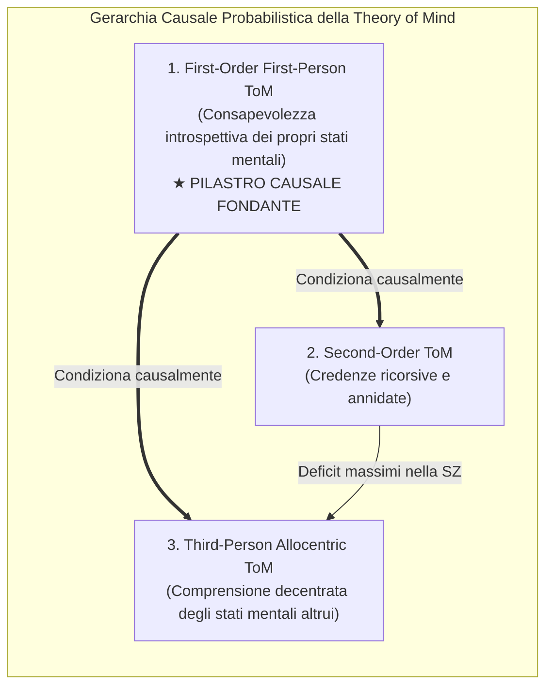

# Causal Discovery e Machine Learning per i Target Psicosociali

## Definizione Operativa
Il **Causal Discovery e Causal Machine Learning nei Target Psicosociali** definisce l'applicazione congiunta di algoritmi di induzione causale vincolata (in particolare il *Greedy Fast Causal Inference - GFCI*) e modelli statistici strutturali (*Structural Equation Modeling - SEM*, *Reti Bayesiane*) per mappare grafi aciclici diretti (DAG) e identificare relazioni di causa-effetto autentiche tra costrutti neuropsicologici, clinici ed esiti funzionali (Mok, Cheng & Chu, 2025; Miley et al., 2023; Bosco et al., 2024).

**Distinzione Epistemologica Fondamentale:** Supera l'illusione predittiva del Machine Learning puramente correlazionale o "black-box" (in cui variabili correlate ma causalmente inerti possono apparire falsamente predittive), distinguendo nettamente tra:
1. **Cause Dirette (Punti di Leva Terapeutica):** Variabili che, se modificate mediante intervento clinico, determinano una variazione causale diretta nell'esito funzionale;
2. **Cause Distali o Indirette:** Variabili la cui associazione con l'outcome è interamente mediata da fattori intermedi;
3. **Associazioni Spurie e Confounders:** Variabili correlate solo a causa di un ancestro comune non controllato.

```mermaid
flowchart TD
    subgraph ObservationalData ["1. Dati Clinici & Neuropsicologici Osservazionali"]
        D1["Sintomi Positivi & Negativi (PANSS)"]
        D2["Durata Psicosi Non Trattata (DUP)"]
        D3["Deficit Neurocognitivo Globale (Memoria, Attenzione)"]
        D4["Capacità Socio-Affettiva (Piacere sociale, Espressività)"]
        D5["Motivazione Intrinseca & Volizione"]
    end

    subgraph CausalDiscoveryEngine ["2. Algoritmo di Scoperta Causale (GFCI + SEM)"]
        G1["Test di Indipendenza Condizionale & Orientamento Archi (GFCI)"]
        G2["Costruzione del Grafo Causale Aciclico (DAG / PAG)"]
        G3["Stima Quantitativa dei Pesi di Regressione Strutturale (SEM)"]
    end

    subgraph CausalMap ["3. Architettura Causale Validata (Miley et al., 2023)"]
        DUP["DUP & Neurocognizione<br/>(Fattori Distali Indiretti)"]
        AFF["Capacità Socio-Affettiva<br/>(Piacere & Espressione)"]
        MOT["Motivazione Intrinseca<br/>(Volizione)"]
        OUT["Funzionamento Sociale & Occupazionale<br/>(Outcome Funzionale nel Mondo Reale)"]

        DUP -.->|Effetto indiretto mediato| AFF
        DUP -.->|Effetto indiretto mediato| MOT
        AFF ==>|CAUSA DIRETTA PRIMARIA (β = 0.77 - 1.50)| OUT
        MOT ==>|CAUSA DIRETTA PRIMARIA| OUT
    end

    subgraph ClinicalIntervention ["4. Traslazione nella Pratica Clinica & CBT"]
        C1["INTERVENTO DIRETTO (High-Impact):<br/>• Attivazione comportamentale per anedonia<br/>• Amplificazione dell'esperienza affettiva positiva<br/>• Valorizzazione della motivazione autonoma"]
        C2["INTERVENTO DI SUPPORTO (Low-Impact sull'outcome isolato):<br/>• Training neurocognitivo decontestualizzato"]
    end

    ObservationalData --> CausalDiscoveryEngine
    CausalDiscoveryEngine --> CausalMap
    CausalMap --> ClinicalIntervention
```

## Evidenze dalla Letteratura

### 1. Il Modello Causale della Psicosi all'Esordio (Miley et al., 2023)
Nello studio di riferimento condotto su 276 pazienti con psicosi all'esordio (*First-Episode Schizophrenia*), l'applicazione dell'algoritmo *Greedy Fast Causal Inference (GFCI)* ha consentito di decostruire assunti storici della psichiatria clinica:
- **La Fallacia del DUP come Causa Diretta del Recupero:** Sebbene la durata della psicosi non trattata (*Duration of Untreated Psychosis - DUP*) sia statisticamente associata a una prognosi peggiore, il modello causale dimostra che il DUP **non esercita un effetto causale diretto** sul funzionamento psicosociale e occupazionale a lungo termine. Il suo impatto è interamente mediato dal deterioramento della motivazione e della capacità socio-affettiva.
- **La Neurocognizione come Fattore Non Causale Diretto:** I punteggi dei test neurocognitivi tradizionali (velocità di elaborazione, memoria di lavoro) non agiscono come cause dirette dell'autonomia comunitaria, spiegando perché i programmi di *Cognitive Remediation* pura spesso migliorano i punteggi ai test neuropsicologici senza tradursi automaticamente in un reale reinserimento lavorativo.
- **I Veri Driver Causali: Capacità Socio-Affettiva e Motivazione:**
  - La **capacità socio-affettiva** (*social affective capacity*, valutata mediante items specifici della scala QLS e scale TEPS) e la **motivazione** presentano una dimensione dell'effetto causale eccezionalmente elevata (**effect size da 0.77 a 1.50**; $p < 0.001$), qualificandosi come i target terapeutici prioritari e insostituibili per la *recovery*.

### 2. Architettura Causale Gerarchica della Theory of Mind (Bosco et al., 2024)
L'impiego delle Reti Bayesiane applicate all'assessment della cognizione sociale (*Theory of Mind Assessment Scale - T.h.o.m.a.s*) su individui con schizofrenia e controlli sani ha permesso di delineare la **catena di dipendenza causale** tra le diverse dimensioni della mentalizzazione:



- **Primato della ToM di Prima Persona:** La consapevolezza introspettiva e il riconoscimento in prima persona dei propri stati interni (*first-order first-person ToM*) costituiscono la condizione necessaria affinché il paziente possa sviluppare o mantenere capacità di mentalizzazione più complesse.
- **Deficit Elettivi nella Schizofrenia:** I deficit più severi si riscontrano nella *Second-Order ToM* e nella *Third-Person Allocentric ToM*. Tuttavia, tentare di riabilitare direttamente queste ultime senza aver prima consolidato la ToM di prima persona risulta clinicamente inefficace, poiché la struttura probabilistica della rete mostra che la probabilità di successo sui compiti di terzo ordine è condizionata all'integrità del primo ordine.

**Riferimenti Bibliografici:**
- Mok, C. H. Y., Cheng, C. P. W., & Chu, M. H. W. (2025). Application of artificial intelligence and psychosocial functioning in psychosis: a systematic review and meta-analysis. *Frontiers in Psychiatry*, 16, 1692177. https://doi.org/10.3389/fpsyt.2025.1692177
- Miley, K., Meyer-Kalos, P., Ma, S., Bond, D. J., Kummerfeld, E., & Vinogradov, S. (2023). Causal pathways to social and occupational functioning in the first episode of schizophrenia: uncovering unmet treatment needs. *Psychological Medicine*, 53(5), 2041–2049. https://doi.org/10.1017/S0033291721003780
- Bosco, F. M., Colle, L., Salvini, R., & Gabbatore, I. (2024). A machine-learning approach to investigating the complexity of theory of mind in individuals with schizophrenia. *Heliyon*, 10(6), e30693. https://doi.org/10.1016/j.heliyon.2024.e30693
- Rajula, H. S. R., Verlato, G., Manchia, M., Antonucci, N., & Fanos, V. (2020). Comparison of conventional statistical methods with machine learning in medicine: diagnosis, drug development, and treatment. *Medicina*, 56(9), 455. https://doi.org/10.3390/medicina56090455

## Relazioni
- Vedi anche: [[fpsyt-16-1692177]], [[ai-psychosocial-functioning-in-psychosis]], [[applied-theory-of-mind-llm]], [[modello-centauro-clinico]], [[synthetic-psychopathology]], [[metastabilita-predictive-coding-trauma]], [[multimodal-anxiety-detection-ai]], [[clinical-ai-simulation]]
