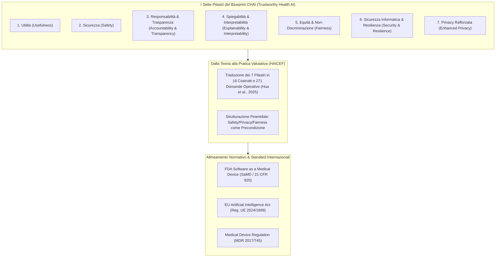

---
tags: [chai, coalition-for-health-ai, trustworthy-ai, health-ai-governance, clinical-validation, ai-safety, algorithmic-fairness, transparency, explainability]
source_papers: ["ai_v4i1e69006.pdf"]
---

# Coalition for Health AI (CHAI) Blueprint per l'IA Sanitaria Affidabile

## Definizione Operativa
- Il **Coalition for Health AI (CHAI) Blueprint** (*Blueprint for Trustworthy AI Implementation Guidance and Assurance for Healthcare*) è il quadro di riferimento programmatico sviluppato nell'aprile 2023 da una coalizione multistakeholder statunitense (comprendente leader accademici, ospedali universitari come Mayo Clinic, Johns Hopkins, Harvard/BIDMC, partner tecnologici come Microsoft e Google, ed enti regolatori) per stabilire standard operativi, linee guida di implementazione e protocolli di garanzia (*assurance*) per l'Intelligenza Artificiale in medicina e sanità pubblica.
- **I Sette Pilastri dell'IA Affidabile in Sanità:** Il Blueprint definisce 7 dimensioni cardine che ogni algoritmo o modello di intelligenza artificiale clinica deve soddisfare:
  1. **Usefulness (Utilità):** Dimostrazione di un valore clinico o operativo tangibile nel miglioramento degli esiti di salute o nell'efficienza dell'assistenza.
  2. **Safety (Sicurezza):** Prevenzione attiva del danno iatrogeno, monitoraggio continuo degli eventi avversi e contenimento dei rischi algoritmici.
  3. **Accountability and Transparency (Responsabilità e Trasparenza):** Chiara attribuzione dei ruoli lungo il ciclo di vita dell'algoritmo e comunicazione esplicita delle caratteristiche, dati di training e limiti del modello.
  4. **Explainability and Interpretability (Spiegabilità e Interpretabilità):** Resa trasparente e comprensibile dei meccanismi inferenziali e dei razionali clinici per medici e pazienti.
  5. **Fairness (Equità):** Prevenzione e correzione di bias algoritmici, sistemici e di popolazione, garantendo parità prestazionale tra coorti demografiche.
  6. **Security and Resilience (Sicurezza Informatica e Resilienza):** Protezione dei sistemi contro attacchi avversari, violazioni e tolleranza a guasti ambientali o interruzioni di rete.
  7. **Enhanced Privacy (Privacy Rafforzata):** Salvaguardia assoluta della confidenzialità dei dati sanitari protetti secondo standard avanzati di governance e conformità normativa (HIPAA, GDPR).

---

## I Sette Pilastri Fondazionali del Blueprint CHAI

### 1. Utilità Clinica (*Usefulness*)
- L'IA sanitaria non deve limitarsi a una performance statistica teorica (es. accuratezza su benchmark pubblici), ma deve dimostrare una reale utilità nel mondo reale: miglioramento della qualità delle cure, riduzione dei tempi decisionali, supporto all'aderenza terapeutica o ottimizzazione dei percorsi assistenziali.

### 2. Sicurezza Clinica e Mitigazione del Rischio (*Safety*)
- Include la tracciabilità delle fonti di dato (*data provenance*), la prevenzione delle allucinazioni cliniche e dei consigli terapeutici errati (*harm control*), e la presenza di protocolli di escalation deterministica per la gestione delle emergenze (*critical help*).

### 3. Responsabilità e Trasparenza (*Accountability & Transparency*)
- Impone la documentazione trasparente dei dati di addestramento, dell'architettura del modello, dei contesti di utilizzo autorizzati (*usage specification*) e dei confini operativi (*model limitations*). Garantisce che vi siano figure umane chiaramente identificate e responsabili per l'intero ciclo di vita del dispositivo.

### 4. Spiegabilità e Interpretabilità (*Explainability & Interpretability*)
- Distingue tra interpretabilità tecnica (per sviluppatori e revisori) e interpretabilità clinica/riflessiva (per medici e pazienti). Negli agenti generativi sanitari, la spiegabilità deve chiarire il fondamento dell'indicazione clinica senza esporre tracce di ragionamento disorientanti o fuorvianti ([[reflective-interpretability]]).

### 5. Equità Algoritmica e Giustizia Distributiva (*Fairness*)
- Richiede la valutazione disaggregata delle performance su sottogruppi di popolazione stratificati per età, sesso, genere, etnia, livello socio-economico e disabilità. Previene l'amplificazione dei bias istituzionali storici presenti nei dati sanitari.

### 6. Sicurezza Informatica e Resilienza Operativa (*Security & Resilience*)
- Valuta la resistenza a tentativi di attacco avversario, jailbreak di prompt (*persona-induced jailbreak*), iniezione di dati avversari e guasti infrastrutturali, garantendo la continuità operativa in condizioni di stress.

### 7. Privacy Rafforzata (*Enhanced Privacy*)
- Definisce standard rigorosi per il consenso informato, la crittografia dei dati in transito e a riposo, la de-identificazione certificata e il divieto categorico di condividere dati clinici intimi con terze parti o per il re-training di modelli fondazionali commerciali senza consenso esplicito.

---

## Dalla Teoria dei Principi all'Audit Empirico: L'Implementazione in HAICEF

Il Blueprint CHAI ha fornito le fondamenta concettuali per la governance dell'IA sanitaria, ma storicamente è rimasto a un livello di principio teorico. La ricerca sistematica condotta da Hua et al. (2025; *JMIR AI*) ha operazionalizzato il Blueprint CHAI all'interno del framework **HAICEF**, traducendo i 7 pilastri in:
- **Costrutti Gerarchici:** Mappatura diretta dei pilastri CHAI sui livelli di base (Safety, Security, Privacy, Fairness) e intermedi (Accountability, Transparency, Explainability, Beneficence, Validity, Reliability).
- **271 Quesiti Binarizzati/Standardizzati:** Creazione di una checklist granulare che trasforma principi etici astratti in test verificabili (es. *"Il chatbot dispone di un protocollo certificato per la deviazione di chiamate in caso di ideazione suicidaria?"*, *"I dati conversazionali vengono crittografati secondo standard HIPAA/GDPR?"*).
- **Integrazione Regolatoria:** Ponte operativo verso la conformità ai requisiti stringenti di **FDA SaMD** (21 CFR 820) e dell'**EU AI Act** (Articoli 9, 10, 13, 14, 15).

---

## Riferimenti Bibliografici
- Coalition for Health AI (CHAI). (2023). *Blueprint for Trustworthy AI: Implementation Guidance and Assurance for Healthcare*. Published online April 2023. https://www.coalitionforhealthai.org/
- Hua, Y., Xia, W., Bates, D., Hartstein, G. L., Kim, H. T., Li, M., Nelson, B. W., Stromeyer, C., IV, King, D., Suh, J., Zhou, L., & Torous, J. (2025). Standardizing and Scaffolding Health Care AI-Chatbot Evaluation: Systematic Review. *JMIR AI*, 4, e69006. https://doi.org/10.2196/69006

---

## Relazioni
- Scheda sintesi collegata: [[ai_v4i1e69006]]
- Concetti correlati: [[haicef-framework]], [[healthcare-conversational-agents]], [[five-axis-clinical-evaluation]], [[software-as-a-medical-device-salute-mentale]], [[three-layer-governance-framework]], [[reflective-interpretability]], [[audit-bias-llm-clinici]], [[modello-centauro-clinico]].
