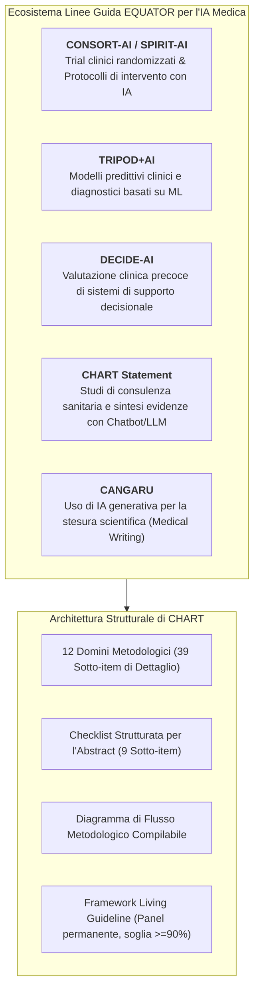
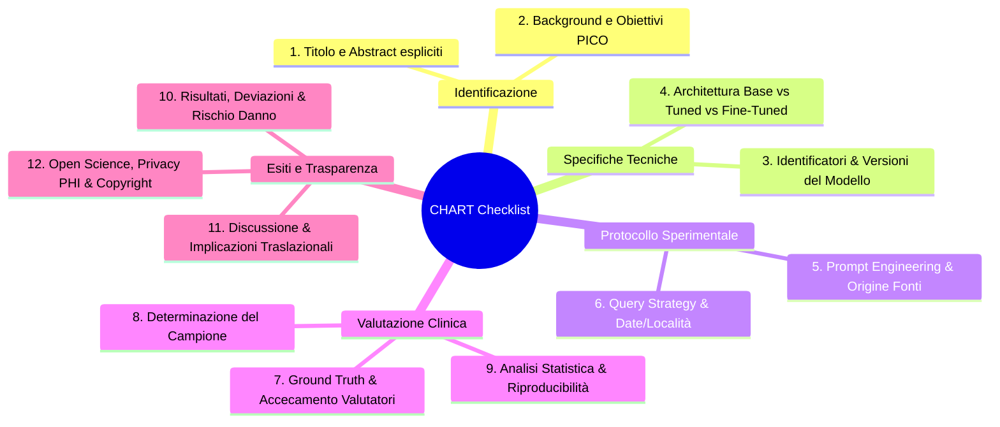
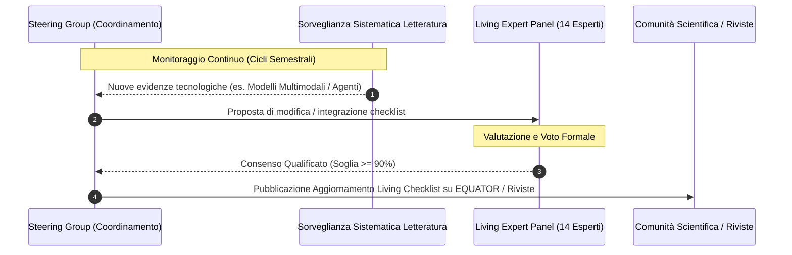

---
tags: [chart-reporting-guideline, reporting-standards, equator-network, medical-ai-transparency, clinical-nlp, living-guideline, evidence-based-medicine, prompt-reproducibility]
source_papers: ["CHART2025.pdf"]
---

# CHART Reporting Guideline (Chatbot Assessment Reporting Tool)

## Definizione Operativa
- Il **CHART Reporting Guideline** (*Chatbot Assessment Reporting Tool*) è lo standard metodologico internazionale registrato presso l'**EQUATOR Network** (*Enhancing the QUAlity and Transparency Of health Research*) progettato per guidare e standardizzare la rendicontazione degli studi di valutazione di chatbot basati su intelligenza artificiale generativa che sintetizzano evidenze cliniche o erogano consigli sanitari (*Chatbot Health Advice - CHA studies*).
- **Consenso Internazionale e Copubblicazione:** Elaborato da un consorzio globale di oltre 500 esperti tramite un rigoroso processo Delphi asincrono modificato e panel di consenso sincrono (Huo et al., 2025; *JAMA Network Open*, *The Lancet*, *NEJM-AI*, *BMJ Medicine*, *Annals of Internal Medicine*, *BJS*, *BMC Medicine*), CHART stabilisce una griglia di trasparenza articolata in **12 domini principali e 39 sotto-item**, affiancata da una checklist sintetica per l'abstract (9 item) e da un diagramma di flusso metodologico standardizzato.
- **Utilità Clinica e Metodologica:** Colma un vuoto critico nella letteratura biomedica post-ChatGPT: prima di CHART, la maggior parte degli studi su chatbot medici ometteva versioni dei modelli, prompt grezzi, date/localizzazioni delle query e criteri di determinazione del campione. CHART garantisce la riproducibilità sperimentale, la verificabilità dell'accuratezza diagnostico-terapeutica e la tracciabilità delle allucinazioni cliniche e dei bias algoritmici.

---

## I 12 Domini Metodologici della Checklist CHART

### 1. Inquadramento e Quesito di Ricerca (Item 1–2)
- **Titolo e Struttura Abstract (Item 1a-b):** Esplicitazione immediata dell'uso di chatbot basati su GenAI per sintesi di evidenze o consulenza clinica; applicazione di formato strutturato.
- **Background e Obiettivi PICO (Item 2a-b):** Rationale clinico ancorato alla letteratura; formulazione del quesito con target di popolazione, intervento IA, comparatori umani o benchmark, ed esiti primari.

### 2. Tracciabilità Tecnica del Modello (Item 3–4)
- **Identificatori e Release (Item 3a-b):** Nome commerciale, ID univoco di release/checkpoint (es. `gpt-4o-2024-05-13`, `claude-3-5-sonnet-20240620`, `gemini-1.5-pro-preview-0514`), data dell'ultimo aggiornamento e natura open-source vs commerciale/proprietaria.
- **Livello di Adattamento Architetturale (Item 4a-c):** Esplicitazione se il modello è utilizzato out-of-the-box (*base model*), tramite Retrieval-Augmented Generation (*tuned model* / RAG), o riaddestrato su corpus clinici (*fine-tuned model*), con documentazione di iperparametri (temperatura, top-p, system prompt, context length).

### 3. Rigore nel Prompt Engineering e Strategia di Query (Item 5–6)
- **Origine e Profilo degli Autori dei Prompt (Item 5a, 5ai-iii):** Delineare come i prompt sono stati generati (linee guida, casi clinici reali, simulazioni), chi li ha formulati (clinici, metodologi, pazienti/cittadini) e fornire l'intero archivio dei prompt testuali grezzi.
- **Canale e Condizioni di Query (Item 6a-d):** Canale di accesso (chiamate API batch vs interfaccia web consumer con cronologia); data esatta e coordinate geografiche (città/nazione) per controllare il dinamismo degli aggiornamenti silenti; isolamento delle sessioni di chat (nuova chat per ciascun prompt per evitare *context leakage*); rilascio degli output integrali generati.

### 4. Ground Truth, Metriche e Validazione Umana (Item 7–9)
- **Definizione della Ground Truth (Item 7a-b):** Esplicitare lo standard di riferimento clinico (linee guida internazionali, consensus di esperti, criteri nosografici formali).
- **Team di Valutazione e Accecamento (Item 7bi-iii):** Numero di valutatori, competenze cliniche, coinvolgimento di pazienti (PPI) e soprattutto **accecamento (*blinding*)** dei giudici rispetto all'identità del modello per neutralizzare bias di reputazione.
- **Campionamento e Riproducibilità Statistica (Item 8–9):** Giustificazione del volume di query; calcolo della concordanza inter-rater (Cohen's Kappa, Fleiss' Kappa, ICC) e stima della varianza deterministica/stocastica tramite test-retest ripetuti.

### 5. Rendicontazione degli Errori e Sicurezza Clinica (Item 10–11)
- **Allineamento e Tassonomia delle Deviazioni (Item 10a-b):** Quantificazione dell'accordo e classificazione dettagliata degli errori (omissioni diagnostiche, dosaggi farmacologici errati, raccomandazioni contrarie alle linee guida).
- **Rilevamento di Risposte Dannose (*Harmful Outputs*) e Bias (Item 10c):** Identificazione esplicita di allucinazioni che potrebbero causare danni fisici o psicologici ai pazienti e presenza di discriminazioni algoritmiche (età, genere, etnia).
- **Discussione e Limiti (Item 11a-c):** Contestualizzazione dei risultati, ammissione dei limiti metodologici (natura in-silico priva di interazione umana ecologica) e impatto per la clinica e la regolamentazione.

### 6. Open Science, Privacy e Governance Etica (Item 12)
- **Tutela della Privacy Sanitaria (Item 12ci):** Misure a presidio di dati sanitari protetti (*Protected Health Information - PHI*), conformità HIPAA/GDPR, assenza di trasmissione di dati sensibili a server pubblici.
- **Proprietà Intellettuale e Fair Use (Item 12cii):** Rispetto delle licenze delle linee guida o banche dati mediche utilizzate per alimentare o testare il modello.
- **Open Data & Code Repositories (Item 12d-e):** Condivisione pubblica di protocollo registrato, script di interrogazione, prompt completi, trascrizioni grezze delle risposte e matrici di scoring.

---

## Il Framework "Living Reporting Guideline"

Data la rapidissima obsolescenza tecnologica nel campo dell'IA generativa (introduzione di agenti autonomi, modelli speech-to-speech nativi e multimodali), CHART adotta la metodologia delle **Living Guidelines**:

- **Soglia di Consenso del 90%:** Per evitare aggiornamenti caotici e instabili, qualsiasi modifica ai 39 sotto-item richiede l'approvazione di almeno il 90% dei 14 membri del Living Expert Panel.
- **Ciclo di Monitoraggio Semestrale:** Incontri semestrali del nucleo di coordinamento per i primi due anni, con possibilità di convocazioni straordinarie ad interim.

---

## Differenze tra Reporting Guideline e Critical Appraisal Tool

> [!IMPORTANT]
> **Reporting vs Quality Appraisal:**
> - **CHART** è una **linea guida per la rendicontazione** (*reporting guideline*): prescrive *cosa e come* gli autori devono documentare nel manoscritto affinché lo studio sia trasparente, completo e replicabile.
> - CHART **non** è una scala di valutazione qualitativa o di rischio di bias (*risk of bias tool* come RoB 2 o PROBAST), anche se la completezza del reporting secondo CHART è il prerequisito indispensabile per applicare framework di valutazione critica (es. [[traffic-light-quality-appraisal-clinical-ai]]).

---

## Riferimenti Bibliografici
- The CHART Collaborative (Huo, B., Collins, G. S., Chartash, D., Thirunavukarasu, A. J., Flanagin, A., Iorio, A., Cacciamani, G., ..., & Guyatt, G. H.). (2025). Reporting guideline for chatbot health advice studies: The CHART Statement. *JAMA Network Open*, 8(8), e2530220. https://doi.org/10.1001/jamanetworkopen.2025.30220
- The CHART Collaborative. (2025). Reporting guidelines for chatbot health advice studies: explanation and elaboration for the Chatbot Assessment Reporting Tool (CHART). *BMJ*, 390, e083305. https://doi.org/10.1136/bmj-2024-083305
- Moher, D., Schulz, K. F., Simera, I., & Altman, D. G. (2010). Guidance for developers of health research reporting guidelines. *PLoS Medicine*, 7(2), e1000217.
- Logullo, P., MacCarthy, A., Kirtley, S., & Collins, G. S. (2020). Reporting guideline checklists are not quality evaluation forms: they are guidance for writing. *Health Science Reports*, 3(2), e165.

---

## Related pages
- [[CHART2025]]
- [[chatbot-health-advice-studies]]
- [[traffic-light-quality-appraisal-clinical-ai]]
- [[chai-blueprint-health-ai]]
- [[clinical-fidelity-assessment]]
- [[ai-research-ethics]]
- [[gdpr-governance-mental-health-ai]]
- [[prompting-in-psychology]]
- [[large-language-models]]