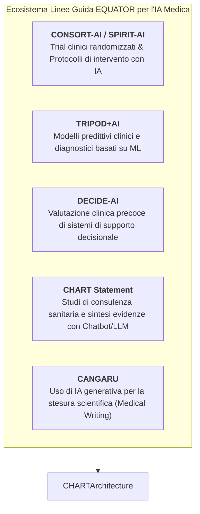

# CHART Reporting Guideline (Chatbot Assessment Reporting Tool)

## Definizione Operativa
- Il **CHART Reporting Guideline** (*Chatbot Assessment Reporting Tool*) è lo standard metodologico internazionale registrato presso l'**EQUATOR Network** (*Enhancing the QUAlity and Transparency Of health Research*) progettato per guidare e standardizzare la rendicontazione degli studi di valutazione di chatbot basati su intelligenza artificiale generativa che sintetizzano evidenze cliniche o erogano consigli sanitari (*Chatbot Health Advice - CHA studies*).
- **Consenso Internazionale e Copubblicazione:** Elaborato da un consorzio globale di oltre 500 esperti tramite un rigoroso processo Delphi asincrono modificato e panel di consenso sincrono (Huo et al., 2025), CHART stabilisce una griglia di trasparenza articolata in **12 domini principali e 39 sotto-item**, affiancata da una checklist sintetica per l'abstract (9 item) e da un diagramma di flusso metodologico standardizzato.
- **Utilità Clinica e Metodologica:** Colma un vuoto critico nella letteratura biomedica post-ChatGPT, garantendo la riproducibilità sperimentale, la verificabilità dell'accuratezza diagnostico-terapeutica e la tracciabilità delle allucinazioni cliniche e dei bias algoritmici.

## Evidenze dalla Letteratura
CHART si inserisce nell'ecosistema EQUATOR come strumento dedicato specificamente agli studi di consulenza sanitaria tramite LLM. Prima della sua introduzione, la letteratura mancava di standardizzazione su versioni dei modelli, prompt engineering e criteri di campionamento.

**Riferimenti Bibliografici:**
- The CHART Collaborative (Huo, B., Collins, G. S., et al.). (2025). Reporting guideline for chatbot health advice studies: The CHART Statement. *JAMA Network Open*, 8(8), e2530220. https://doi.org/10.1001/jamanetworkopen.2025.30220
- The CHART Collaborative. (2025). Reporting guidelines for chatbot health advice studies: explanation and elaboration for the Chatbot Assessment Reporting Tool (CHART). *BMJ*, 390, e083305. https://doi.org/10.1136/bmj-2024-083305
- Moher, D., et al. (2010). Guidance for developers of health research reporting guidelines. *PLoS Medicine*, 7(2), e1000217.
- Logullo, P., et al. (2020). Reporting guideline checklists are not quality evaluation forms: they are guidance for writing. *Health Science Reports*, 3(2), e165.

## Relazioni
- [[chart2025-1]]
- [[chatbot-health-advice-studies]]
- [[traffic-light-quality-appraisal-clinical-ai]]
- [[chai-blueprint-health-ai]]
- [[clinical-fidelity-assessment]]
- [[ai-research-ethics]]
- [[gdpr-governance-mental-health-ai]]
- [[prompting-in-psychology]]
- [[large-language-models]]