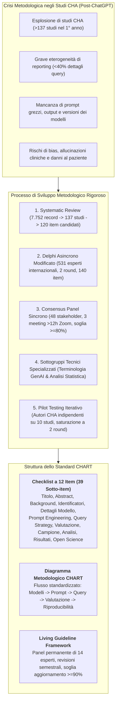
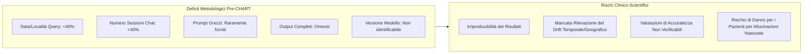
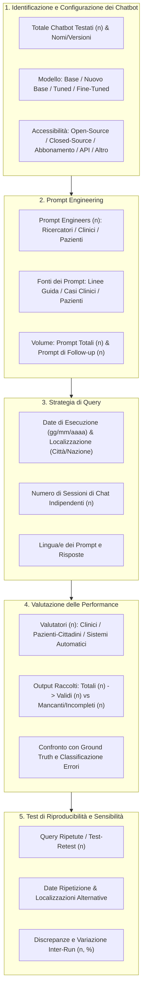

# Reporting Guideline for Chatbot Health Advice Studies: The CHART Statement (The CHART Collaborative / Huo et al., 2025)

## Definizione Operativa
- Lo **CHART Statement** (*Chatbot Assessment Reporting Tool*) è la prima linea guida internazionale standardizzata per la rendicontazione metodologica e trasparente degli studi di consulenza sanitaria erogata da chatbot basati su intelligenza artificiale generativa (*Chatbot Health Advice - CHA studies*), pubblicata congiuntamente da un consorzio internazionale multidisciplinare guidato da Bright Huo e Gordon H. Guyatt su *JAMA Network Open* (2025; doi: 10.1001/jamanetworkopen.2025.30220) e copubblicata sulle principali riviste mediche mondiali (*The Lancet*, *NEJM-AI*, *BMJ Medicine*, *Annals of Internal Medicine*, *BJS*, *BMC Medicine*, *Artificial Intelligence in Medicine*, *Surgical Endoscopy*).
- **Iniziativa EQUATOR Network:** Registrata formalmente presso l'EQUATOR Network (*Enhancing the QUAlity and Transparency Of health Research*), la linea guida si compone di una **checklist di 12 item principali articolati in 39 sotto-item**, una **checklist dedicata per l'abstract (9 item)** e un **diagramma metodologico di flusso** per tracciare la selezione dei modelli, la progettazione dei prompt, l'esecuzione delle query, la valutazione delle performance e la riproducibilità.
- **Utilità Clinica e Metodologica:** Risponde alla crisi di riproducibilità e all'eterogeneità metodologica emersa dopo l'introduzione mainstream dei Large Language Models (LLM): una systematic review preliminare su 137 studi CHA ha rivelato che meno del 40% riportava la strategia di query, la data delle interrogazioni o il numero di sessioni di chat, con frequente omissione dei prompt grezzi, degli output completi e dei dettagli architetturali dei modelli. CHART definisce uno standard rigoroso per consentire a clinici, revisori, editori e autorità regolatorie di valutare la validità, la sicurezza, il rischio di allucinazioni e l'affidabilità clinica dei consigli sanitari generati dall'AI.

## Evidenze dalla Letteratura

### 1. Inquadramento del Problema: L'Emergenza degli Studi CHA (Chatbot Health Advice)
- **Definizione di Studio CHA:** Qualsiasi indagine scientifica che valuti le prestazioni di modelli di intelligenza artificiale generativa (LLM, modelli multimodali) nell'interrogazione tramite interfaccia conversazionale per sintetizzare evidenze cliniche o fornire consigli sanitari (dalla promozione della salute alla prevenzione, screening, diagnosi, terapia o informazione medica generale).
- **Il Gap di Trasparenza Documentato:** La revisione sistematica propedeutica a CHART (Huo et al., 2025; *JAMA Netw Open*, 7.752 record esaminati) ha identificato 137 studi CHA pubblicati a meno di un anno dal rilascio di ChatGPT, evidenziando deficit critici:
  - Meno del **40%** riportava la data esatta delle query, la localizzazione geografica o il numero di sessioni di chat indipendenti impiegate.
  - Pochissimi studi descrivevano il processo di sviluppo o iterazione del prompt engineering.
  - La condivisione dei prompt originali grezzi e delle risposte testuali complete era un'eccezione anziché la norma.
  - Spesso non era possibile identificare la versione esatta, la data di release o la natura del modello (base, fine-tuned o tuned via RAG).

### 2. Metodologia di Sviluppo dello Standard CHART
Lo sviluppo ha seguito le linee guida metodologiche dell'EQUATOR Network per la creazione di reporting guideline sanitarie:

1. **Gruppo di Coordinamento (*Steering Group*):** Costituito presso la McMaster University, l'Università di Oxford e centri affiliati, con approvazione etica waivata dall'Hamilton Integrated Research Ethics Board.
2. **Revisione Sistematica e Scoping:** Registrata prospetticamente su OSF (*Open Science Framework*), ha generato un elenco iniziale di **120 item candidati**.
3. **Indagine Delphi Asincrona Modificata:**
   - 1.043 esperti internazionali invitati da diverse discipline (clinici di tutte le specialità, epidemiologi, metodologi, ricercatori di IA generativa, editor di riviste top-tier, bioeticisti, giuristi, esperti di regolamentazione, partner di pazienti).
   - **531 partecipanti (50,9%)** hanno completato entrambi i round di votazione sulla piattaforma online *Welphi* (Decision Eyes).
   - Generazione di 28 item candidati aggiuntivi (totale: **140 item valutati**).
4. **Consensus Panel Sincrono Internazionale:**
   - 48 stakeholder multidisciplinari (inclusi 4 partner di pazienti).
   - **3 riunioni sincrone su Zoom per oltre 12 ore complessive** (30 giugno, 5 agosto e 2 settembre 2024).
   - Soglia prefissata di consenso per inclusione: $\ge 80\%$.
   - Istituzione di 2 sottogruppi specialistici: uno sulla terminologia tecnica di Generative AI e uno sull'analisi statistica e metriche di riproducibilità.
5. **Pilot Testing Iterativo:** Due round condotti da gruppi di 5 autori indipendenti di studi CHA su 10 articoli pubblicati, fino al raggiungimento della piena saturazione qualitativa.

### 3. La Checklist CHART: I 12 Domini e i 39 Sotto-item

| Sezione | N° Item | Voce della Checklist CHART | Dettaglio Operativo e Razionale Metodologico |
| :--- | :---: | :--- | :--- |
| **Titolo e Abstract** | **1a** | *Titolo* | Dichiarare esplicitamente che lo studio valuta uno o più chatbot guidati da IA generativa per evidenze cliniche o consigli sanitari. |
| | **1b** | *Abstract/Summary* | Applicare una struttura formale standardizzata che riassuma fedelmente modello, prompt, reference standard e risultati quantitativi. |
| **Introduzione** | **2a** | *Background* | Descrivere il contesto clinico, il razionale scientifico e la rilevanza sanitaria della valutazione del chatbot con riferimenti bibliografici. |
| | **2b** | *Obiettivi* | Esplicitare quesiti di ricerca secondo la struttura PICO (pubblico target, intervento IA, comparatori, esiti clinici attesi). |
| **Identificatori del Modello** | **3a** | *Identificatori e Versioni* | Riportare nome esatto, codice di versione specifico e data di release/ultimo aggiornamento del modello e del chatbot. |
| | **3b** | *Accessibilità del Modello* | Dichiarare se il modello/chatbot è open-source (pesi aperti) oppure proprietario/closed-source. |
| **Dettagli del Modello** | **4a** | *Natura del Modello* | Specificare se si tratta di modello base, nuovo modello base, modello con tuning (es. RAG) o modello sottoposto a fine-tuning. |
| | **4b** | *Citazione Modello Base* | Citare le pubblicazioni e i dettagli architetturali del modello base per garantirne la tracciabilità. |
| | **4c** | *Parametri e Dati di Tuning* | Se fine-tuned o tuned, documentare i dati di training pre/post-deployment e gli iperparametri operativi (temperatura, top-p, context window). |
| **Prompt Engineering** | **5a** | *Evoluzione dei Prompt* | Descrivere il processo iterativo di sviluppo, raffinamento e test dei prompt utilizzati. |
| | **5ai** | *Origine dei Prompt* | Delineare le fonti da cui sono stati ricavati i prompt (ricercatori, clinici esperti, vignette DSM/linee guida, pazienti reali/pubblico). |
| | **5aii** | *Profilo degli Ingegneri di Prompt* | Indicare numero, qualifiche cliniche e competenze tecniche di chi ha redatto e raffinato i prompt. |
| | **5aiii** | *Coinvolgimento Pazienti/Pubblico* | Riportare ogni coinvolgimento di pazienti e cittadini (*Patient and Public Involvement - PPI*) nella co-creazione dei prompt. |
| | **5b** | *Fornitura dei Prompt Grezzi* | Fornire il testo integrale di tutti i prompt impiegati (inclusi system prompt, few-shot examples e prompt di follow-up). |
| **Strategia di Query** | **6a** | *Modalità di Accesso* | Specificare il canale di accessibilità al modello (interfaccia web consumer, abbonamento commerciale, chiamate API dirette, integrazione software). |
| | **6b** | *Data e Localizzazione Geografica* | Riportare giorno, mese, anno, città e nazione di esecuzione delle query per tenere conto del drift e della geolocalizzazione degli LLM. |
| | **6c** | *Gestione delle Sessioni di Chat* | Dichiarare se i prompt sono stati immessi in sessioni di chat separate e indipendenti (azzeramento contesto) o all'interno della medesima sessione. |
| | **6d** | *Trascrizione Integrale Output* | Rendere disponibili tutte le risposte grezze complete generate dai chatbot esaminati. |
| **Valutazione delle Performance** | **7a** | *Ground Truth / Standard di Riferimento* | Definire rigorosamente la "ground truth" (linee guida di pratica clinica, consensus expert panel, criteri nosografici formali). |
| | **7b** | *Processo di Valutazione* | Dettagliare il protocollo di scoring qualitativo e quantitativo delle risposte. |
| | **7bi** | *Composizione del Team di Valutatori* | Riportare numero, specializzazione medica, anni di esperienza clinica e ruolo degli esaminatori umani. |
| | **7bii** | *Coinvolgimento di Pazienti nella Valutazione* | Dettagliare l'eventuale ruolo di pazienti o caregiver nel valutare comprensibilità, empatia e usabilità delle risposte. |
| | **7biii** | *Accecamento (*Blinding*)* | Dichiarare se i valutatori erano all'oscuro dell'identità specifica del chatbot/modello durante lo scoring per prevenire bias di conferma. |
| **Campionamento** | **8** | *Determinazione del Campione* | Giustificare il numero di prompt, di sessioni indipendenti e di risposte analizzate (calcolo del potere o giustificazione campionaria). |
| **Analisi dei Dati** | **9a** | *Metodi Statistici e Riproducibilità* | Descrivere le analisi statistiche, inclusa la variabilità test-retest tra run ripetute (concordanza, coefficiente Kappa, ICC). |
| | **9ai** | *Metriche di Performance* | Definire con precisione le metriche utilizzate (accuratezza, completezza, tasso di allucinazione, leggibilità Flesch-Kincaid, scale Likert). |
| **Risultati** | **10a** | *Allineamento con Ground Truth* | Riportare l'accordo quantitativo e qualitativo tra output del chatbot e standard di riferimento con intervalli di confidenza. |
| | **10b** | *Caratterizzazione delle Deviazioni* | Classificare la natura, la gravità e la tipologia clinica delle risposte errate o discordanti rispetto alla linea guida. |
| | **10c** | *Valutazione Risposte Pericolose/Fuorvianti* | Rendicontare specificamente la presenza di output potenzialmente dannosi per il paziente (*harmful*), allucinazioni critiche o bias demografici. |
| **Discussione** | **11a** | *Interpretazione Clinica* | Discutere i risultati nel quadro della letteratura biomedica preesistente e della sicurezza clinica. |
| | **11b** | *Punti di Forza e Limiti* | Evidenziare punti di forza dello studio e limiti intrinseci (es. natura in-silico, assenza di follow-up longitudinale sul paziente). |
| | **11c** | *Implicazioni Traslazionali* | Delineare le ricadute pratiche per la clinica, la formazione medica, le politiche sanitarie, la regolamentazione e la ricerca futura. |
| **Open Science ed Etica** | **12a** | *Conflitti di Interesse* | Dichiarare qualsiasi conflitto di interesse finanziario o non finanziario di tutti gli autori. |
| | **12b** | *Finanziamenti* | Indicare le fonti di finanziamento e il loro eventuale ruolo nella conduzione, analisi o pubblicazione dello studio. |
| | **12c** | *Approvazione Etica* | Riportare il percorso di approvazione presso il comitato etico (IRB) o le motivazioni formali dell'esenzione (*waiver*). |
| | **12ci** | *Tutela Dati Sanitari e Privacy (PHI)* | Descrivere le misure adottate per proteggere i dati sanitari protetti (*Protected Health Information - PHI*) e prevenire fughe di dati. |
| | **12cii** | *Licenze e Copyright* | Specificare se è stata ottenuta formale autorizzazione/licenza per l'uso di materiali protetti da copyright o linee guida proprietarie. |
| | **12d** | *Protocollo dello Studio* | Fornire il link al protocollo registrato prospetticamente (es. OSF, PROSPERO). |
| | **12e** | *Disponibilità dei Dati e Codice* | Indicare il repository pubblico (GitHub, Zenodo, OSF) con prompt grezzi, codice di interrogazione, risposte e pesi/parametri del modello. |

### 4. Il Diagramma Metodologico CHART
Lo CHART Statement fornisce un diagramma di flusso metodologico compilabile (*CHART Methodological Diagram*) strutturato in 5 fasi sequenziali:

### 5. Aspetti Chiave: Dottrina del Fair Use, Sicurezza e Governance "Living"

#### A. Dottrina del Fair Use e Proprietà Intellettuale nei Modelli Medici
Lo studio analizza i 4 fattori cardine del *Fair Use* applicati agli LLM in ambito sanitario:
1. **Scopo e Natura dell'Uso (*Purpose and character*):** Valutare se l'impiego del modello ha finalità di ricerca clinica no-profit, didattica o commerciale.
2. **Natura dei Dati di Training Originali (*Nature of original data*):** Distinguere tra dati generici del web e testi medici specialistici/evidenze scientifiche proprietarie validate.
3. **Quantità e Sostanzialità del Materiale Utilizzato (*Amount and substantiality*):** Documentare se il modello ha memorizzato o sintetizzato interi capitoli di linee guida o estratti circoscritti.
4. **Impatto sul Valore Economico dell'Opera Originale (*Market impact*):** Verificare che la sintesi del chatbot non funga da sostituto parassitario delle fonti originali protette da diritto d'autore.

#### B. Protezione dei Dati Sanitari (PHI) e Prevenzione dei Bias
- Gli input immessi nelle interfacce web commerciali di LLM possono essere memorizzati sui server per il riaddestramento, violando le normative sanitarie (HIPAA, GDPR). CHART impone di esplicitare le misure di de-identificazione e le garanzie contrattuali (BAA - *Business Associate Agreement*).
- È obbligatorio valutare la presenza di distorsioni algoritmiche (*bias*) legate a etnia, sesso, genere, livello socioeconomico o lingua nei consigli sanitari erogati.

#### C. Modello "Living Reporting Guideline"
A causa della rapidissima evoluzione dell'IA generativa (modelli multimodali voce-video, sistemi agentici autonomi), lo steering group ha strutturato CHART come **Living Guideline**:
- **Sorveglianza Continua:** Ricerche sistematiche periodiche della letteratura.
- **Incontri Semestrali:** Il nucleo di coordinamento si riunisce ogni 6 mesi per i primi 2 anni (fino al 2026).
- **Living Expert Panel:** Un panel ristretto di 14 specialisti pronti a riunirsi ad interim.
- **Soglia di Aggiornamento $\ge 90\%$:** Modifiche o integrazioni ai sotto-item richiedono il 90% di consenso tra i membri del living panel, proteggendo lo standard da fluttuazioni volatili pur garantendo tempestività di adattamento.

## Implicazioni Metodologiche, Cliniche e di Governance

1. **Adozione Editoriale Mandatoria:** Le riviste mediche sono invitate a richiedere formalmente la checklist CHART compilata al momento della sottomissione di manoscritti che valutano chatbot sanitari, analogamente a quanto avvenuto con CONSORT e PRISMA.
2. **Distinzione tra Reporting e Valutazione di Qualità:** CHART è una linea guida per la stesura e la trasparenza degli studi (*reporting guideline*), non uno strumento di valutazione critica (*critical appraisal tool* o *risk of bias tool*), sebbene ne costituisca il prerequisito informativo indispensabile.
3. **Benchmarking Sicuro per le Decisioni Sanitarie:** Fornire trasparenza assoluta su parametri, prompt e geolocalizzazione permette a direzioni ospedaliere e decisori pubblici di verificare se un chatbot sia realmente pronto per l'implementazione a supporto dei pazienti o del personale sanitario.

**Riferimenti Bibliografici:**
- The CHART Collaborative (Huo, B., Collins, G. S., Chartash, D., Thirunavukarasu, A. J., Flanagin, A., Iorio, A., Cacciamani, G., ..., & Guyatt, G. H.). (2025). Reporting guideline for chatbot health advice studies: The CHART Statement. *JAMA Network Open*, 8(8), e2530220. https://doi.org/10.1001/jamanetworkopen.2025.30220
- The CHART Collaborative. (2025). Reporting guidelines for chatbot health advice studies: explanation and elaboration for the Chatbot Assessment Reporting Tool (CHART). *BMJ*, 390, e083305. https://doi.org/10.1136/bmj-2024-083305
- Huo, B., Boyle, A., Marfo, N., et al. (2025). Large language models for chatbot health advice studies: a systematic review. *JAMA Network Open*, 8(2), e2457879. https://doi.org/10.1001/jamanetworkopen.2024.57879
- CHART Collaborative. (2024). Protocol for the development of the Chatbot Assessment Reporting Tool (CHART) for clinical advice. *BMJ Open*, 14(5), e081155. https://doi.org/10.1136/bmjopen-2023-081155
- Collins, G. S., Moons, K. G. M., Dhiman, P., et al. (2024). TRIPOD+AI statement: updated guidance for reporting clinical prediction models that use regression or machine learning methods. *BMJ*, 385, e078378.
- Liu, X., Rivera, S. C., Moher, D., Calvert, M. J., Denniston, A. K.; SPIRIT-AI and CONSORT-AI Working Group. (2020). Reporting guidelines for clinical trial reports for interventions involving artificial intelligence: the CONSORT-AI Extension. *BMJ*, 370, m3164.
- Vasey, B., Nagendran, M., Campbell, B., et al.; DECIDE-AI expert group. (2022). Reporting guideline for the early-stage clinical evaluation of decision support systems driven by artificial intelligence: DECIDE-AI. *Nature Medicine*, 28(5), 924–933.

## Relazioni
- [[chart-reporting-guideline]]
- [[chatbot-health-advice-studies]]
- [[traffic-light-quality-appraisal-clinical-ai]]
- [[chai-blueprint-health-ai]]
- [[clinical-fidelity-assessment]]
- [[ai-research-ethics]]
- [[large-language-models]]
- [[prompting-in-psychology]]
- [[gdpr-governance-mental-health-ai]]
- [[healthcare-conversational-agents]]
- [[clinical-ai-simulation]]