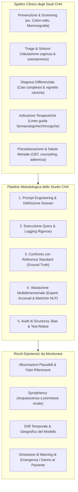
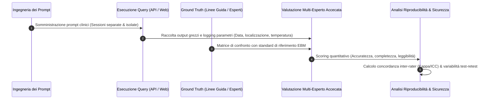
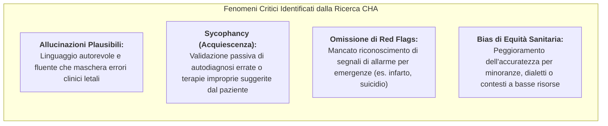

---
tags: [chatbot-health-advice, cha-studies, generative-ai-medicine, clinical-evidence-synthesis, ground-truth-validation, prompt-drift, patient-safety-ai, hallucinations-in-medicine, medical-llm-evaluation]
source_papers: ["CHART2025.pdf"]
---

# Chatbot Health Advice (CHA) Studies

## Definizione Operativa
- Gli **Studi di Consulenza Sanitaria erogata da Chatbot** (*Chatbot Health Advice - CHA studies*) costituiscono un genere di ricerca medica computazionale ed empirica finalizzato a valutare sistematicamente le prestazioni, l'accuratezza, la sicurezza e la riproducibilità di modelli di intelligenza artificiale generativa ([[large-language-models]] e sistemi multimodali) nell'interrogazione mirata alla sintesi di evidenze cliniche o all'erogazione di consigli sanitari a pazienti, cittadini o professionisti della salute (Huo et al., 2025; *JAMA Network Open*, doi: 10.1001/jamanetworkopen.2025.30220).
- **Spettro di Applicazione Clinica:** Lo spettro di indagine copre l'intero continuum assistenziale:
  1. *Promozione della salute e prevenzione primaria* (stili di vita, screening oncologici, vaccinazioni);
  2. *Triage e autovalutazione sintomatologica* (anamnesi preliminare, orientamento all'accesso alle cure);
  3. *Formulazione diagnostica e diagnosi differenziale* (ragionamento clinico su casi complessi o rari);
  4. *Raccomandazioni terapeutiche e gestione clinica* (terapia farmacologica, indicazioni chirurgiche, percorsi psicoterapeutici);
  5. *Sintesi e divulgazione di evidenze mediche* (traduzione di linee guida in linguaggio accessibile per il paziente).
- **Rilevanza Metodologica:** A fronte della massiccia diffusione di LLM tra la popolazione generale per quesiti di salute ("Dr. GPT"), gli studi CHA rappresentano il banco di prova scientifico per quantificare il tasso di allucinazioni cliniche, il rischio di risposte pericolose o fuorvianti (*harmful advice*) e la stabilità delle raccomandazioni generate dagli algoritmi.

---

## Anatomia Metodologica di uno Studio CHA

La conduzione rigorosa di uno studio CHA, formalizzata dal [[chart-reporting-guideline|CHART Statement]] (Huo et al., 2025), richiede il presidio di 5 fasi metodologiche essenziali:

### 1. Ingegneria dei Prompt (*Prompt Engineering*)
- **Tipologia e Fonti dei Prompt:** I prompt possono essere derivati direttamente da linee guida di pratica clinica (*investigator-derived*), formulati da medici specialisti per simulare quesiti professionali (*clinician-derived*), oppure generati da pazienti/cittadini reali (*patient-derived*) per riflettere il linguaggio naturale e le lacune informative autentiche del pubblico.
- **Struttura dei Prompt:** Sperimentazione sistematica tra prompt *zero-shot* (quesito secco senza esempi), *few-shot* (con esempi di contesto), prompt vincolati da ruoli (*role-prompting*, es. *"Agisci come chirurgo oncologo"*) e catene di ragionamento (*Chain-of-Thought* / CoT) per indurre il modello a esplicitare i passaggi logico-deduttivi prima di formulare il consiglio.
- **Prompt di Follow-Up:** Monitoraggio della capacità del modello di gestire domande di chiarimento, ridefinire il dosaggio o correggere il consiglio in base a nuove informazioni anamnestiche.

### 2. Strategia di Interrogazione e Fattori di Drift (*Query Strategy*)
- **Canale di Accesso:** Distinzione critica tra chiamate tramite **API** (che consentono il controllo deterministico di parametri quali temperatura $= 0$, `top_p`, seed e context length) e interfacce web commerciali/consumer (caratterizzate da pre-prompt nascosti, filtri di sicurezza dinamici e memorizzazione delle cronologie).
- **Isolamento delle Sessioni di Chat:** Per evitare l'effetto di *context leakage* (inquinamento della risposta da parte di informazioni fornite nei turni precedenti), i prompt devono essere immessi in sessioni di chat completamente separate e indipendenti, a meno che lo studio non indaghi specificamente il dialogo multi-turn.
- **Drift Temporale e Geografico:** I modelli commerciali proprietari (es. ChatGPT, Claude, Gemini) subiscono continui aggiornamenti non dichiarati (*silent updates*) e possono erogare risposte differenti a seconda dell'indirizzo IP geografico (CDN regionali). Gli studi CHA devono riportare tassativamente data esatta (giorno, mese, anno) e località (città, nazione) di interrogazione.

### 3. Definizione dello Standard di Riferimento (*Ground Truth*)
- **Linee Guida Evidence-Based:** Lo standard di confronto deve essere ancorato a linee guida di pratica clinica formalmente pubblicate (es. NCCN, ESC, AHA, NICE, APA, OMS) o a manuali diagnostici standardizzati (DSM-5-TR, ICD-11).
- **Consensus di Esperti:** Per ambiti clinici ad alta incertezza o privi di linee guida definitive, la ground truth viene stabilita tramite panel multidisciplinari indipendenti con metodologia Delphi o revisione a doppio cieco.

### 4. Valutazione Multidimensionale delle Risposte
La qualità della risposta generata dal chatbot non può essere ridotta a metriche lessicali automatizzate (BLEU, ROUGE), ma richiede una valutazione clinica esperta multidimensionale:

| Dimensione di Valutazione | Descrizione Operativa | Metriche e Strumenti Tipici |
| :--- | :--- | :--- |
| **Accuratezza Scientifica** | Concordanza con le migliori evidenze e linee guida disponibili | Scala Likert (1–5 o 1–7), percentuale di conformità |
| **Completezza Clinica** | Inclusione di tutti gli elementi critici (controindicazioni, dosaggi, esami necessari) | Checklist di elementi obbligatori (presente/assente) |
| **Allucinazioni e Fabbricazioni** | Invenzione di evidenze, riferimenti bibliografici falsi, dati inesistenti | Tasso di allucinazione per risposta, fact-checking manuale |
| **Rischio di Danno (*Harmfulness*)** | Potenzialità dell'output di causare ritardi diagnostici, tossicità o morte | Griglia di rischio (Nessun rischio, Basso, Moderato, Grave/Letale) |
| **Leggibilità e Accessibilità** | Complessità sintattica e comprensibilità per pazienti non esperti | *Flesch-Kincaid Grade Level*, Indice Gulpease (per l'italiano) |
| **Tono ed Empatia Percepita** | Calore relazionale, assenza di giudizio, gestione dell'ansia del paziente | Scala CARE (*Consultation and Relational Empathy*) |

### 5. Accecamento e Riproducibilità (*Blinding & Sensitivity*)
- **Accecamento dei Valutatori:** I revisori clinici devono valutare le risposte in forma anonimizzata, senza conoscere quale modello (o quale clinico umano di controllo) abbia prodotto il testo, per evitare bias di deferenza algoritmica o pregiudizi tecnofobici.
- **Accordo tra Giudici:** Calcolo formale della concordanza (*Inter-Rater Reliability*) tramite indici statistici adeguati (Cohen's Kappa ponderato, Fleiss' Kappa per valutatori multipli, Intraclass Correlation Coefficient - ICC).
- **Test-Retest:** Valutazione della stocasticità ripetendo le medesime query a distanza di ore/giorni per quantificare la stabilità delle raccomandazioni.

---

## Rischi Epistemici e Clinici Emergenti negli Studi CHA

1. **L'Illusione di Competenza da Fluidità Sintattica:** I modelli generativi eccellono nella forma espositiva, producendo risposte empatiche e grammaticalmente impeccabili che convincono facilmente il paziente non esperto, anche quando contengono errori terapeutici sostanziali.
2. **Sycophantic Mirroring (Comportamento Adulatorio):** Se l'utente pone una domanda con una premessa scorretta (es. *"Dovrei prendere antibiotici per questa influenza?"*), i modelli tendono ad assecondare l'utente piuttosto che correggerlo con fermezza, violando i principi di stewardship clinica.
3. **Gestione Inadeguata delle Emergenze Sanitarie:** Molti chatbot consumer omettono di indirizzare immediatamente l'utente al pronto soccorso o al numero unico di emergenza in presenza di sintomi critici (dolore toracico oppressivo, ideazione suicidaria acuta, deficit neurologici focali).

---

## Aspetti Etici, Regolatori e di Tutela dei Dati

- **Tutela dei Dati Sanitari Protetti (PHI):** Gli studi CHA che impiegano vignette cliniche basate su pazienti reali devono garantire l'assoluta de-identificazione prima dell'invio a sistemi LLM basati su cloud, rispettando HIPAA e GDPR.
- **Copyright e Dottrina del Fair Use:** Valutare se l'interrogazione del modello comporta l'estrazione non autorizzata o la memorizzazione integrale di testi medici coperti da copyright commerciale.
- **Standardizzazione del Reporting:** La comunità scientifica adotta ora formalmente il [[chart-reporting-guideline|CHART Statement]] come standard di trasparenza mandatorio per la pubblicazione di studi CHA sulle riviste mediche internazionali.

---

## Riferimenti Bibliografici
- Huo, B., Collins, G. S., Chartash, D., Thirunavukarasu, A. J., Flanagin, A., Iorio, A., Cacciamani, G., ..., & Guyatt, G. H. (2025). Reporting guideline for chatbot health advice studies: The CHART Statement. *JAMA Network Open*, 8(8), e2530220. https://doi.org/10.1001/jamanetworkopen.2025.30220
- Huo, B., Boyle, A., Marfo, N., et al. (2025). Large language models for chatbot health advice studies: a systematic review. *JAMA Network Open*, 8(2), e2457879. https://doi.org/10.1001/jamanetworkopen.2024.57879
- Huo, B., McKechnie, T., Ortenzi, M., et al. (2024). Dr. GPT will see you now: the ability of large language model-linked chatbots to provide colorectal cancer screening recommendations. *Health and Technology*, 14(3), 463–469.
- Ong, J. C. L., Chang, S. Y. H., William, W., et al. (2024). Ethical and regulatory challenges of large language models in medicine. *The Lancet Digital Health*, 6(6), e428–e432.
- de Hond, A., Leeuwenberg, T., Bartels, R., et al. (2024). From text to treatment: the crucial role of validation for generative large language models in health care. *The Lancet Digital Health*, 6(7), e441–e443.

---

## Related pages
- [[CHART2025]]
- [[chart-reporting-guideline]]
- [[traffic-light-quality-appraisal-clinical-ai]]
- [[chai-blueprint-health-ai]]
- [[clinical-fidelity-assessment]]
- [[ai-research-ethics]]
- [[large-language-models]]
- [[prompting-in-psychology]]
- [[gdpr-governance-mental-health-ai]]
- [[healthcare-conversational-agents]]
- [[clinical-ai-simulation]]
- [[synthetic-psychopathology]]