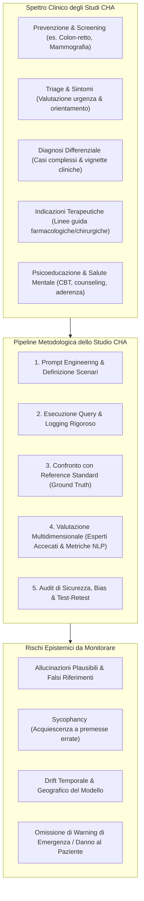
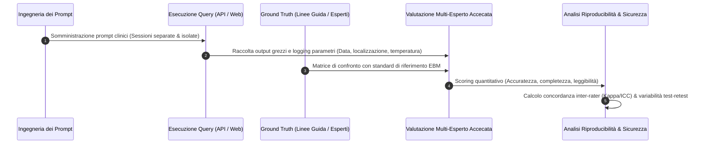

# Chatbot Health Advice (CHA) Studies

## Definizione Operativa
Gli **Studi di Consulenza Sanitaria erogata da Chatbot** (*Chatbot Health Advice - CHA studies*) costituiscono un genere di ricerca medica computazionale ed empirica finalizzato a valutare sistematicamente le prestazioni, l'accuratezza, la sicurezza e la riproducibilità di modelli di intelligenza artificiale generativa ([[large-language-models]] e sistemi multimodali) nell'interrogazione mirata alla sintesi di evidenze cliniche o all'erogazione di consigli sanitari a pazienti, cittadini o professionisti della salute (Huo et al., 2025; *JAMA Network Open*, doi: 10.1001/jamanetworkopen.2025.30220).

**Spettro di Applicazione Clinica:** Lo spettro di indagine copre l'intero continuum assistenziale:
1. *Promozione della salute e prevenzione primaria* (stili di vita, screening oncologici, vaccinazioni);
2. *Triage e autovalutazione sintomatologica* (anamnesi preliminare, orientamento all'accesso alle cure);
3. *Formulazione diagnostica e diagnosi differenziale* (ragionamento clinico su casi complessi o rari);
4. *Raccomandazioni terapeutiche e gestione clinica* (terapia farmacologica, indicazioni chirurgiche, percorsi psicoterapeutici);
5. *Sintesi e divulgazione di evidenze mediche* (traduzione di linee guida in linguaggio accessibile per il paziente).

**Rilevanza Metodologica:** A fronte della massiccia diffusione di LLM tra la popolazione generale per quesiti di salute ("Dr. GPT"), gli studi CHA rappresentano il banco di prova scientifico per quantificare il tasso di allucinazioni cliniche, il rischio di risposte pericolose o fuorvianti (*harmful advice*) e la stabilità delle raccomandazioni generate dagli algoritmi.

## Evidenze dalla Letteratura

### Anatomia Metodologica di uno Studio CHA
La conduzione rigorosa di uno studio CHA, formalizzata dal [[chart-reporting-guideline|CHART Statement]] (Huo et al., 2025), richiede il presidio di 5 fasi metodologiche essenziali:

### 1. Ingegneria dei Prompt (*Prompt Engineering*)
I prompt possono essere derivati da linee guida, medici o pazienti. Sperimentazione sistematica tra *zero-shot*, *few-shot*, *role-prompting* e *Chain-of-Thought*. Monitoraggio della capacità di gestire domande di follow-up.

### 2. Strategia di Interrogazione e Fattori di Drift (*Query Strategy*)
Distinzione tra chiamate API (deterministiche) e interfacce web commerciali. Necessità di isolamento delle sessioni di chat per evitare *context leakage*. Monitoraggio necessario per *silent updates* e variabilità geografica (CDN).

### 3. Definizione dello Standard di Riferimento (*Ground Truth*)
Ancoraggio a linee guida di pratica clinica (NCCN, ESC, NICE, ecc.) o consenso di esperti tramite metodologia Delphi.

### 4. Valutazione Multidimensionale delle Risposte
La qualità richiede una valutazione clinica esperta multidimensionale:

| Dimensione di Valutazione | Descrizione Operativa |
| :--- | :--- |
| **Accuratezza Scientifica** | Concordanza con le migliori evidenze e linee guida disponibili |
| **Completezza Clinica** | Inclusione di tutti gli elementi critici |
| **Allucinazioni e Fabbricazioni** | Invenzione di evidenze, riferimenti bibliografici falsi |
| **Rischio di Danno (*Harmfulness*)** | Potenzialità di causare ritardi o tossicità |
| **Leggibilità e Accessibilità** | Comprensibilità per pazienti non esperti |
| **Tono ed Empatia Percepita** | Calore relazionale e gestione ansia |

### 5. Accecamento e Riproducibilità (*Blinding & Sensitivity*)
Accecamento dei valutatori (blinded review), calcolo della concordanza (*Inter-Rater Reliability*) e test-retest per la stabilità.

**Riferimenti Bibliografici:**
- Huo, B., Collins, G. S., Chartash, D., Thirunavukarasu, A. J., Flanagin, A., Iorio, A., Cacciamani, G., ..., & Guyatt, G. H. (2025). Reporting guideline for chatbot health advice studies: The CHART Statement. *JAMA Network Open*, 8(8), e2530220. https://doi.org/10.1001/jamanetworkopen.2025.30220
- Huo, B., Boyle, A., Marfo, N., et al. (2025). Large language models for chatbot health advice studies: a systematic review. *JAMA Network Open*, 8(2), e2457879. https://doi.org/10.1001/jamanetworkopen.2024.57879
- Huo, B., McKechnie, T., Ortenzi, M., et al. (2024). Dr. GPT will see you now: the ability of large language model-linked chatbots to provide colorectal cancer screening recommendations. *Health and Technology*, 14(3), 463–469.
- Ong, J. C. L., Chang, S. Y. H., William, W., et al. (2024). Ethical and regulatory challenges of large language models in medicine. *The Lancet Digital Health*, 6(6), e428–e432.
- de Hond, A., Leeuwenberg, T., Bartels, R., et al. (2024). From text to treatment: the crucial role of validation for generative large language models in health care. *The Lancet Digital Health*, 6(7), e441–e443.

## Relazioni
- [[chart2025-1]]
- [[chart-reporting-guideline]]
- [[traffic-light-quality-appraisal-clinical-ai]]
- [[chai-blueprint-health-ai]]
- [[clinical-fidelity-assessment]]
- [[ai-research-ethics]]
- [[large-language-models]]
- [[prompting-in-psychology]]
- [[gdpr-governance-mental-health-ai]]
- [[healthcare-conversational-agents]]
- [[clinical-ai-simulation]]
- [[synthetic-psychopathology]]