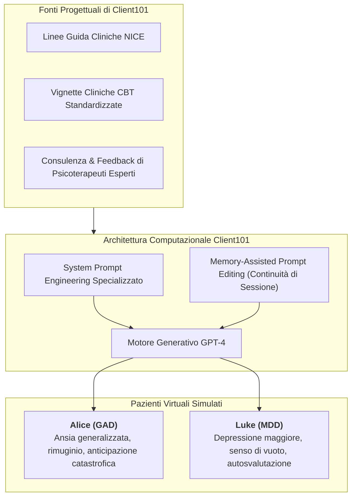
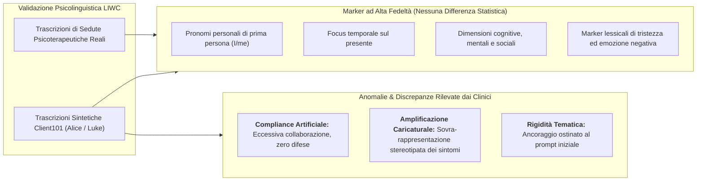
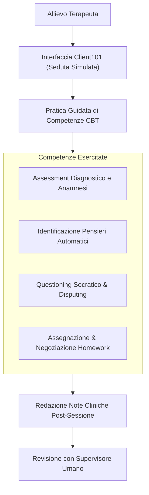

# Framework Client101 per la Simulazione di Pazienti Virtuali e Benchmarking Psicolinguistico

## Definizione Operativa
- Il **Framework Client101** (Cabrera Lozoya et al., 2025) è una piattaforma web interattiva basata su modelli linguistici generativi ([[large-language-models]], GPT-4) progettata per simulare **pazienti psicoterapeutici virtuali standardizzati**, destinata all'addestramento clinico e alla [[deliberate-practice-in-psicoterapia-ia|Deliberate Practice]] di psicologi, psichiatri e psicoterapeuti in formazione.
- **Evoluzione Storica dei Sistemi Dialogici:** Si colloca nella traiettoria evolutiva dei sistemi di simulazione in salute mentale, superando i limiti dei modelli basati su regole rigide (*ELIZA*, *PARRY*) e dei primi chatbot statistici (*ClientBot*):
  - *ELIZA (1966) / PARRY (1971):* Pattern matching superficiale, assenza di memoria contestuale.
  - *ClientBot (Tanana et al., 2019):* Dialoghi statistici limitati, frequenti rotture di coerenza logica.
  - *Client101 (2025):* Profili clinici ricchi basati su vignette CBT e linee guida NICE, coerenza multi-turno e validazione psicolinguistica avanzata.
- **Personas Cliniche Formalizzate:** Implementa due prototipi nosografici distinti:
  1. **"Alice":** Simulazione di Disturbo d'Ansia Generalizzato (GAD), caratterizzata da rimuginio, ipervigilanza e intolleranza dell'incertezza.
  2. **"Luke":** Simulazione di Disturbo Depressivo Maggiore (MDD), caratterizzato da anedonia, autosvalutazione, pensieri automatici negativi e ridotta energia.

---

## Architettura Tecnica: Memory-Assisted Prompt Editing

Uno dei principali ostacoli storici nella simulazione di pazienti tramite LLM è la perdita progressiva del contesto clinico lungo la seduta (*semantic drift* e amnesia tematica).
- **Memory-Assisted Prompt Editing:** Client101 implementa un meccanismo dinamico che riassume e inietta periodicamente i punti cardine emersi nel dialogo (fatti biografici, credenze espresse, eventi scatenanti) all'interno del prompt di sistema di ogni turno.
- **Preservazione della Coerenza Narrativa:** Consente al paziente virtuale di ricordare eventi menzionati all'inizio del colloquio, reagire in modo coerente a ristrutturazioni cognitive e mantenere una traiettoria affettiva stabile per l'intera durata della sessione.

---

## Validazione Psicolinguistica Computazionale: Analisi LIWC

Gli autori hanno sottoposto le trascrizioni generate da Client101 a una rigorosa validazione empirica, confrontando le sessioni simulate condotte da 16 professionisti della salute mentale con un corpus di trascrizioni di sedute reali mediante l'analisi **LIWC** (*Linguistic Inquiry and Word Count*).

### 1. Sovrapposizione Psicolinguistica Positiva
- I pattern linguistici profondi di Alice e Luke presentano una distribuzione statistica sovrapponibile a quella dei pazienti reali nelle categorie: *first-person pronouns*, *negative emotions*, *sadness*, *present focus* e *health references*.

### 2. Le Tre Anomalie Cliniche Emerse
Nonostante la fedeltà lessicale, la valutazione qualitativa dei clinici ha evidenziato tre limiti strutturali:
1. **Compliance Artificiale (*Artificial Compliance*):** I chatbot sono eccessivamente collaborativi, chiari e disponibili a seguire la guida del terapeuta. Manca la naturale resistenza al cambiamento, l'ambivalenza motivazionale e la complessità difensiva tipica della relazione terapeutica reale.
2. **Amplificazione Caricaturale (*Symptom Amplification*):** Il modello tende a concentrare ed esagerare continuamente i sintomi descritti nel prompt, generando risposte che rischiano di risultare stereotipate o 'da manuale'.
3. **Rigidità Tematica (*Algorithmic Rigidity*):** Il paziente virtuale fatica a deviare spontaneamente su argomenti contingenti o apparentemente scollegati, mantenendo una focalizzazione artificialmente ordinata sui soli temi della vignetta iniziale.

---

## Applicazioni Formative e Valore Pedagogico

- **Palestra Clinica a Rischio Zero:** Permette ai terapeuti in formazione di esercitarsi ripetutamente sulla conduzione di colloqui diagnostici e tecniche di ristrutturazione cognitiva senza alcun rischio iatrogeno per persone reali.
- **Consapevolezza dell'Effetto ELIZA:** Il training con Client101 richiede che gli allievi siano formati sui limiti del simulatore, evitando che internalizzino un'idea distorta di paziente ideale, passivo e privo di resistenze.

---

## Related pages
- [[Sunto_articoli]]
- [[bolt-behavioral-assessment-framework]]
- [[patient-psi-simulazione-clinica]]
- [[deliberate-practice-in-psicoterapia-ia]]
- [[diagnosis-of-thought-framework]]
- [[clinical-fidelity-assessment]]
- [[large-language-models]]
- [[ai-assisted-psychotherapy]]
