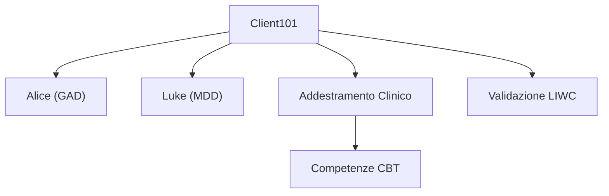

# Client101: Framework per la Simulazione di Pazienti Virtuali e Benchmarking Psicolinguistico

## Definizione Operativa
Il **Framework Client101** (Cabrera Lozoya et al., 2025) è una piattaforma web interattiva basata su modelli linguistici generativi (GPT-4) progettata per simulare **pazienti psicoterapeutici virtuali standardizzati**, destinata all'addestramento clinico e alla [[deliberate-practice-in-psicoterapia-ia|Deliberate Practice]] di psicologi, psichiatri e psicoterapeuti in formazione.

Il sistema supera i limiti dei modelli basati su regole rigide (*ELIZA*, *PARRY*) e dei primi chatbot statistici (*ClientBot*) offrendo profili clinici basati su vignette CBT e linee guida NICE, con coerenza multi-turno garantita dall'architettura **Memory-Assisted Prompt Editing**.

### Personas Cliniche
- **"Alice":** Simulazione di Disturbo d'Ansia Generalizzato (GAD), caratterizzata da rimuginio, ipervigilanza e intolleranza dell'incertezza.
- **"Luke":** Simulazione di Disturbo Depressivo Maggiore (MDD), caratterizzato da anedonia, autosvalutazione, pensieri automatici negativi e ridotta energia.

## Evidenze dalla Letteratura
La validazione del sistema è stata condotta confrontando trascrizioni sintetiche con trascrizioni di sedute reali tramite analisi **LIWC** (*Linguistic Inquiry and Word Count*).

### Validazione Psicolinguistica
I pattern linguistici di Alice e Luke presentano una distribuzione statistica sovrapponibile a quella dei pazienti reali (pronomi di prima persona, focus sul presente, marker di tristezza/emozione negativa).

### Limiti Strutturali Rilevati
1. **Compliance Artificiale:** I chatbot sono eccessivamente collaborativi, mancando della naturale resistenza e ambivalenza motivazionale.
2. **Amplificazione Caricaturale:** Tendenza a sovra-rappresentare i sintomi, risultando a volte stereotipati.
3. **Rigidità Tematica:** Difficoltà nel deviare spontaneamente su argomenti contingenti non previsti dal prompt iniziale.

**Riferimenti Bibliografici:**
- Cabrera Lozoya et al. (2025). Framework Client101 per la Simulazione di Pazienti Virtuali.

## Relazioni

- [[sunto-articoli]]
- [[bolt-behavioral-assessment-framework]]
- [[patient-psi-simulazione-clinica]]
- [[deliberate-practice-in-psicoterapia-ia]]
- [[diagnosis-of-thought-framework]]
- [[clinical-fidelity-assessment]]
- [[large-language-models]]
- [[ai-assisted-psychotherapy]]
