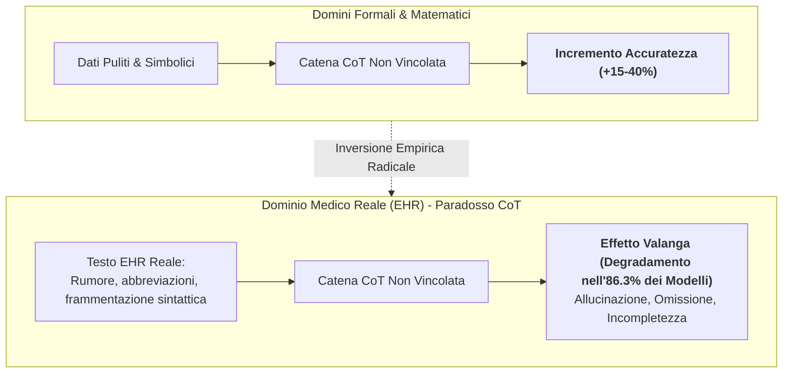
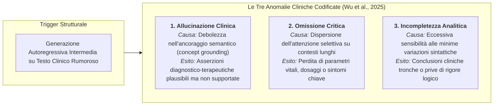
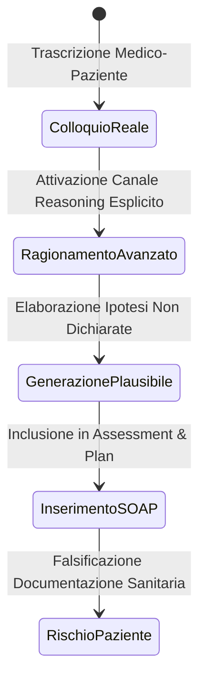
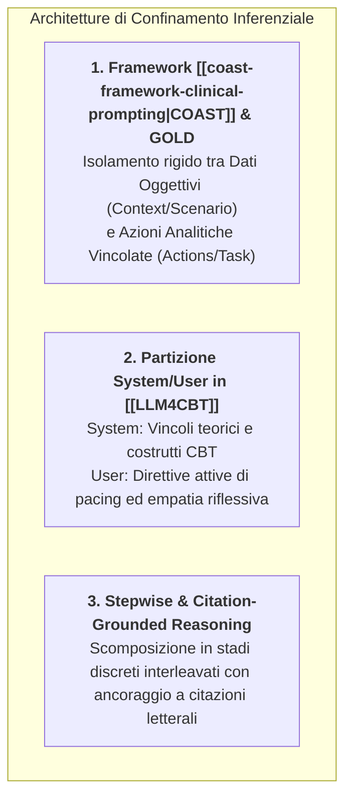

# Il Paradosso del Chain-of-Thought Clinico (Clinical CoT Paradox)

## Definizione Operativa
- Il **Paradosso del Chain-of-Thought Clinico** (*Clinical CoT Paradox*) definisce il fenomeno controintuitivo ed empiricamente validato in base al quale l'applicazione di catene logiche di deduzione sequenziale (*Chain-of-Thought* - CoT) a testi medici ed elettronici reali (cartelle cliniche elettroniche - EHR) determina un **degradamento sistematico dell'accuratezza diagnostica e dell'affidabilità clinica** rispetto a una configurazione di inferenza diretta *zero-shot* (Wu et al., 2025).
- **Inversione del Paradigma Computazionale:** Mentre nei domini formali, matematici ed educativi il CoT potenzia drasticamente le performance dei [[large-language-models|LLM]], nel testo clinico non strutturato la generazione di passaggi intermedi liberi innesca un **effetto valanga (*avalanche effect*)** di propagazione e amplificazione degli errori.
- **Entità Empirica del Fenomeno (Wu et al., 2025):** In una valutazione sistematica condotta su **95 modelli linguistici avanzati** testati su **87 task clinici multilingue** estratti da EHR reali, l'**86.3% dei modelli** ha registrato un crollo significativo delle prestazioni quando forzato a generare ragionamenti sequenziali intermedi non vincolati.

---

## I Determinanti Tecnologici e le Tre Anomalie Cliniche

L'inadeguatezza del CoT classico sui dati sanitari deriva dalla peculiare struttura dei documenti medici: i testi clinici reali sono intrinsecamente densi, privi di struttura grammaticale lineare, ricchi di sigle specialistiche non standardizzate e frammentati. La generazione autoregressiva di pensieri intermedi allontana progressivamente il modello dai fatti documentati, generando tre classi di fallimento:

### 1. Allucinazione da Perdita di Ancoraggio Semantico (*Concept Grounding Failure*)
- Nei passi generativi intermedi, il modello produce inferenze probabilistiche basate sulle proprie associazioni parametriche anziché sul testo sorgente.
- Una volta formulata un'assunzione non verificata nei primi passaggi del CoT, l'architettura autoregressiva la assume come presupposto vero per i token successivi, giungendo a conclusioni diagnostiche clinicamente pericolose ma formalmente ineccepibili.

### 2. Omissione da Dispersione Attentiva (*Attentional Dispersion*)
- La generazione di lunghe catene verbali intermedie satura la finestra di contesto operativo.
- L'attenzione selettiva del modello si disperde lungo il testo autogenerato, determinando la "dimenticanza" di elementi anamnestici cruciali presenti nell'input originario (es. allergie farmacologiche, valori pressori borderline, precedenti chirurgici).

### 3. Incompletezza da Instabilità Sintattica (*Syntactic Sensitivity*)
- I modelli linguistici dimostrano un'estrema vulnerabilità a micro-variazioni nel fraseggio del prompt quando devono articolare lunghi percorsi logici, interrompendo precocemente l'analisi differenziale o omettendo la sintesi terapeutica.

---

## Il Paradosso nei Modelli di Frontiera per Note SOAP

Ricerche mirate sulla generazione automatica di note cliniche **SOAP** (*Subjective, Objective, Assessment, Plan*) a partire da trascrizioni di colloqui medico-paziente reali hanno confermato il paradosso anche sui modelli di ragionamento avanzato di ultima generazione (come **o1** e **GPT-5.4**):

- **L'Illusione di Plausibilità:** I modelli con canali di ragionamento esplicito tendono a colmare i vuoti informativi della conversazione inferendo dettagli clinici non discussi dal medico o inventando interpretazioni nosografiche plausibili ma infondate.
- **Rischio Iatrogeno e Giuridico:** L'introduzione di note SOAP arricchite da allucinazioni deduttive contamina la documentazione sanitaria ufficiale, esponendo il personale curante a responsabilità mediche e i pazienti a trattamenti inappropriati.

---

## Strategie di Risoluzione: Scaffolding a Vincolo Rigido

Per neutralizzare il paradosso del CoT senza rinunciare alla profondità analitica, la ricerca biomedica e psicoterapeutica ha convalidato tre soluzioni architetturali di confinamento logico:

### 1. Il Framework COAST per l'Isolamento Metodologico
Il framework **[[coast-framework-clinical-prompting|COAST]]** (*Context, Objective, Actions, Scenario, Task*) costringe l'LLM a separare programmaticamente la base empirica (*Context / Scenario*) dalle operazioni deduttive (*Actions / Task*), imponendo che ogni singola inferenza clinica sia esplicitamente associata a una citazione letterale tratta dal testo sorgente.

### 2. L'Architettura LLM4CBT e il Controllo del Pacing
Nel dominio della psicoterapia cognitivo-comportamentale, l'architettura **[[LLM4CBT]]** (Kim et al., 2025) risolve il bias da problem-solving precoce dei modelli:
- Il **System Prompt** fissa le definizioni teoriche (Pensieri Automatici, Freccia Discendente);
- Lo **User Prompt** prescrive regole dinamiche di interazione: impone al modello di rallentare (*pacing*), di formulare risposte riflessive e normalizzanti e di inserire pause di fronte a resistenze del paziente, impedendo deduzioni premature non verificate.

---

## Riferimenti Bibliografici
- Wu, K., et al. (2025). Why Chain of Thought Fails in Clinical Text Understanding. *arXiv:2509.21933* / *OpenReview*.
- Source-Aware Clinical AI Group. (2026). When Reasoning Hurts: Source-Aware Evaluation of Frontier LLMs for Clinical SOAP Note Generation. *arXiv:2605.24902*.
- Kim, S., et al. (2025). Aligning large language models for cognitive behavioral therapy: a proof-of-concept study. *Frontiers in Psychiatry*, 16:1583739.
- Gallifant, J., et al. (2025). The TRIPOD-LLM reporting guideline for studies using large language models. *medRxiv*.
- Wei, J., et al. (2022). Chain-of-Thought Prompting Elicits Reasoning in Large Language Models. *NeurIPS 2022*.

---

## Relazioni
- Scheda di sintesi collegata: [[Ricerca_Prompting_LLM_Clinico_Sanitario]]
- Standard di reporting collegato: [[tripod-llm-reporting-guideline]]
- Concetti correlati: [[coast-framework-clinical-prompting]], [[stepwise-cot]], [[accuratezza-vs-fattualita-in-genai]], [[patient-psi-simulazione-clinica]], [[Clinical_AI_Blueprint]], [[prompt-experiment-gap-in-clinical-ai]], [[korsakoff-confabulazione-llm]]
