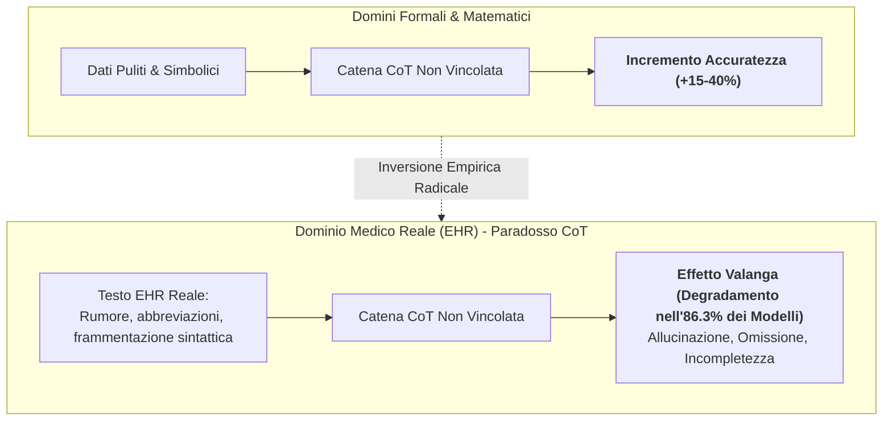

# Il Paradosso del Chain-of-Thought Clinico (Clinical CoT Paradox)

## Definizione Operativa
Il **Paradosso del Chain-of-Thought Clinico** (*Clinical CoT Paradox*) definisce il fenomeno controintuitivo ed empiricamente validato in base al quale l'applicazione di catene logiche di deduzione sequenziale (*Chain-of-Thought* - CoT) a testi medici ed elettronici reali (cartelle cliniche elettroniche - EHR) determina un **degradamento sistematico dell'accuratezza diagnostica e dell'affidabilità clinica** rispetto a una configurazione di inferenza diretta *zero-shot* (Wu et al., 2025).

*   **Inversione del Paradigma Computazionale:** Mentre nei domini formali, matematici ed educativi il CoT potenzia drasticamente le performance dei [[large-language-models|LLM]], nel testo clinico non strutturato la generazione di passaggi intermedi liberi innesca un **effetto valanga (*avalanche effect*)** di propagazione e amplificazione degli errori.
*   **Entità Empirica del Fenomeno (Wu et al., 2025):** In una valutazione sistematica condotta su **95 modelli linguistici avanzati** testati su **87 task clinici multilingue** estratti da EHR reali, l'**86.3% dei modelli** ha registrato un crollo significativo delle prestazioni quando forzato a generare ragionamenti sequenziali intermedi non vincolati.

## Evidenze dalla Letteratura
L'inadeguatezza del CoT classico sui dati sanitari deriva dalla peculiare struttura dei documenti medici: i testi clinici reali sono intrinsecamente densi, privi di struttura grammaticale lineare, ricchi di sigle specialistiche non standardizzate e frammentati. La generazione autoregressiva di pensieri intermedi allontana progressivamente il modello dai fatti documentati, generando tre classi di fallimento (Wu et al., 2025):

1.  **Allucinazione Clinica:** Debolezza nell'ancoraggio semantico (*concept grounding*) che porta ad asserzioni diagnostico-terapeutiche plausibili ma non supportate.
2.  **Omissione Critica:** Dispersione dell'attenzione selettiva su contesti lunghi, causando la perdita di parametri vitali, dosaggi o sintomi chiave.
3.  **Incompletezza Analitica:** Eccessiva sensibilità alle minime variazioni sintattiche che produce conclusioni cliniche tronche o prive di rigore logico.

Il paradosso è stato confermato anche sui modelli di ragionamento avanzato di ultima generazione (**o1**, **GPT-5.4**) nella generazione di note cliniche **SOAP**: l'illusione di plausibilità spinge il modello a colmare i vuoti informativi inferendo dettagli non discussi, creando rischi iatrogeni e giuridici.

Per neutralizzare il paradosso, sono stati convalidati framework di confinamento logico:
*   **Framework COAST:** Separa programmaticamente la base empirica dalle operazioni deduttive, ancorando ogni inferenza a citazioni letterali.
*   **Architettura LLM4CBT:** Risolve il bias da problem-solving precoce imponendo regole dinamiche di interazione (es. rallentamento del *pacing*, risposte riflessive) (Kim et al., 2025).

**Riferimenti Bibliografici:**
- Wu, K., et al. (2025). Why Chain of Thought Fails in Clinical Text Understanding. *arXiv:2509.21933* / *OpenReview*.
- Source-Aware Clinical AI Group. (2026). When Reasoning Hurts: Source-Aware Evaluation of Frontier LLMs for Clinical SOAP Note Generation. *arXiv:2605.24902*.
- Kim, S., et al. (2025). Aligning large language models for cognitive behavioral therapy: a proof-of-concept study. *Frontiers in Psychiatry*, 16:1583739.
- Gallifant, J., et al. (2025). The TRIPOD-LLM reporting guideline for studies using large language models. *medRxiv*.
- Wei, J., et al. (2022). Chain-of-Thought Prompting Elicits Reasoning in Large Language Models. *NeurIPS 2022*.

## Relazioni
- Scheda di sintesi collegata: [[ricerca-prompting-llm-clinico-sanitario]]
- Standard di reporting collegato: [[tripod-llm-reporting-guideline]]
- Concetti correlati: [[coast-framework-clinical-prompting]], [[stepwise-cot]], [[accuratezza-vs-fattualita-in-genai]], [[patient-psi-simulazione-clinica]], [[clinical-ai-blueprint]], [[prompt-experiment-gap-in-clinical-ai]], [[korsakoff-confabulazione-llm]]
