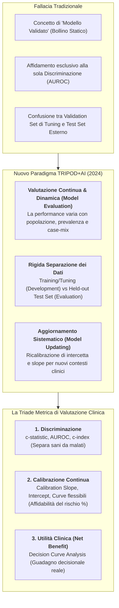
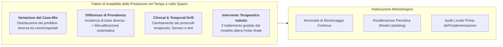
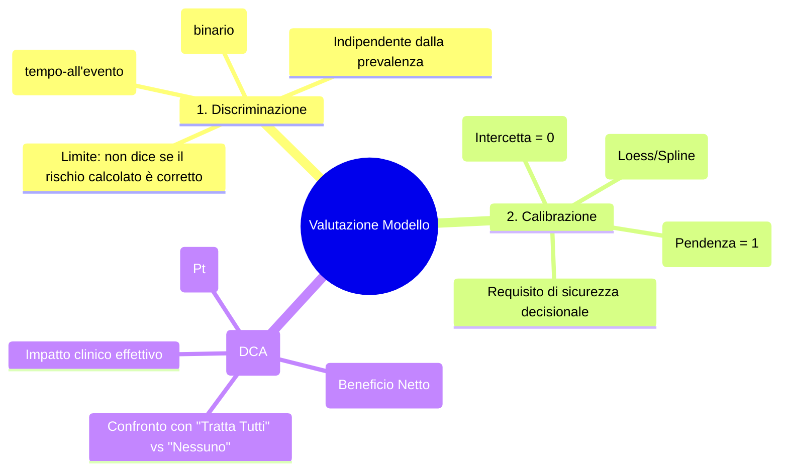
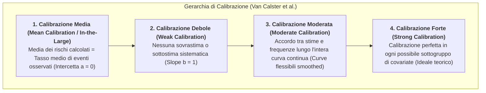
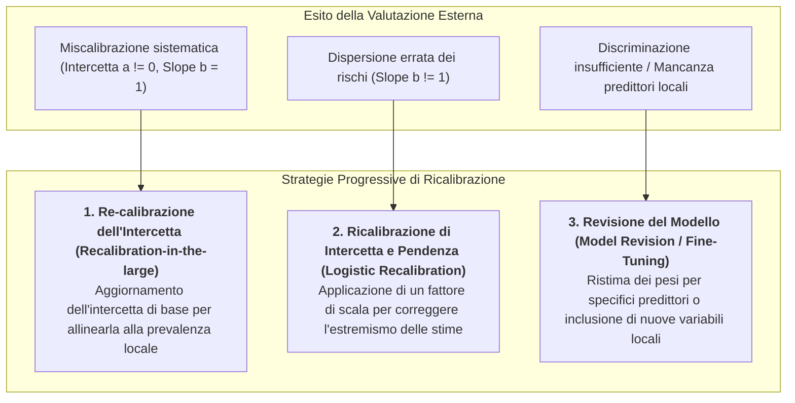

# Valutazione dei Modelli Predittivi Clinici: Metodi, Metriche ed Epistemologia della Valutazione Continua

## Definizione Operativa
- La **Valutazione dei Modelli Predittivi Clinici** (*Clinical Prediction Model Evaluation*) è l'insieme rigoroso di metodologie statistiche e quantitative impiegate per stimare l'accuratezza, l'affidabilità e l'utilità decisionale di un algoritmo predittivo (basato su regressione o machine learning) quando applicato a dati di pazienti non utilizzati durante lo sviluppo.
- **La Svolta Epistemologica: Il Rifiuto del "Modello Validato":** Come formalizzato nel consenso internazionale **TRIPOD+AI** (Collins et al., 2024; *BMJ*) e nel lavoro fondativo di Van Calster et al. (2023; *BMC Medicine*), **non esiste un modello predittivo validato in senso assoluto o permanente** (*"There is no such thing as a validated prediction model"*). La performance di un modello non è una proprietà matematica intrinseca dell'algoritmo, ma riflette l'interazione dinamica tra il modello e la specifica popolazione clinica a cui viene applicato.
- **La Triade di Valutazione delle Performance:** La valutazione rigorosa di un modello predittivo in sanità non può ridursi a una singola metrica globale (come l'AUROC), ma richiede la stima integrata di tre dimensioni complementari:
  1. **Discriminazione:** Capacità del modello di assegnare un rischio stimato più elevato a chi sviluppa l'evento rispetto a chi non lo sviluppa ($c$-statistic / AUROC / $c$-index).
  2. **Calibrazione:** Concordanza numerica puntuale tra le probabilità stimate dal modello e le frequenze reali di eventi osservate nei dati (valutata mediante *curve di calibrazione continue*, pendenza e intercetta).
  3. **Utilità Clinica e Beneficio Netto:** Guadagno decisionale effettivo ottenuto impiegando il modello per guidare le scelte terapeutiche rispetto alle strategie standard, quantificato tramite la **Decision Curve Analysis (DCA)** e il calcolo del **Beneficio Netto (*Net Benefit*)**.

---

## 1. Perché Non Esiste un Modello Predittivo "Validato"

Il passaggio concettuale da "validazione" a **valutazione continua** poggia su quattro pilastri epidemiologici:

1. **Variazione del Case-Mix e dello Spettro della Malattia:** Un modello sviluppato in un centro ospedaliero terziario ad alta complessità (con pazienti gravi e comorbilità multiple) fallirà sistematicamente se applicato nelle cure primarie, dove la maggioranza dei pazienti presenta forme lievi o asintomatiche.
2. **Differenze di Prevalenza / Incidenza di Base:** Se la prevalenza della patologia nella nuova popolazione è dimezzata rispetto alla coorte di addestramento, il modello sovrastimerà sistematicamente la probabilità di malattia in tutti i pazienti (generando un'intercetta di calibrazione negativa), pur mantenendo identica l'AUROC.
3. **Deriva Temporale e Cambiamenti di Pratica Clinica (*Temporal Drift*):** L'introduzione di nuovi esami diagnostici o di terapie più efficaci altera le traiettorie prognostiche nel corso degli anni. Un modello prognostico per lo shock settico sviluppato nel 2018 non riflette l'evoluzione dei protocolli post-pandemici.
4. **Il Paradosso dell'Intervento:** Quando un modello predittivo ad alto rischio induce il medico a intervenire tempestivamente (es. iniziando una terapia intensiva che previene l'evento infausto), l'evento predetto non si verificherà: questo fenomeno abbassa apparentemente la performance del modello nei dati osservazionali post-implementazione (*treatment-induced confounding*).

---

## 2. Le Tre Dimensioni Metodologiche della Performance

### 2.1. Discriminazione: Capacità Separativa Globale
- **Definizione:** Misura la probabilità che, data una coppia casuale di soggetti (uno che ha sviluppato l'esito e uno che non l'ha sviluppato), il modello assegni un rischio stimato più elevato al soggetto con l'esito.
- **Metriche:** 
  - $c$-statistic (concordance statistic) per esiti dicotomici, coincidente con l'Area Under the Receiver Operating Characteristic curve (**AUROC**);
  - $c$-index di Harrell o di Uno per esiti tempo-all'evento (*time-to-event / survival models*).
- **Limiti Clinici dell'AUROC:** L'AUROC valuta unicamente l'**ordinamento relativo** dei rischi, non il loro valore assoluto. Un modello che moltiplichi tutte le probabilità reali per un fattore 10 (stimando un rischio del 90% quando quello reale è del 9%) manterrà un'AUROC perfetta (1.00), pur essendo clinicamente fuorviante e potenzialmente letale per le decisioni terapeutiche.

### 2.2. Calibrazione: La Garanzia di Affidabilità del Rischio Assoluto
La calibrazione misura il grado di accordo numerico tra il rischio calcolato dall'algoritmo ($\hat{p}$) e la reale frequenza empirica dell'evento ($p$).

- **Valutazione Grafica Fondamentale:** La calibrazione deve essere sempre presentata mediante un **Calibration Plot**, ponendo sull'asse $x$ il rischio stimato e sull'asse $y$ la percentuale di eventi osservati, utilizzando curve di regressione continua non parametrica (spline o curve Loess flessibili), affiancate dalla bisettrice a 45° (calibrazione ideale perfetta).
- **Indici Quantitativi di Calibrazione:**
  - **Calibration Intercept / Calibration-in-the-Large ($a$):** Indica se il modello sovrastima sistematicamente il rischio ($a < 0$) o lo sottostima ($a > 0$). In un modello ben calibrato, $a = 0$.
  - **Calibration Slope ($b$):** 
    - Se $b = 1$, il modello presenta una perfetta dispersione dei rischi.
    - Se $b < 1$, il modello è affetto da **overfitting/estremizzazione delle predizioni**: assegna probabilità troppo vicine a 0 per i bassi rischi e troppo vicine a 1 per gli alti rischi (frequente nei modelli di deep learning e random forests non regolarizzati).
    - Se $b > 1$, il modello è affetto da *underfitting* o sub-ottimale utilizzo dell'informazione predittiva.

### 2.3. Utilità Clinica e Decision Curve Analysis (DCA)
- **Il Limite delle Misure Statistiche Pure:** Né l'AUROC né la calibrazione quantificano se l'uso del modello migliorerà gli esiti dei pazienti nella pratica reale, poiché non considerano il peso relativo tra i benefici di un vero positivo e i danni di un falso positivo (es. biopsia non necessaria o tossicità da farmaco).
- **Decision Curve Analysis (Vickers & Elkin, 2006):** Calcola il **Beneficio Netto (*Net Benefit*)** lungo un intervallo di soglie decisionali cliniche ($p_t$):

$$\text{Net Benefit} = \frac{\text{Veri Positivi}}{N} - \frac{\text{Falsi Positivi}}{N} \left( \frac{p_t}{1 - p_t} \right)$$

- **Interpretazione della Curva Decisionale:** Il modello dimostra utilità clinica se la sua curva di beneficio netto si colloca stabilmente **al di sopra delle strategie di default** (*"tratta tutti i pazienti"* e *"non trattare nessun paziente"*) all'interno della finestra di soglia decisionale considerata clinicamente rilevante dagli operatori.

---

## 3. Disambiguazione dei Dataset: Sviluppo vs Valutazione Esterna

Uno degli errori più gravi nella letteratura medica su intelligenza artificiale è la confusione tra il *validation set* interno e la vera *valutazione esterna*:

| Tipologia Dataset | Ruolo Metodologico nello Studio | Permette Scelte Architetturali? | Rischio di Bias / Sovrastima |
| :--- | :--- | :---: | :--- |
| **Training Set** | Addestramento dei pesi o stima dei coefficienti. | Sì (Fase di Fit) | Massimo (Overfitting primario). |
| **Tuning / Validation Set (Interno)** | Selezione di iperparametri, potatura, early stopping o selezione variabili. | **Sì** (Scelta del modello migliore) | **Elevato (*Optimism Bias*):** le decisioni dei ricercatori dipendono dai risultati su questo set. |
| **Internal Validation (CV / Bootstrap)** | Stima dell'ottimismo algoritmico sulla stessa popolazione di sviluppo. | No (Procedura statistica chiusa) | Misura l'overfitting interno, ma non la generalizzabilità esterna. |
| **Evaluation Set (Test Esterno Held-Out)** | Stima definitiva e non viziata delle prestazioni su soggetti e centri indipendenti. | **ASSOLUTAMENTE NO** (Valutazione cieca) | Minimo: stima fedele della generalizzabilità ecologica nel mondo reale. |

---

## 4. Strategie di Ricalibrazione e Aggiornamento (Model Updating)

Quando una valutazione esterna rileva un calo delle prestazioni di calibrazione, non è sempre necessario cestinare il modello. TRIPOD+AI raccomanda di documentare formalmente le procedure di **Model Updating**:

---

## Concetti Correlati e Connessioni Wiki
- [[tripod-ai-reporting-guideline|TRIPOD+AI Reporting Guideline]] - Linea guida internazionale di rendicontazione dei modelli predittivi
- [[TRIPOD_AI2024|Sintesi Paper TRIPOD+AI 2024 (Collins et al., BMJ)]] - Scheda dettagliata del paper fondamentale
- [[tripod-llm-reporting-guideline|TRIPOD-LLM Reporting Guideline]] - Adattamento per modelli generativi e prompt engineering
- [[cross-cultural-bias-and-fairness-audits-ai|Audit di Fairness e Bias nei Sistemi di IA Sanitaria]] - Verifica delle prestazioni disaggregate per sottogruppi
- [[dataset-integrity-and-contamination-in-medical-ai|Integrità del Dataset e Contaminazione nei Sistemi Sanitari]] - Gestione del data leakage tra train e evaluation set
- [[software-as-a-medical-device-salute-mentale|Software as a Medical Device (SaMD)]] - Requisiti di prestazione clinica per la marcatura regolatoria
