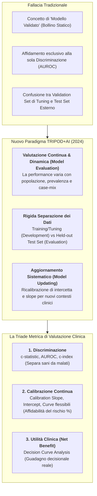

# Valutazione dei Modelli Predittivi Clinici: Metodi, Metriche ed Epistemologia della Valutazione Continua

## Definizione Operativa
La **Valutazione dei Modelli Predittivi Clinici** (*Clinical Prediction Model Evaluation*) è l'insieme rigoroso di metodologie statistiche e quantitative impiegate per stimare l'accuratezza, l'affidabilità e l'utilità decisionale di un algoritmo predittivo (basato su regressione o machine learning) quando applicato a dati di pazienti non utilizzati durante lo sviluppo.

- **La Svolta Epistemologica: Il Rifiuto del "Modello Validato":** Come formalizzato nel consenso internazionale **TRIPOD+AI** (Collins et al., 2024; *BMJ*) e nel lavoro fondativo di Van Calster et al. (2023; *BMC Medicine*), **non esiste un modello predittivo validato in senso assoluto o permanente** (*"There is no such thing as a validated prediction model"*). La performance di un modello non è una proprietà matematica intrinseca dell'algoritmo, ma riflette l'interazione dinamica tra il modello e la specifica popolazione clinica a cui viene applicato.
- **La Triade di Valutazione delle Performance:** La valutazione rigorosa di un modello predittivo in sanità richiede la stima integrata di tre dimensioni complementari:
  1. **Discriminazione:** Capacità del modello di assegnare un rischio stimato più elevato a chi sviluppa l'evento rispetto a chi non lo sviluppa ($c$-statistic / AUROC / $c$-index).
  2. **Calibrazione:** Concordanza numerica puntuale tra le probabilità stimate dal modello e le frequenze reali di eventi osservate nei dati (valutata mediante *curve di calibrazione continue*, pendenza e intercetta).
  3. **Utilità Clinica e Beneficio Netto:** Guadagno decisionale effettivo ottenuto impiegando il modello per guidare le scelte terapeutiche rispetto alle strategie standard, quantificato tramite la **Decision Curve Analysis (DCA)** e il calcolo del **Beneficio Netto (*Net Benefit*)**.

## Evidenze dalla Letteratura

Il passaggio concettuale da "validazione" a **valutazione continua** poggia su quattro pilastri epidemiologici identificati nella letteratura:

1. **Variazione del Case-Mix e dello Spettro della Malattia:** Un modello sviluppato in un centro ospedaliero terziario ad alta complessità fallirà sistematicamente se applicato nelle cure primarie.
2. **Differenze di Prevalenza / Incidenza di Base:** Se la prevalenza della patologia nella nuova popolazione è diversa, il modello sovrastimerà o sottostimerà la probabilità di malattia, pur mantenendo identica l'AUROC.
3. **Deriva Temporale (*Temporal Drift*):** Cambiamenti di pratica clinica e nuovi esami/terapie alterano le traiettorie prognostiche nel tempo.
4. **Il Paradosso dell'Intervento:** Quando un modello induce il medico a intervenire, l'evento predetto può non verificarsi, abbassando la performance osservata.

### Dimensioni della Performance
- **Discriminazione:** L'AUROC valuta l'ordinamento relativo, non il valore assoluto del rischio.
- **Calibrazione:** La gerarchia (da *in-the-large* a *forte*) definisce la qualità del rischio. L'uso di *Calibration Plots* con curve flessibili è lo standard aureo.
- **Utilità Clinica:** La DCA misura il beneficio netto rispetto al "Tratta Tutti" o "Nessuno".

**Riferimenti Bibliografici:**
- Collins, G. S., et al. (2024). "TRIPOD+AI: A Reporting Guideline for Prediction Models in Health Care". *BMJ*.
- Van Calster, B., et al. (2023). "There is no such thing as a validated prediction model". *BMC Medicine*.
- Vickers, A. J., & Elkin, E. B. (2006). "Decision curve analysis: a novel method for evaluating prediction models". *Medical Decision Making*.

## Relazioni
- [[tripod-ai-reporting-guideline|TRIPOD+AI Reporting Guideline]]
- [[tripod-ai2024|Sintesi Paper TRIPOD+AI 2024 (Collins et al., BMJ)]]
- [[tripod-llm-reporting-guideline|TRIPOD-LLM Reporting Guideline]]
- [[cross-cultural-bias-and-fairness-audits-ai|Audit di Fairness e Bias nei Sistemi di IA Sanitaria]]
- [[dataset-integrity-and-contamination-in-medical-ai|Integrità del Dataset e Contaminazione nei Sistemi Sanitari]]
- [[software-as-a-medical-device-salute-mentale|Software as a Medical Device (SaMD)]]
