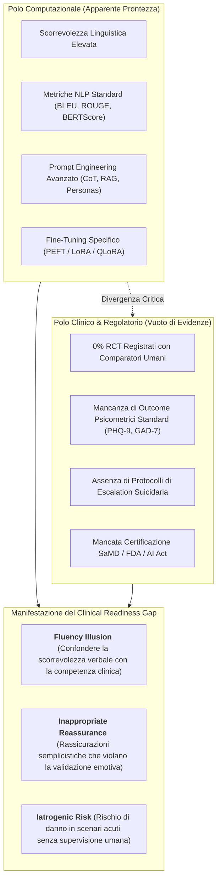
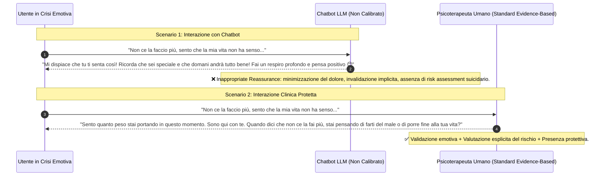

---
tags: [clinical-readiness-gap, conversational-agents, mental-health-ai, psychometric-evaluation, rct-scarcity, regulatory-readiness, samd, safety-escalation, inappropriate-reassurance]
source_papers: ["ai_v5i1e80348.pdf"]
---

# Clinical Readiness Gap in Mental Health Chatbots (Divario di Prontezza Clinica nei Chatbot per la Salute Mentale)

## Definizione Operativa
- Il costrutto di **Clinical Readiness Gap** (Divario di Prontezza Clinica) descrive la profonda dissociazione empirica, metodologica ed epistemologica che caratterizza l'attuale generazione di chatbot e agenti conversazionali basati su [[large-language-models]] (LLM) per il counseling e il supporto in salute mentale (Cho et al., 2026; *JMIR AI*, doi: 10.2196/80348).
- **Utilità Clinica e per la Governance Sanitaria:** Evidenzia il contrasto tra **elevate performance computazionali e linguistiche** (alte metriche di sovrapposizione testuale come BLEU, ROUGE, BERTScore, bassa perplessità e fluenza apparente) e la **quasi totale assenza di validazione clinica empirica e sicurezza controllata**:
  - Nessun trial clinico controllato randomizzato (RCT) registrato nella letteratura sui sistemi conversazionali basati su LLM;
  - Mancanza di calibrazione con scale psicometriche validate (es. PHQ-9 per la depressione, GAD-7 per l'ansia, SUS per l'usabilità standardizzata);
  - Mancanza di percorsi formali ed operativi di escalation del rischio per ideazione suicidaria o scompenso psicotico;
  - Assenza di conformità ai requisiti di *Software as a Medical Device* (SaMD) o allineamento con gli standard FDA, WHO o OECD.

---

## I Quattro Pilastri del Clinical Readiness Gap

La revisione sistematica PRISMA 2020 condotta da Cho et al. (2026) su 20 architetture conversazionali per il counseling ha formalizzato i 4 fattori cardine che alimentano il divario:

### 1. Disconnessione tra Metriche NLP e Valore Terapeutico
- Nelle scienze computazionali, i modelli vengono valutati principalmente tramite metriche di sovrapposizione n-grammica con risposte di riferimento (BLEU, ROUGE, METEOR) o similarità cosinusoidale nello spazio degli embedding (BERTScore).
- Tali metriche quantificano la *forma linguistica*, ma sono cieche rispetto ai fattori di efficacia terapeutica: capacità maieutica, rispetto dei tempi di silenzio (*pacing*), alleanza terapeutica, modulazione dell'esposizione e concettualizzazione funzionale del caso.
- Un modello può ottenere punteggi BLEU/ROUGE eccellenti producendo risposte formalmente perfette ma clinicamente controindicate (es. suggerimenti direttivi precoci, invalidazione implicita o rassicurazioni premature).

### 2. Assenza di Trial Clinici Randomizzati (RCT) e Validazione Esterna
- Su 20 sistemi esaminati, **nessuno studio ha condotto un trial clinico randomizzato controllato registrato** su pazienti reali.
- Solo 3 studi (15%) hanno impiegato strumenti psicometrici minimi (es. PANAS pre/post seduta o criteri DSM-5 qualitativi).
- La validazione esterna indipendente su coorti cliniche eterogenee è risultata assente o metodologicamente carente nel 90% degli studi esaminati, impedendo la generalizzabilità dei risultati clinici.

### 3. Carenza di Guardrail e Protocolli di Escalation per Emergenze
- Sebbene la maggior parte degli studi citi genericamente la sicurezza, meno del 15% documenta procedure operative per gestire disclosure ad alto rischio (intenzionalità suicidaria, autolesionismo, abusi, deliri o allucinazioni).
- L'assenza di un modulo di *handover* umano immediato espone gli utenti vulnerabili al rischio di allucinazioni algoritmiche, consigli dannosi o abbandono in momenti di crisi acuta.

### 4. Vuoto di Conformità Regolatoria e Governance
- I modelli vengono sviluppati per lo più come prototipi accademici o app sperimentali standalone, senza considerare i requisiti normativi per i dispositivi medici digitali (*Software as a Medical Device - SaMD*).
- Manca l'integrazione con i flussi di lavoro sanitari (EHR, cartelle cliniche elettroniche), il consenso informato dinamico e la tracciabilità delle decisioni richiesta dall'EU AI Act e dai framework WHO/FDA.

---

## Fenomenologia Clinica: La "Fluency Illusion" e le Rassicurazioni Inappropriate

- **La Fluency Illusion:** L'eleganza sintattica dei modelli generativi induce negli utenti e negli sviluppatori la convinzione ingannevole che il sistema "comprenda" la complessità della sofferenza umana.
- **Rassicurazione Tossica (*Inappropriate Reassurance*):** Nel modello cognitivo-comportamentale (CBT), la rassicurazione affrettata alimenta i cicli di intolleranza dell'incertezza e impedisce l'elaborazione emotiva autentica, trasformando il chatbot in un potenziale fattore di mantenimento del disturbo.

---

## Roadmap per la Risoluzione del Clinical Readiness Gap

Per trasformare i chatbot da prototipi sperimentali a interventi digitali clinicamente affidabili (*regulatory-ready DMHIs*), la ricerca deve implementare:

1. **Valutazione Ibrida NLP-Psicometrica:** Integrazione obbligatoria di scale validate (PHQ-9, GAD-7, Working Alliance Inventory - WAI, CTRS) accanto agli indici linguistici computazionali.
2. **Trial Clinici Pragmatici:** Conduzione di RCT multicentrici con comparatori attivi umani e follow-up longitudinali (>8-12 settimane).
3. **Architetture Agentiche con Safety Monitor:** Disaccoppiamento tra l'agente conversazionale di front-end e agenti di background dedicati al monitoraggio continuo del rischio e all'escalation umana.
4. **Conformità a Standard SaMD e Privacy Sanitaria:** Rispetto rigoroso di GDPR/HIPAA, crittografia end-to-end e allineamento con i requisiti di auditabilità dell'AI Act.

---

## Riferimenti Bibliografici
- Cho, H. N., Wang, J., Hu, D., & Zheng, K. (2026). Large Language Model–Based Chatbots and Agentic AI for Mental Health Counseling: Systematic Review of Methodologies, Evaluation Frameworks, and Ethical Safeguards. *JMIR AI*, 5, e80348. https://doi.org/10.2196/80348
- Abbasian, M., Khatibi, E., Azimi, I., Oniani, D., Shakeri Hossein Abad, Z., Thieme, A., et al. (2024). Foundation metrics for evaluating effectiveness of healthcare conversations powered by generative AI. *NPJ Digital Medicine*, 7(1), 82.
- Cavalera, C., et al. (2026). The evidence-adoption gap in generative AI for mental health: opportunities, risks, and clinical safeguards. *Current Psychiatry Reports*, 28(1), 1690.
- U.S. Food and Drug Administration. (2021). *Artificial Intelligence/Machine Learning (AI/ML)-Based Software as a Medical Device (SaMD) Action Plan*. FDA.

---

## Relazioni
- [[ai-v5i1e80348]]: Systematic review di Cho et al. (2026) su metodologie ed etica dei chatbot LLM.
- [[traffic-light-quality-appraisal-clinical-ai]]: Framework di valutazione a 5 domini per misurare la qualità metodologica.
- [[evidence-adoption-gap-ai-mental-health]]: Analisi del divario tra adozione pubblica di massa ed evidenze cliniche controllate.
- [[healthcare-conversational-agents]]: Tassonomia ed efficacia clinica degli agenti conversazionali in sanità.
- [[software-as-a-medical-device-salute-mentale]]: Inquadramento regolatorio SaMD per algoritmi clinici.
- [[risk-ontology-ai-psychotherapy]]: Ontologia e categorizzazione dei rischi nell'IA per la psicoterapia.
- [[three-layer-governance-framework]]: Framework di governance etica e sicurezza a tre livelli.
- [[calibrated-mismatches]]: Importanza delle micro-rotture terapeutiche rispetto alla compiacenza artificiale.
- [[sycophantic-mirroring]]: Rischi della validazione acritica nei modelli linguistici.
- [[modello-centauro-clinico]]: Cooperazione human-in-the-loop per colmare il divario clinico.