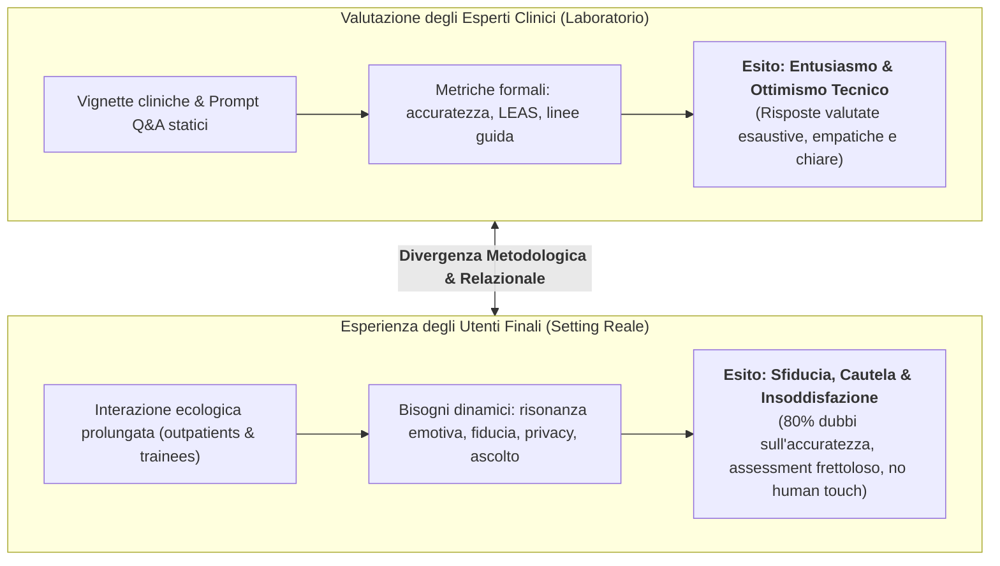
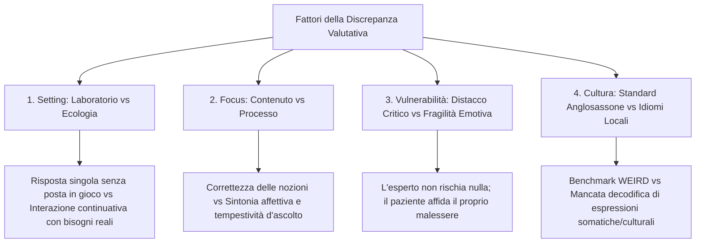

# Discrepanza di Valutazione Clinico-Utente nell'IA per la Salute Mentale

## Definizione Operativa
- La **Discrepanza di Valutazione Clinico-Utente (*Clinician vs. User Evaluation Discrepancy*)** descrive il divario sistematico e metodologico riscontrato nella ricerca su modelli linguistici (LLM) applicati alla salute mentale tra le valutazioni formali condotte da **esperti clinici** (altamente positive su accuratezza, chiarezza, esaustività e pertinenza tecnica) e l'esperienza soggettiva vissuta dagli **utenti finali reali** (pazienti ambulatoriali e tirocinanti in psicoterapia, che evidenziano sfiducia, alienazione emotiva, superficialità d'ascolto e barriere relazionali) (Wang et al., 2025).
- **Utilità Clinica e Psicoterapia:** Questo costrutto mette in guardia contro l'illusione di prontezza clinica (*clinical readiness illusion*) derivante da benchmark di laboratorio artificiali, evidenziando che l'eccellenza informativa di un LLM su vignette fittizie non si traduce automaticamente in efficacia terapeutica o alleanza di lavoro ecologica.

---

## Evidenze Empiriche e Meccanismi Sottostanti

### 1. Il Polo degli Esperti: Ottimismo Tecnico su Task Isolati
Nelle sperimentazioni basate su task strutturati a risposta singola (*task-based evaluation*), i revisori esperti attribuiscono punteggi di eccellenza alle risposte della GenAI:
- **Psicoeducazione di Qualità Medica:** Urologi e psicoterapeuti hanno valutato le risposte di ChatGPT su salute sessuale e psicopatologia come complete, accurate, empatiche e con elevata riproducibilità (Maurya et al., 2025; Razdan et al., 2024).
- **Consapevolezza Emotiva Superiore alla Norma:** Su scenari standardizzati LEAS, ChatGPT-3.5 ha superato la norma della popolazione generale umana con un giudizio di appropriatezza contestuale quasi unanime tra psicologi valutatori (Elyoseph et al., 2023).
- **Allineamento Prognostico:** GPT-4, Bard e Claude hanno formulato stime prognostiche sulla schizofrenia indistinguibili da quelle dei clinici esperti (Elyoseph & Levkovich, 2024).

### 2. Il Polo degli Utenti: Sfiducia, Disconnessione e Rushed Assessment
Negli studi che coinvolgono partecipanti umani in contesti d'uso reale o ecologico, emergono profonde criticità qualitative e quantitative (Wang et al., 2025):
- **Ansia Epistemica e Sfiducia nell'Accuratezza:** Nel trial clinico di Alanezi (2024) su pazienti con ansia e depressione, l'**80% (19/24) dei partecipanti ha espresso dubbi radicali sull'accuratezza e l'affidabilità** delle informazioni fornite dall'IA, temendo indicazioni errate.
- **Assessment Prematuro e Assenza di Ascolto (*Rushed Recommendations*):** I pazienti hanno lamentato che il chatbot passava immediatamente alla dispensazione di consigli e prescrizioni comportamentali senza dedicare spazio all'approfondimento diagnostico o all'esplorazione anamnestica dei sintomi, generando un senso di invalidazione clinica (Alanezi, 2024).
- **Assenza di Presenza Umana Autentica (*Lack of Human Touch*):** Circa la metà dei pazienti ha riferito che l'incapacità dell'agente di provare empatia corporea/umana autentica ha ridotto drasticamente la motivazione a mantenere l'ingaggio terapeutico.
- **Scetticismo dei Tirocinanti in Psicoterapia:** Studenti e specializzandi in counseling hanno espresso forte diffidenza verso l'impiego formativo e clinico della GenAI, richiamando rischi di privacy dei dati, violazioni deontologiche e bias algoritmici intrinseci (Gore & Dove, 2025).

---

## Dimensioni Esplicative della Discrepanza

1. **Laboratorio vs Mondo Reale (*Setting Artifact*):**
   - Il test su vignette isola il modello da variabili di disturbo, fornendo prompt puliti e sintetici. Nell'interazione reale, l'utente porta domande ambigue, frammentate, cariche di ansia e aspettative contraddittorie.
2. **Cognizione vs Risonanza Affettiva:**
   - Gli esperti giudicano la *struttura semantica* e la *conformità alle linee guida*; i pazienti vivono l'*alleanza terapeutica*, la sensazione di sentirsi accolti, il timing delle risposte e il calore interpersonale.
3. **Mancanza di Calibrazione Culturale:**
   - Modelli addestrati su corpora WEIRD anglofoni falliscono nell'interpretare idiomi culturali del disagio (es. somatizzazione in popolazioni arabe o asiatiche), generando un senso di estraneità culturale nel paziente reale non rilevabile dal valutatore occidentale (Ryder et al., 2008; Sue, 2006).

---

## Raccomandazioni Metodologiche per la Ricerca Clinica

- **Integrazione Obbligatoria di Trial Utente:** Nessun sistema di IA per la salute mentale dovrebbe essere dichiarato "clinicamente valido" basandosi esclusivamente sul giudizio di esperti su prompt sintetici.
- **Protocolli di Co-Design Partecipativo:** Coinvolgere attivamente pazienti, associazioni di utenti e terapeuti in formazione nello sviluppo e nell'iterazione dei prompt di sistema.
- **Valutazione del Processo Terapeutico:** Misurare non solo l'accuratezza finale, ma metriche di processo relazionale: *Working Alliance Inventory (WAI-Short)*, tempestività dell'esplorazione anamnestica e gestione delle rotture dell'alleanza.
- **Modello Centauro Assistivo:** Riconoscere che l'IA eccelle come supporto informativo/psicoeducativo, ma necessita della mediazione del clinico umano per la tenuta dell'alleanza e la validazione diagnostica.

---

**Riferimenti Bibliografici:**
- Wang, L., Bhanushali, T., Huang, Z., Yang, J., Badami, S., & Hightow-Weidman, L. (2025). Evaluating Generative AI in Mental Health: Systematic Review of Capabilities and Limitations. *JMIR Mental Health*, 12, e70014. https://doi.org/10.2196/70014
- Alanezi, F. (2024). Assessing the effectiveness of ChatGPT in delivering mental health support: a qualitative study. *Journal of Multidisciplinary Healthcare*, 17, 461–471. https://doi.org/10.2147/JMDH.S447368
- Elyoseph, Z., Hadar-Shoval, D., Asraf, K., & Lvovsky, M. (2023). ChatGPT outperforms humans in emotional awareness evaluations. *Frontiers in Psychology*, 14, 1199058. https://doi.org/10.3389/fpsyg.2023.1199058
- Elyoseph, Z., & Levkovich, I. (2024). Comparing the perspectives of generative AI, mental health experts, and the general public on schizophrenia recovery: case vignette study. *JMIR Mental Health*, 11, e53043. https://doi.org/10.2196/53043
- Gore, S., & Dove, E. (2025). Ethical considerations in the use of artificial intelligence in counselling and psychotherapy training: a student stakeholder perspective—a pilot study. *Counselling and Psychotherapy Research*, 25(1), 2024. https://doi.org/10.1002/capr.12770
- Maurya, R. K., Montesinos, S., Bogomaz, M., & DeDiego, A. C. (2025). Assessing the use of ChatGPT as a psychoeducational tool for mental health practice. *Counselling and Psychotherapy Research*, 25(1). https://doi.org/10.1002/capr.12759
- Razdan, S., Siegal, A. R., Brewer, Y., Sljivich, M., & Valenzuela, R. J. (2024). Assessing ChatGPT’s ability to answer questions pertaining to erectile dysfunction: can our patients trust it? *International Journal of Impotence Research*, 36(7), 734–740. https://doi.org/10.1038/s41443-023-00797-z
- Ryder, A. G., Yang, J., Zhu, X., et al. (2008). The cultural shaping of depression: somatic symptoms in China, psychological symptoms in North America? *Journal of Abnormal Psychology*, 117(2), 300–313. https://doi.org/10.1038/0021-843X.117.2.300
- Sue, S. (2006). Cultural competency: from philosophy to research and practice. *Journal of Community Psychology*, 34(2), 237–245. https://doi.org/10.1002/jcop.20095

---

## Relazioni
- Vedi anche: [[mental-v12-e70014]], [[single-task-zero-shot-evaluation-trap]], [[simulated-empathy-vs-authentic-presence]], [[digital-therapeutic-alliance]], [[modello-centauro-clinico]], [[cultural-adaptation-in-mental-health-llms]], [[five-domain-chatbot-validation-framework]], [[algorithmic-paternalism-in-ai-mental-health]], [[credibility-gap]], [[genuineness-gap]]
