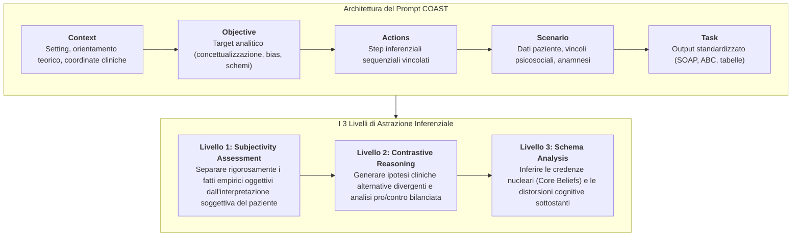
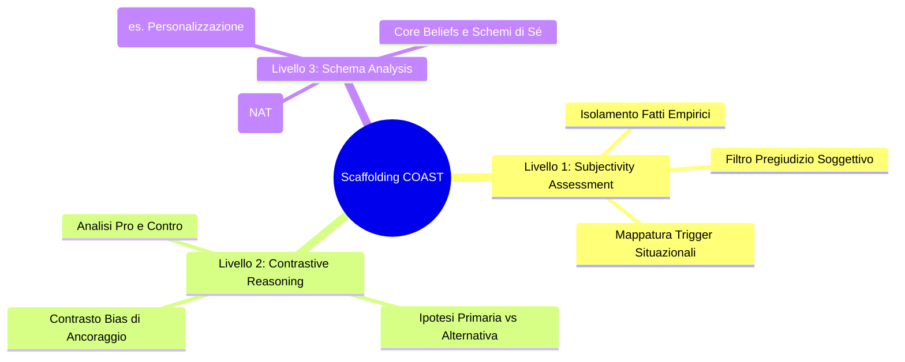
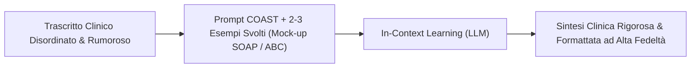

# Framework COAST e Prompting Clinico a Livelli di Astrazione

## Definizione Operativa
- Il **Framework COAST** è una metodologia strutturata di prompt engineering clinico progettata per proceduralizzare le richieste rivolte ai [[large-language-models]] (LLM) in contesti psicoterapeutici e di salute mentale, trasformando istruzioni vaghe in una rigida **impalcatura cognitiva (*cognitive scaffolding*)**.
- **La Struttura Pentapartita COAST:**
  1. **C - Context (Contesto):** Definizione del setting clinico, dell'orientamento teorico (es. CBT standard, ACT, terapia metacognitiva) e delle coordinate epidemiologico-anamnestiche.
  2. **O - Objective (Obiettivo):** Dichiarazione esplicita del target clinico dell'analisi (es. concettualizzazione del caso, estrazione di pensieri automatici disfunzionali, individuazione di trigger situazionali ed evitamenti).
  3. **A - Actions (Azioni):** Sequenza logico-metodologica vincolata di passi inferenziali che il modello deve eseguire in modo sequenziale.
  4. **S - Scenario (Scenario):** Vincoli anagrafici, elementi psicosociali, fattori di mantenimento e caratteristiche del paziente.
  5. **T - Task (Task):** Formato di output standardizzato e strutturato richiesto (es. note cliniche SOAP, schema ABC cognitivo, formulazione condivisa a tabella).
- **I Tre Livelli di Astrazione Deduttiva:** COAST vincola il ragionamento del modello a seguire una progressione a 3 stadi gerarchici (*Subjectivity Assessment* $\rightarrow$ *Contrastive Reasoning* $\rightarrow$ *Schema Analysis*), impedendo il salto prematuro a conclusioni diagnostiche affrettate (*premature closure*) e il tipico bias di problem-solving precoce dei modelli generativi commerciali.

---

## I Tre Livelli di Astrazione nel Ragionamento Clinico Assistito

### Livello 1: Subjectivity Assessment (Valutazione della Soggettività)
- **Scopo:** Decontaminare i dati grezzi del paziente, separando nettamente i fatti oggettivi osservabili (es. *"Il responsabile non ha risposto alla mia email entro due ore"*) dalle interpretazioni, inferenze e proiezioni soggettive del paziente (es. *"Vuole licenziarmi e pensa che io sia incompetente"*).
- **Funzione Clinica:** Impedisce al modello di allinearsi acriticamente alla narrazione catastrofica del paziente, ponendo le basi per l'esame di realtà e la ristrutturazione cognitiva.

### Livello 2: Contrastive Reasoning (Ragionamento Contrastivo)
- **Scopo:** Forzare il modello linguistico a produrre molteplici ipotesi esplicative divergenti e plausibili per la medesima situazione clinica, valutandone criticamente le evidenze a favore e contrarie.
- **Funzione Clinica:** Neutralizza il naturale bias di conferma dell'algoritmo, sbloccando la fissità interpretativa del clinico in formazione e favorendo il pensiero differenziale prima di formulare la concettualizzazione definitiva.

### Livello 3: Schema Analysis (Analisi degli Schemi Profondi)
- **Scopo:** Identificare le distorsioni cognitive sistematiche (es. *Personalizzazione*, *Pensiero Dicotomico*, *Catastrofizzazione*, *Iper-generalizzazione*) e risalire induttivamente ai *Core Beliefs* e agli schemi maladattivi precoci sottostanti.
- **Funzione Clinica:** Eleva l'analisi dal livello puramente descrittivo/sintomatologico a quello eziopatogenetico e funzionale, in piena aderenza ai modelli CBT avanzati.

---

## Integrazione Metodologica: Few-Shot Prompting e In-Context Learning

- **Il Fallimento del Zero-Shot Astratto:** Fornire a un LLM indicazioni generiche in linguaggio naturale (*"Sii un buon terapeuta ed estrai i pensieri disfunzionali"*) genera risposte prolisse, ridondanti e instabili, con perdita di aderenza tassonomica.
- **In-Context Learning Strutturato:** L'inserimento nel prompt COAST di **2 o 3 coppie input-output (Few-Shot Prompting)** contenenti casi clinici fittizi risolti (ad esempio frammenti di seduta con relativa compilazione di schede SOAP o griglie ABC Beckiane) guida l'attenzione del modello verso la sintassi clinica desiderata, garantendo elevata consistenza e riproducibilità.

---

## Riferimenti Bibliografici
- *L'Intelligenza Artificiale Generativa in Psicoterapia: Dalla Scatola Nera alla Pratica Clinica Sicura* (`Clinical_AI_Blueprint.pdf`).
- Beck, J. S. (2020). *Cognitive Behavior Therapy: Basics and Beyond* (3rd ed.). Guilford Press.
- Bousquet, J., et al. (2024). Multi-agent exploratory thinking and demographic swapping for mitigating algorithmic diagnostic bias. *Journal of Medical Artificial Intelligence*.
- Wu, K., et al. (2025). The Avalanche Effect: How Chain-of-Thought Reasoning Degrades Performance on Unstructured Real-World Clinical Records. *Nature Digital Medicine*.

---

## Relazioni
- Scheda sintesi collegata: [[Clinical_AI_Blueprint]]
- Concetti correlati: [[mind-safe-framework]], [[patient-psi-simulazione-clinica]], [[chart-reporting-guideline]], [[cbt-dialogue-systems-and-tools]], [[llm-case-conceptualization-pipeline]], [[stepwise-cot]], [[audit-bias-llm-clinici]], [[deliberate-practice-in-psicoterapia-ia]].
