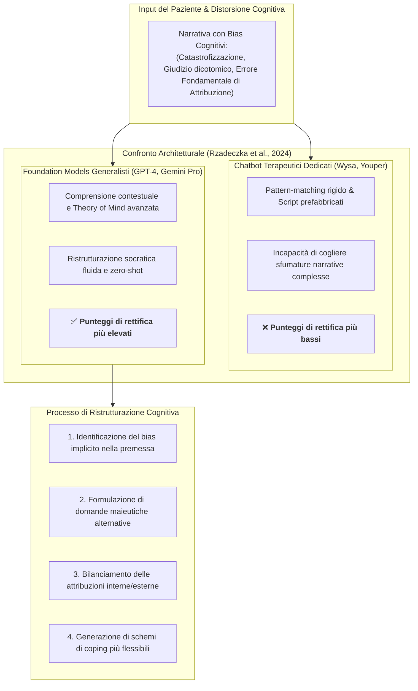

# Cognitive Bias Rectification in Large Language Models

## Definizione Operativa
- Capacità clinica e computazionale dei modelli linguistici fondazionali generalisti su larga scala (LLM come GPT-4, GPT-4o, Gemini Pro) di individuare, decostruire e riformulare attivamente le distorsioni cognitive, gli errori di attribuzione causale e i bias di giudizio espressi dagli utenti nel discorso terapeutico (Zhang & Wang, 2024; Rzadeczka et al., 2024).
- **Utilità Clinica e CBT:** Riconosce la transizione dai chatbot terapeutici tradizionali basati su regole o piccoli modelli dedicati (es. Wysa, Youper) ai modelli di fondazione generalisti, evidenziando che questi ultimi possiedono una rappresentazione semantica del contesto e una capacità di Theory of Mind (ToM) nettamente superiore per decostruire bias cognitivi complessi quali l'*overtrust*, l'*errore fondamentale di attribuzione* (*fundamental attribution error*) e l'*ipotesi del mondo giusto* (*just-world hypothesis*).

## Evidenze dalla Letteratura
### 1. Lo Studio di Rzadeczka et al. (2024)
- **Metodologia:** Valutazione comparativa dell'efficacia delle architetture di IA conversazionale nel rettificare deficit di Theory of Mind (ToM) e bias di autonomia cognitiva attraverso vignette cliniche standardizzate.
- **Risultati Chiave:**
  - I modelli di fondazione generalisti su larga scala (**GPT-4** e **Gemini Pro**) hanno dimostrato una netta superiorità rispetto ai bot specializzati nel riconoscere ragionamenti fallaci e promuovere prospettive alternative equilibrate.
  - GPT-4 ha conseguito i punteggi più alti del benchmark, mentre chatbot commerciali dedicati alla salute mentale (Wysa) hanno ottenuto le valutazioni più basse, a causa della rigidità delle loro risposte pre-strutturate.
  - La capacità di rettificare i bias cognitivi scala direttamente con la dimensione dei parametri, la complessità dell'addestramento e la ricchezza semantica del modello fondazionale (Zhang & Wang, 2024).

### 2. Principali Bias Cognitivi e Strategie di Rettifica
| Bias Cognitivo | Descrizione del Pattern Disfunzionale | Meccanismo di Rettifica Operato dall'LLM |
| :--- | :--- | :--- |
| **Errore Fondamentale di Attribuzione (*Fundamental Attribution Error*)** | Tendenza a spiegare i comportamenti altrui unicamente tramite tratti stabili di personalità, sottovalutando le determinanti situazionali e ambientali. | L'LLM introduce scenari contestuali alternativi e variabili situazionali esterne che possono aver guidato l'azione osservata. |
| **Ipotesi del Mondo Giusto (*Just-World Hypothesis*)** | Convinzione che il mondo sia intrinsecamente giusto e che le persone meritino sempre le sventure che subiscono (conduce a *victim blaming* o auto-colpevolizzazione patologica). | Il modello evidenzia il ruolo del caso, della complessità sistemica e dell'ingiustizia strutturale, separando la responsabilità dall'autostima. |
| **Overtrust & Bias di Conferma** | Tendenza ad accettare acriticamente conclusioni negative o segnali ambigui come prove certe di fallimento imminente. | Il modello applica la tecnica della verifica delle prove (*evidence testing*), invitando a quantificare le probabilità reali degli scenari temuti. |
| **Catastrofizzazione & Pensiero Dicotomico (Tutto-o-Nulla)** | Polarizzazione assoluta degli esiti e anticipazione automatica dello scenario peggiore possibile. | Decatastrofizzazione maieutica graduata: formulazione dello scenario peggiore, migliore e più probabile. |

### Vantaggi nel Setting CBT
- **Immediatezza e Disponibilità:** Permette al paziente di esercitarsi nella ristrutturazione cognitiva in tempo reale non appena si manifesta un pensiero automatico negativo (NAT), riducendo i tempi di latenza tra l'evento scatenante e l'elaborazione.
- **Varietà Semantica:** Genera molteplici angolazioni e reframing alternativi, aiutando a superare la rigidità mentale tipica della ruminazione ansioso-depressiva.

### Limiti Clinici e Rischi
- **Compiacenza Algoritmica (*Sycophancy*):** Se il prompt del sistema non è rigidamente orientato all'approccio socratico, l'LLM rischia di convalidare acriticamente le premesse distorte dell'utente per mantenere un tono accomodante (vedi [[sycophantic-mirroring]]).
- **Comprensione Superficiale vs Insight Vissuto:** La decostruzione logica del bias prodotta dall'IA non equivale all'assimilazione emotiva ed esperienziale da parte del paziente, richiedendo il consolidamento guidato dal terapeuta umano.

**Riferimenti Bibliografici:**
- Zhang, Z., & Wang, J. (2024). Can AI replace psychotherapists? Exploring the future of mental health care. *Frontiers in Psychiatry*, 15, 1444382. https://doi.org/10.3389/fpsyt.2024.1444382
- Blackwell, S. E., & Heidenreich, T. (2021). Cognitive behavior therapy at the crossroads. *International Journal of Cognitive Therapy*, 14(1), 1–22. https://doi.org/10.1007/s41811-021-00104-y
- Elyoseph, Z., Hadar-Shoval, D., Asraf, K., & Lvovsky, M. (2023). ChatGPT outperforms humans in emotional awareness evaluations. *Frontiers in Psychology*, 14, 1199058. https://doi.org/10.3389/fpsyg.2023.1199058
- Rzadeczka, M., Sterna, A., Stolińska, J., Kaczyńska, P., & Moskalewicz, M. (2024). The efficacy of conversational artificial intelligence in rectifying the theory of mind and autonomy biases: Comparative analysis. *arXiv preprint arXiv:2406.13813*.

## Relazioni
- [[fpsyt-15-1444382]]
- [[patient-candidness-in-ai-interaction]]
- [[automated-cognitive-restructuring]]
- [[cognitive-distortion-detection]]
- [[sycophantic-mirroring]]
- [[cbt-dialogue-systems-and-tools]]
- [[applied-theory-of-mind-llm]]
- [[modello-centauro-clinico]]
- [[clinical-readiness-gap-in-mh-chatbots]]