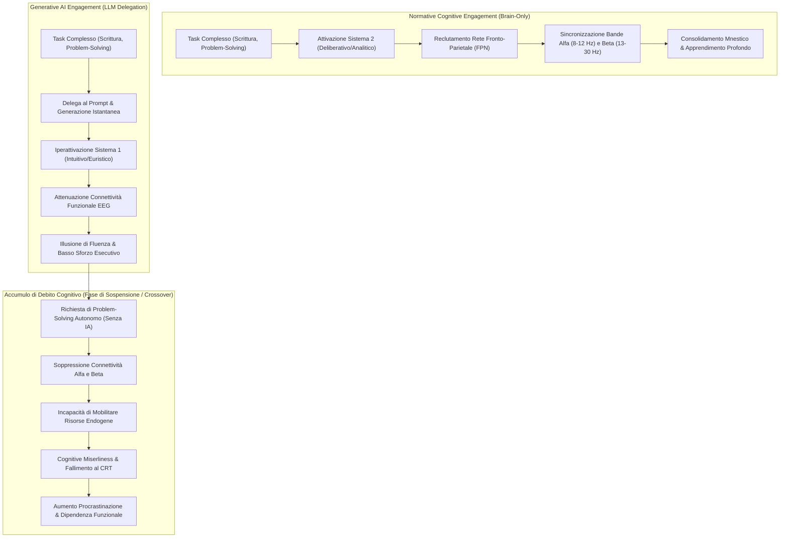

# Accumulo di Debito Cognitivo nell'Uso dell'IA Generativa (Cognitive Debt in Generative AI)

## Definizione Operativa
Il costrutto di **Debito Cognitivo (*Cognitive Debt*)** nell'interazione con l'Intelligenza Artificiale Generativa (formalizzato empiricamente da Kosmyna et al., 2025 e sistematizzato da Liao, Ko, & Yen, 2026) indica la **progressiva de-sincronizzazione, deplezione funzionale e compromissione della mobilitazione delle risorse cognitive endogene** derivante dalla delega continuativa e passiva dei processi deliberativi a modelli linguistici di grandi dimensioni ([[large-language-models]]).

**Utilità Clinica, Didattica e Cognitiva:** Spiega perché l'efficienza a breve termine fornita da ChatGPT si traduce in un deterioramento delle funzioni esecutive superiori a lungo termine. Quando gli individui esternalizzano la sintesi, la pianificazione e il ragionamento analitico all'algoritmo (*cognitive offloading*), il cervello accumula un debito che si manifesta drammaticamente nella fase di *crossover* (ovvero quando l'utente deve svolgere un compito complesso in autonomia, senza ausilio di IA), evidenziando un collasso della **connettività funzionale nelle bande $\alpha$ (8–12 Hz) e $\beta$ (13–30 Hz)**, una marcata tendenza all'**avarizia cognitiva** (*cognitive miserliness*) e un crollo delle performance al **Cognitive Reflection Test (CRT)**.

## Evidenze dalla Letteratura

### 1. Il Paradigma di Scrittura e Crossover di Kosmyna et al. (2025)
Nello studio controllato condotto dal Media Lab del MIT (Kosmyna et al., 2025; ripreso da Liao et al., 2026), 54 studenti universitari sono stati monitorati tramite **elettroencefalografia ad alta densità (EEG)** durante l'esecuzione di compiti complessi di scrittura saggistica:
- **Condizione Brain-Only:** I partecipanti che non hanno utilizzato alcun supporto tecnologico hanno mostrato la più robusta, densa e diffusa integrazione di rete funzionale inter-emisferica, con una forte coordinazione tra le cortecce prefrontali e i nodi parieto-occipitali.
- **Condizione Search Engine:** I partecipanti che hanno utilizzato i motori di ricerca tradizionali hanno mostrato pattern intermedi, contraddistinti da una consistente attivazione visuo-spaziale e di scanning critico.
- **Condizione LLM (ChatGPT):** I partecipanti supportati dall'IA generativa hanno manifestato una drastica **riduzione della connettività globale di rete**, operando in uno stato di minimo ingaggio attentivo ed esecutivo.

### 2. Le Bande $\alpha$ e $\beta$ come Indici del Debito
- **Banda $\alpha$ (8–12 Hz):** Fondamentale per l'inibizione selettiva dei distrettori ambientali, la focalizzazione interna e la regolazione della memoria di lavoro. Il gruppo *LLM-to-brain* (coloro che dopo tre sessioni con ChatGPT sono passati alla scrittura autonoma) ha mostrato una netta **depressione della sincronizzazione $\alpha$**, indicando vulnerabilità alla distrazione e incapacità di strutturare il flusso ideativo endogeno.
- **Banda $\beta$ (13–30 Hz):** Riflette l'elaborazione attiva del pensiero analitico, la concentrazione sostenuta e il controllo motorio/esecutivo top-down. La persistente attenuazione della connettività $\beta$ evidenzia che il disuso delle funzioni esecutive superiori inibisce la capacità di problem-solving complesso non assistito.

### 3. Avarizia Cognitiva (*Cognitive Miserliness*) e Disregolazione Dual-System
La mente umana è un "avaro cognitivo" (*cognitive miser*; Stanovich, 2009; Deng & Deng, 2025): tende intrinsecamente a risparmiare energia computazionale scegliendo la via euristica a minor dispendio biologico.
- **Iperattivazione del Sistema 1:** Le risposte sintatticamente impeccabili di ChatGPT offrono una falsa sensazione di comprensione immediata (*fluency heuristic*), spegnendo i meccanismi di verifica critica.
- **Atrofia Funzionale del Sistema 2:** Il sistema deliberativo, deputato al ragionamento logico-matematico, alla decostruzione di premesse fallaci e al controllo comportamentale, viene disattivato. Negli utilizzatori abituali di ChatGPT si registra un calo statisticamente significativo nei punteggi del **Cognitive Reflection Test (CRT)** e un aumento dei fallimenti cognitivi quotidiani (misurati con il *Cognitive Failures Questionnaire* - CFQ-7; Goh et al., 2025).

**Riferimenti Bibliografici:**
- Kosmyna, N., et al. (2025). *Cognitive Offloading and EEG Network Connectivity in LLM Interaction*.
- Liao, J., Ko, S., & Yen, H. (2026). *Sistematizzazione del Debito Cognitivo nell'Era Generativa*.
- Stanovich, K. E. (2009). *Decision making and rationality in the modern world*.
- Deng, Y., & Deng, X. (2025). *Cognitive Miserliness and Human-AI Interaction*.
- Goh, A., et al. (2025). *Cognitive Failures Questionnaire in AI-enhanced learning*.

## Relazioni
- [[main-1]]
- [[uso-problematico-chatbot-ai]]
- [[psychometric-assessment-problematic-ai-use]]
- [[human-in-the-reasoning]]
- [[modello-centauro-clinico]]
- [[large-language-models]]
- [[over-deference-in-llm-supervision]]
- [[quattro-condizioni-liceita-ia-psicologia]]
