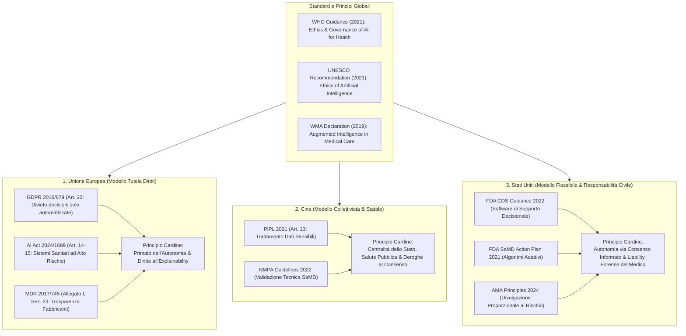

# Modelli Comparativi di Governance dell'IA Sanitaria (Comparative AI Health Governance)

## Definizione Operativa
- Quadro analitico transnazionale e bioetico che confronta le strategie normative, deontologiche e di tutela dei diritti dei pazienti relative all'Intelligenza Artificiale clinica nei tre principali poli giurisdizionali globali: **Unione Europea (UE)**, **Repubblica Popolare Cinese (Cina)** e **Stati Uniti d'America (USA)** (Montanari Vergallo et al., 2025; Han et al., 2024; Kandeel et al., 2026; Sun, 2024).
- **Paradigmi Giuridico-Etici a Confronto:**
  1. **Unione Europea (*Rights-Based / Safeguard-Oriented Model*):** Primato assoluto della dignità della persona e dell'autonomia decisionale; classificazione dei dispositivi medici a base IA come ad alto rischio (*AI Act*); diritti vincolanti di esplicabilità, supervisione umana (*human-in-the-loop*) e divieto di decisioni cliniche automatizzate senza facoltà di contestazione (*GDPR*).
  2. **Cina (*State-Centric / Collectivist Model*):** Priorità alla salute pubblica, alla sicurezza collettiva e all'innovazione industriale; controllo tecnico centralizzato da parte delle autorità regolatorie (NMPA); ampie deroghe al consenso per doveri statali ed emergenze sanitarie, senza obbligo di spiegazione algoritmica verso il paziente.
  3. **Stati Uniti (*Market-Driven / Tort Liability Model*):** Assenza di una legge federale organica; regolamentazione flessibile tramite linee guida di agenzia (FDA) e codici professionali (AMA); tutela del paziente affidata all'obbligo di disclosure proporzionale al rischio clinico e ai meccanismi di responsabilità civile per colpa medica (*medical malpractice*).

---

## Analisi Comparativa dei Tre Poli Giuridici

### 1. Unione Europea: Il Paradigma dei Diritti Fondamentali e dell'Alto Rischio
L'Unione Europea adotta un approccio basato sul principio di precauzione e sulla centralità della persona umana (Montanari Vergallo et al., 2025):
- **GDPR (Regolamento UE 2016/679):**
  - *Articolo 22:* Sancisce il diritto fondamentale di ogni paziente a **non essere sottoposto a decisioni cliniche basate unicamente su trattamenti automatizzati** che producano effetti giuridici o incidano significativamente sulla sua salute.
  - *Data Governance:* Impone i principi inderogabili di *data minimization*, proporzionalità e *accountability*, vietando l'uso secondario di dati clinici per l'addestramento algoritmico senza esplicita base giuridica o rigorosi protocolli di de-identificazione (*differential privacy*).
- **AI Act (Regolamento UE 2024/1689):**
  - *Classificazione ad Alto Rischio (High-Risk):* Tutti i sistemi di IA destinati a diagnosi, prognosi, stratificazione del rischio o supporto alle decisioni terapeutiche sono classificati come ad alto rischio (Art. 6 e Allegati).
  - *Obblighi di Human Oversight ed Explainability (Art. 14–15):* L'architettura deve garantire che il medico mantenga la supervisione effettiva, comprenda la logica del modello e possa disattivare o ignorare l'output in qualsiasi momento.
- **Medical Device Regulation (MDR 2017/745):**
  - Impone ai fabbricanti di software medico (SaMD) di fornire istruzioni chiare e trasparenti per consentire al clinico di istruire adeguatamente il paziente.

---

### 2. Cina: Il Paradigma Collettivista e la Centralità Tecnico-Statale
La Cina struttura la governance dell'IA sanitaria integrando lo sviluppo industriale rapido con la sicurezza nazionale e l'armonia sociale (Han et al., 2024; Sun, 2024):
- **Personal Information Protection Law (PIPL, 2021):**
  - *Articolo 13:* Regola il trattamento dei dati personali e sanitari sensibili, ponendo il consenso come base generale. Tuttavia, introduce ampie e rilevanti **eccezioni in cui il consenso del paziente non è richiesto**: adempimento di obblighi legali e doveri statali, gestione di emergenze di salute pubblica, o salvaguardia della vita e della proprietà in contesti critici.
- **Linee Guida NMPA (National Medical Products Administration, 2022):**
  - Focalizzate sui requisiti tecnici di ingegneria del software, tracciabilità del dato, qualità del dataset di validazione e conformità alle autorizzazioni ministeriali.
  - **Assenza di Obblighi di Trasparenza verso il Paziente:** Le direttive impongono la trasparenza del produttore verso l'autorità pubblica e il medico, ma non prevedono l'obbligo giuridico per il clinico di spiegare l'algoritmo al paziente né codificano il diritto individuale a contestare o rifiutare una decisione assistita da IA.

---

### 3. Stati Uniti: Il Modello Flessibile di Mercato e la Responsabilità Forense
Gli Stati Uniti operano senza una legge federale onnicomprensiva sulla privacy o sull'IA, adottando una governance settoriale guidata da agenzie e standard professionali (Kandeel et al., 2026; Mello et al., 2025):
- **Quadro Regolatorio FDA (Food and Drug Administration):**
  - *Guidance sui Clinical Decision Support Systems (CDS, 2022):* Distingue tra software non soggetti a supervisione diretta (quando il medico può esaminare in modo indipendente le basi della raccomandazione) e dispositivi medici software (SaMD) soggetti a rigido controllo pre-market se l'algoritmo agisce come black-box.
  - *Action Plan AI/ML-Based SaMD (2021):* Introduce protocolli di controllo per modelli di machine learning che apprendono e si modificano continuamente nel tempo (*adaptive algorithms*).
- **Linee Guida Deontologiche AMA (American Medical Association, 2024):**
  - Stabiliscono il principio di **disclosure proporzionale al rischio**: l'obbligo di informare il paziente sull'uso di IA aumenta quanto maggiore è il potenziale impatto dell'algoritmo sulla sicurezza e sull'esito clinico.
- **Responsabilità Civile e Dovere di Informativa (*Tort Liability*):**
  - Sebbene non vi sia un diritto statutario alla contestazione dell'algoritmo, la mancata rivelazione dell'uso dell'IA in caso di diagnosi errata o danno iatrogeno espone il clinico a cause di risarcimento per violazione del dovere di consenso informato e colpa professionale (*malpractice*; Mello et al., 2025).

---

## Matrice Comparativa Transnazionale della Governance

| Dimensione di Governance | Unione Europea (UE) | Repubblica Popolare Cinese (Cina) | Stati Uniti d'America (USA) |
| :--- | :--- | :--- | :--- |
| **Cornice Giuridica Prevalente** | Regolamentazione orizzontale vincolante e armonizzata (GDPR, AI Act, MDR). | Legislazione statale centralizzata (PIPL) e linee guida di agenzia (NMPA). | Approccio settoriale federale/statale (FDA, HIPAA) e common law (liability). |
| **Ruolo dell'IA nella Decisione** | Esclusivamente strumento ausiliario (*human-in-the-loop*); divieto di delega autonoma. | Ausiliario sotto il controllo dell'autorità sanitaria e del medico. | Strumento ausiliario; divieto di sostituzione della decisione medica finale. |
| **Trasparenza & Explainability** | Obbligo legale di trasparenza, intelligibilità e informazione sui limiti algoritmici. | Nessun obbligo formale di disclosure al paziente né di spiegazione del codice. | Obbligo deontologico e legale graduato sul livello di rischio di danno (AMA). |
| **Diritto di Opt-Out / Contestazione** | Diritto esplicito all'intervento umano e rifiuto di decisioni automatizzate (Art. 22 GDPR). | Non previsto; prevalenza delle decisioni di sanità pubblica e dell'istituzione. | Non codificato come diritto autonomo; azionabile indirettamente in sede civile. |
| **Base per il Trattamento Dati** | Consenso esplicito o stringenti basi giuridiche con de-identificazione obbligatoria. | Consenso generale, con ampie deroghe per doveri statali e salute pubblica. | Consenso informato e accordi conformi HIPAA tra enti sanitari e vendor tech. |
| **Filosofia Bioetica Sottesa** | **Personalismo & Diritti Umani:** Tutela dell'autodeterminazione e non-discriminazione. | **Collettivismo & Armonia Statale:** Efficienza sistemica, fiducia nell'autorità e progresso. | **Pragmatismo & Responsabilità:** Efficienza di mercato, autonomia negoziale e tutela forense. |

---

## Convergenze Internazionali e Standard Globali

Nonostante le profonde divergenze culturali e normative, le principali organizzazioni mondiali hanno delineato un nucleo etico condiviso:
1. **World Health Organization (WHO, 2021 - *Ethics and Governance of AI for Health*):** Sancisce 6 principi guida universali: tutela dell'autonomia umana, promozione del benessere e sicurezza, garanzia di trasparenza/esplicabilità, promozione di responsabilità e accountability, garanzia di inclusione ed equità, e sostenibilità ecologica.
2. **UNESCO (2021 - *Recommendation on the Ethics of AI*):** Richiede a tutti gli Stati membri di vietare l'impiego di IA che violi i diritti umani e di impedire che logiche puramente finanziarie prevalgano sulla dignità del paziente.
3. **World Medical Association (WMA, 2019 - *Statement on Augmented Intelligence*):** Ribadisce che l'IA in sanità deve essere concepita come "Intelligenza Aumentata" al servizio del medico, senza mai compromettere il nucleo deontologico della relazione di cura.

---

## Riferimenti Bibliografici
- Montanari Vergallo, G., Campanozzi, L. L., Gulino, M., Bassis, L., Ricci, P., Zaami, S., Marinelli, S., Tambone, V., & Frati, P. (2025). How Could Artificial Intelligence Change the Doctor–Patient Relationship? A Medical Ethics Perspective. *Healthcare*, 13(18), 2340. https://doi.org/10.3390/healthcare13182340
- American Medical Association [AMA]. (2024). *Augmented Intelligence Development, Deployment, and Use in Health Care*. AMA Principles.
- European Parliament and Council of the European Union. (2016). Regulation (EU) 2016/679 (General Data Protection Regulation). *Official Journal of the European Union*, L119, 1–88.
- European Parliament and Council of the European Union. (2024). Regulation (EU) 2024/1689 laying down harmonised rules on Artificial Intelligence (Artificial Intelligence Act). *Official Journal of the European Union*.
- Food and Drug Administration [FDA]. (2022). *Clinical Decision Support Software: Guidance for Industry and Food and Drug Administration Staff*. Rockville: FDA.
- Han, Y., Ceross, A., & Bergmann, J. (2024). Regulatory Frameworks for AI-Enabled Medical Device Software in China: Comparative Analysis and Review of Implications for Global Manufacturer. *JMIR AI*, 3, e46871. https://doi.org/10.2196/46871
- Kandeel, M. E., Abo Hamza, E. G., Abouahmed, A., et al. (2026). AI Applications Integrating Legal and Regulatory Perspectives in Mental Health: Systematic Review. *JMIR AI*, 5, e84305. https://doi.org/10.2196/84305
- Mello, M. M., Char, D., & Xu, S. H. (2025). Ethical Obligations to Inform Patients About Use of AI Tools. *JAMA*, 334(8), 767–770. https://doi.org/10.1001/jama.2025.10985
- Sun, S. (2024). Research on the Application of Artificial Intelligence in Medical Field from the Perspective of Behavioral Law. *Beijing Law Review*, 15(2), 899–920. https://doi.org/10.4236/blr.2024.152054
- UNESCO. (2021). *Recommendation on the Ethics of Artificial Intelligence*. Paris: UNESCO.
- World Health Organization [WHO]. (2021). *Ethics and Governance of Artificial Intelligence for Health*. Geneva: WHO Guidance.
- World Medical Association [WMA]. (2019). *WMA Statement on Augmented Intelligence in Medical Care*. Ferney-Voltaire: WMA.

---

## Relazioni
- Vedi anche: [[healthcare-13-02340]], [[shared-decision-making-in-clinical-ai]], [[gdpr-governance-mental-health-ai]], [[informed-consent-for-clinical-ai]], [[human-oversight-and-liability-in-clinical-ai]], [[three-layer-governance-framework]], [[algorithmic-paternalism-in-ai-mental-health]], [[Clinical_decision_making_and_artificial_intelligence]], [[tiered-autonomy-in-clinical-ai]], [[software-as-a-medical-device-salute-mentale]]
