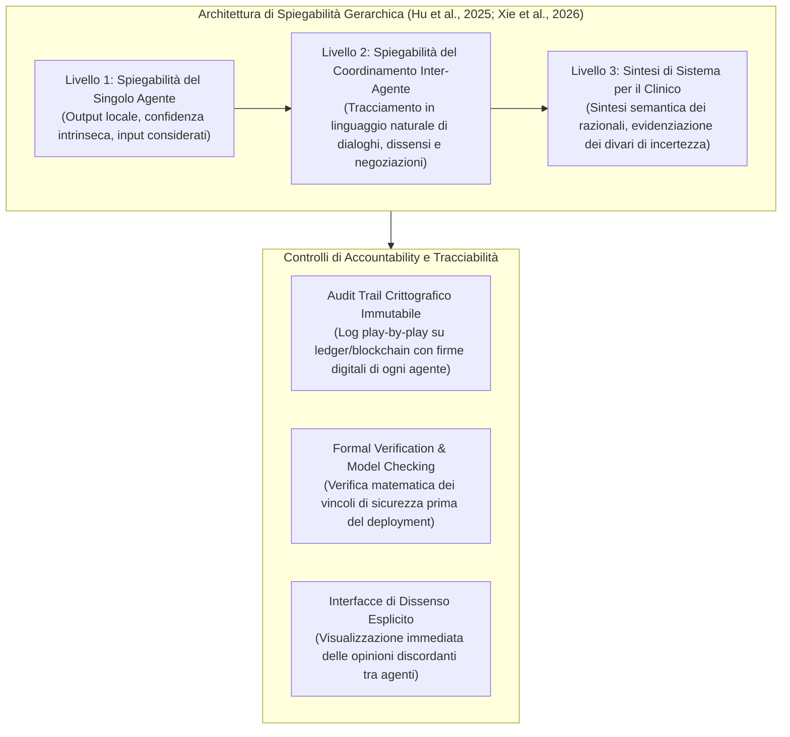

# Opacità Composta nei Sistemi Multi-Agente (Compound Opacity in Multi-Agent AI)

## Definizione Operativa
- Costrutto teorico ed etico-tecnologico formalizzato da **Xie et al. (2026)** e **Salehi et al. (2025)** che definisce la specifica forma di inscrutabilità emergente nei sistemi di Intelligenza Artificiale Multi-Agente (*Multi-Agent Systems - MAS*) impiegati in ambito clinico e sanitario.
- **Assunto Meccanicistico:** A differenza della tradizionale opacità "black-box" di un singolo modello statistico (in cui l'imperscrutabilità risiede nei pesi di una singola rete neurale), la **compound opacity** scaturisce dalla stratificazione, negoziazione dinamica e propagazione asincrona di segnali intermedi tra molteplici agenti autonomi interagenti.
- **Inscrutabilità di Sistema (*System-Level Inscrutability*):** Anche nell'ipotesi in cui i singoli agenti componenti siano parzialmente interpretabili o vincolati a compiti circoscritti, il comportamento globale del network e le traiettorie decisionali emergenti risultano impossibili da ricostruire a posteriori (*post-hoc reconstruction failure*), privando sia i clinici sia gli sviluppatori della capacità di identificare la catena causale di un errore o di un esito avverso (*adverse outcome*).

```mermaid
flowchart TD
    subgraph SingleModel ["Opacità Classica (Single-Model Black Box)"]
        IN_S["Input Clinico"] --> BB["Singola Rete Neurale / LLM<br/>(Pesi opachi)"] --> OUT_S["Output Diagnostico"]
        XAI_S["Metodi XAI Tradizionali<br/>(SHAP, LIME, Saliency Maps)"] -. Analisi post-hoc .-> BB
    end

    subgraph MultiAgentSystem ["Opacità Composta (Multi-Agent Compound Opacity)"]
        IN_M["Dati Multimodali"] --> Ag1["Agente 1: Percezione & Preprocessing"]
        Ag1 -->|Segnale intermedio opaco| Ag2["Agente 2: Ragionamento Clinico (LLM)"]
        Ag2 -->|Negoziazione / Feedback| Ag3["Agente 3: Pianificazione & Triage"]
        Ag3 -->|Accordo probabilistico| Ag4["Agente 4: Esecuzione / Raccomandazione"]
        Ag4 --> OUT_M["Decisione Clinica Complessa"]
        
        Ag2 <-->|Cicli di memoria e auto-correzione| Ag3
        
        FailXAI["Fallimento XAI Convenzionale<br/>(Incapacità di spiegare negoziazioni distribuite emergenti)"] -.-> MultiAgentSystem
    end

    subgraph ClinicalConsequences ["Implicazioni Cliniche e Deontologiche"]
        C1["Responsibility Gap & Many Hands Problem"]
        C2["Compromissione del Consenso Informato"]
        C3["Asimmetria di Responsabilità nel Team Uomo-IA"]
        C4["Amplificazione dell'Automation Bias"]
    end

    OUT_M --> ClinicalConsequences
```

---

## Dimensioni Concettuali e Meccanismi di Emergenza

### 1. Il Limite Epistemologico della XAI Tradizionale
I framework convenzionali di *Explainable AI* (come SHAP, LIME o feature attribution maps) sono stati progettati per modelli deterministici o probabilistici isolati, in cui una matrice di input genera direttamente un vettore di output. 
Nei sistemi agentici distribuiti:
- Ogni agente elabora, sintetizza e trasforma il dato prima di passarlo al nodo successivo.
- Le interazioni non-lineari e i loop di feedback inter-agente (inclusi i cicli di verifica e correzione tra LLM) creano un **effetto moltiplicatore dell'opacità**: le spiegazioni a livello di singolo agente non spiegano *perché* l'interazione collettiva abbia selezionato una specifica strategia clinica a discapito di un'altra (Salehi et al., 2025; Hughes et al., 2025).

---

### 2. Propagazione Nascosta e Cascata degli Errori (*Error Cascading*)
- **Falsa Autorità dei Dati Intermedi:** Gli agenti collocati a valle nella catena operativa tendono a trattare gli output generati dagli agenti a monte come dati oggettivi e autoritativi, anziché come inferenze probabilistiche soggette a margine di errore.
- **Allucinazioni Sistemiche:** Un'allucinazione o un bias cognitivo minimo introdotto nella fase di estrazione dati o di pre-processing può innescare una reazione a catena in cui gli agenti di ragionamento e pianificazione strutturano un intero piano terapeutico attorno a una premessa errata, mascherata da un apparente consenso formale (Brohi et al., 2025; Dror, 2025).

---

### 3. Asimmetria di Responsabilità nei Team Ibridi Uomo-IA
- **Dinamiche Psicosociali di Team:** Le indagini sperimentali sull'interazione tra professionisti sanitari e cluster di agenti intelligenti evidenziano una distorsione percettiva sistematica (Yousefi et al., 2025):
  - Quando il sistema multi-agente opera con successo, il merito viene implicitamente attribuito all'efficacia autonoma della tecnologia.
  - Quando il sistema fallisce o induce in errore, la responsabilità viene psicologicamente e giuridicamente riversata sul professionista umano.
- **Vulnerabilità Epistemica del Clinico:** A causa dell'opacità composta, il medico non ha visibilità sui passaggi logici intermedi. Trovandosi di fronte a un output assertivo formulato da una rete di agenti, il clinico subisce un carico cognitivo eccessivo che disincentiva la verifica punto per punto, favorendo l'**[[over-deference-in-llm-supervision|automation bias]]** e la passività decisionale.

---

### 4. Frattura del Consenso Informato e della Tracciabilità Legale
- **Nullità del Consenso:** La bioetica clinica impone che il paziente comprenda la natura, i rischi e le alternative razionali di un trattamento. Se la logica decisionale distribuita non è ricostruibile nemmeno dagli sviluppatori (*black network*), il paziente non può esprimere un consenso validamente informato (Morley et al., 2020; Xie et al., 2026).
- **Il "Many Hands Problem" Giuridico:** La frammentazione dell'azione clinica in micro-decisioni distribuite tra diversi agenti software, fornitori terzi e operatori sanitari annulla il principio della colpa individuale per negligenza, generando un vuoto normativo (*liability void*) che ostacola il risarcimento del danno e l'incident learning istituzionale (Cestonaro et al., 2023; Bani Issa, 2025).

---

## Confronto: Opacità a Singolo Modello vs Opacità Composta Multi-Agente

| Dimensione | Opacità a Singolo Modello (Single-Model) | Opacità Composta (Multi-Agent Compound Opacity) |
| :--- | :--- | :--- |
| **Origine dell'Opacità** | Pesi interni, complessità parametrica e non linearità di una singola architettura (es. CNN, Transformer). | Interazione dinamica, scambio di messaggi, feedback asincroni e coordinamento tra molteplici agenti eterogenei. |
| **Dinamica Decisionale** | Statica o sequenziale diretta (Input $\rightarrow$ Rete $\rightarrow$ Output). | Distribuita, ciclica, adattiva ed emergente nel tempo. |
| **Efficacia XAI Tradizionale** | Moderata/Accettabile (Feature importance, SHAP, mappe di attivazione, attention heatmaps). | **Fallimentare**: le metriche locali non spiegano la dinamica di negoziazione e la sintesi collettiva del gruppo di agenti. |
| **Rilevazione dell'Errore** | Tracciabile analizzando l'attivazione dei pesi o la distribuzione statistica dei dati di test. | Estremamente complessa: l'errore emerge dall'effetto a cascata e dalla trasformazione del dato lungo la catena. |
| **Impatto sul Clinico** | Dubbio circoscritto a una specifica metrica o inferenza diagnostica. | Illusione di consenso collegiale (*veneer of consensus*), sovraccarico cognitivo e de-skilling sistemico. |
| **Soluzione Architetturale** | Miglioramento degli algoritmi di interpretabilità post-hoc o modelli intrinsecamente interpretabili. | **Spiegabilità gerarchica multilivello**, logging in linguaggio naturale delle comunicazioni inter-agente e audit crittografici. |

---

## Strategie di Mitigazione e Architetture di Spiegabilità Gerarchica



1. **Spiegabilità Gerarchica a Tre Livelli (*Hierarchical Explainability*):**
   - *Livello Modulare (Single-Agent):* Registrazione delle feature determinanti per ogni singolo agente specializzato.
   - *Livello di Orchestrazione (Inter-Agent Coordination):* Trascrizione in linguaggio naturale dei protocolli di negoziazione, permettendo al clinico o all'ispettore di analizzare i turni conversazionali interni tra agenti (Brohi et al., 2025).
   - *Livello Esecutivo (System-Level Summary):* Dashboard integrata che restituisce al medico non solo la raccomandazione finale, ma i punti di dissenso (*conflict points*) e il grado di incertezza complessiva.
2. **Audit Trail Immutabile (*Accountability-by-Design*):** Ogni passaggio decisionale inter-agente viene registrato con marcatura temporale, identità dell'agente, ruolo formale, input scatenante, confidenza numerica e successive modifiche apportate da altri agenti o dall'operatore umano (Phiri, 2025; Kulothungan, 2025).
3. **Integrazione con il Modello di [[tiered-autonomy-in-clinical-ai|Autonomia a Scaglioni (*Tiered Autonomy*)]]:** Quando l'inscrutabilità di un passaggio decisionale supera una soglia predefinita o si manifesta un disaccordo inter-agente, il sistema sospende l'esecuzione automatica e rimette la decisione al clinico umano.

---

## Riferimenti Bibliografici
- Xie, Z., Wang, H., Dai, L., Wang, Z., Song, H., & Qian, J. (2026). Ethical issues in multi-agent AI systems for healthcare: a narrative review. *Frontiers in Public Health*, 14, 1792627. https://doi.org/10.3389/fpubh.2026.1792627
- Bani Issa, H. (2025). Robotic surgery and the law: defining control and criminal responsibility. *Journal of Soft Computing and Data Mining*, 6, 423–434. https://doi.org/10.30880/jscdm.2025.06.01.028
- Brohi, S., ul-ain Mastoi, Q., Jhanjhi, N. Z., & Pillai, T. (2025). A research landscape of agentic AI and large language models: applications, challenges and future directions. *Algorithms*, 18, 499. https://doi.org/10.3390/a18080499
- Cestonaro, C., Delicati, A., Marcante, B., Caenazzo, L., & Tozzo, P. (2023). Defining medical liability when artificial intelligence is applied on diagnostic algorithms: a systematic review. *Frontiers in Medicine*, 10, 1305756. https://doi.org/10.3389/fmed.2023.1305756
- Cherif, A. N., Youssfi, M., En-Naimani, Z., Tadlaoui, A., Soulami, M., Bouattane, O., et al. (2024). CQRS and blockchain with zero-knowledge proofs for secure multi-agent decision-making. *International Journal of Advanced Computer Science and Applications*. https://doi.org/10.14569/IJACSA.2024.0151188
- Dror, I. (2025). Biased and biasing: the hidden bias cascade and bias snowball effects. *Behavioral Sciences*, 15, 490. https://doi.org/10.3390/bs15040490
- Hu, Y., Liu, J., & Jiang, W. (2025). Large language models in nephrology: applications and challenges in chronic kidney disease management. *Renal Failure*, 47, 2555686. https://doi.org/10.1080/0886022X.2025.2555686
- Hughes, L., Dwivedi, Y. K., Malik, T., Shawosh, M., Albashrawi, M., Jeon, I., et al. (2025). AI agents and agentic systems: a multi-expert analysis. *Journal of Computer Information Systems*, 65, 489–517. https://doi.org/10.1080/08874417.2025.2483832
- Kulothungan, V. (2025). Using blockchain ledgers to record AI decisions in IoT. *IoT*, 6, 37. https://doi.org/10.3390/iot6030037
- Morley, J., Machado, C., Burr, C., Cowls, J., Joshi, I., Taddeo, M., et al. (2020). The ethics of AI in health care: a mapping review. *Social Science & Medicine*, 260, 113172. https://doi.org/10.1016/j.socscimed.2020.113172
- Phiri, C. C. (2025). Creating characteristically auditable agentic AI systems. In *Proceedings of the Intelligent Robotics FAIR (2025)*. https://doi.org/10.1145/3759355.3759356
- Salehi, S., Singh, Y., Habibi, P., & Erickson, B. (2025). Beyond single systems: how multi-agent ai is reshaping ethics in radiology. *Bioengineering*, 12, 1100. https://doi.org/10.3390/bioengineering12101100
- Yousefi, M., Shahi, A., Sharifi, M., Romera, A. J. J., Hoermann, S., & Piumsomboon, T. (2025). Team dynamics in human-AI collaboration: effects on confidence, satisfaction, and accountability. In *Proceedings of the 27th International Conference on Multimodal Interaction*. https://doi.org/10.1145/3716553.3750776

---

## Relazioni
- Vedi anche: [[fpubh-14-1792627]], [[tiered-autonomy-in-clinical-ai]], [[human-oversight-and-liability-in-clinical-ai]], [[information-without-explanation-in-clinical-ai]], [[epistemological-paradox-in-clinical-ai]], [[modello-centauro-clinico]], [[over-deference-in-llm-supervision]], [[automated-clinical-ai-red-teaming]], [[algorithmic-paternalism-in-ai-mental-health]], [[reflective-interpretability]]
