# Architettura Concettuale della CBT Guidata da IA (Conceptual Architecture of AI-Guided CBT)

## Definizione Operativa
- L'**Architettura Concettuale dell'AI-Guided CBT** è un modello teorico-clinico formalizzato da **Stojanovic, Stankovic e Ristic (2026)** per descrivere l'interazione dinamica e multilivello tra caratteristiche dell'utente, capacità computazionali dell'Intelligenza Artificiale, fattori di mediazione dell'engagement e processi cardine di cambiamento della Terapia Cognitivo-Comportamentale.
- **Scopo del Modello:** Superare l'approccio riduzionista che valuta l'IA terapeutica unicamente come "software di erogazione" o black-box statistica, fornendo una mappa esplicita dei legami causali che connettono le feature tecnologiche agli esiti clinici e di sanità pubblica nella gestione di depressione e ansia.

```mermaid
flowchart TD
    subgraph Layer1 ["1. Input e Determinanti Individuali dell'Utente"]
        U1["Gravità Clinica di Base (Lieve-Moderata vs Severa)"]
        U2["Digital Literacy e Familiarità Tecnologica"]
        U3["Motivazione al Trattamento e Preferenza per Self-Care"]
        U4["Comorbilità Medico-Psichiatriche e Rete di Supporto"]
    end

    subgraph Layer2 ["2. Funzionalità Tecnologiche dell'IA"]
        T1["NLU & Dialogo Conversazionale Fluido"]
        T2["Personalizzazione Adattiva dei Contenuti"]
        T3["Accessibilità Continua H24 e Immediatezza"]
        T4["Algoritmi di Prompting Socratico e Micro-Nudges"]
    end

    subgraph Layer3 ["3. Meccanismi di Engagement e Alleanza Digitale"]
        E1["Responsività Percepita e Validazione Emotiva"]
        E2["Alleanza Terapeutica Digitale (Facilitatore)"]
        E3["Aderenza Continuativa e Prevenzione del Dropout"]
    end

    subgraph Layer4 ["4. Meccanismi Attivi di Cambiamento CBT"]
        C1["Ristrutturazione Cognitiva Sistematica"]
        C2["Attivazione Comportamentale e Pianificazione Attività"]
        C3["Esposizione Graduata e Acquisizione di Coping Skills"]
        C4["Symptom Tracking e Fenotipizzazione Digitale"]
    end

    subgraph Layer5 ["5. Esiti Clinici e di Sistema Sanitario"]
        O1["Riduzione Quantificata dei Punteggi PHQ-9 e GAD-7"]
        O2["Potenziamento di Autoefficacia e Self-Management"]
        O3["Decompressione dei Servizi Specialistici e Liste d'Attesa"]
        O4["Riduzione Sostenibile del Mental Health Treatment Gap"]
    end

    Layer1 --> Layer2
    Layer2 --> Layer3
    Layer3 -->|Abilita l'Esposizione Ripetuta| Layer4
    Layer4 --> Layer5
```

---

## I Cinque Livelli Funzionali del Modello

### 1. Input e Determinanti Individuali dell'Utente (*User Inputs & Moderators*)
- **Eterogeneità della Popolazione:** L'efficacia dell'AI-guided CBT varia a seconda di fattori intra-individuali. Pazienti con sintomi lievi-moderati o elevata motivazione all'auto-aiuto traggono massimo beneficio da strumenti autonomi, mentre quadri severi richiedono escalation immediata.
- **Digital Literacy:** La familiarità con interfacce conversazionali condiziona la facilità d'uso e riduce l'ansia tecnologica, abbattendo la barriera iniziale all'adozione.

### 2. Funzionalità Tecnologiche dell'IA (*AI Functional Features*)
- **Elaborazione del Linguaggio Naturale (NLU/LLM):** Consente una comunicazione flessibile che simula il dialogo clinico, superando la rigidità degli alberi decisionali statici.
- **Personalizzazione Dinamica:** Calibrazione degli esercizi, del tono e dei moduli terapeutici sulla base delle risposte emotive e dei pattern d'uso longitudinali del paziente.
- **Disponibilità Asincrona H24:** Possibilità di ricevere supporto immediato nei momenti di acuto distress (*in-situ support*), prevenendo l'escalation sintomatica.

### 3. Meccanismi di Engagement e Alleanza Digitale (*Engagement & Alliance Facilitators*)
- **Responsività Percepita (*Perceived Responsiveness*):** L'utente percepisce il sistema come attento, disponibile e privo di giudizio, il che riduce lo stigma e favorisce l'apertura emotiva (*self-disclosure*).
- **Ruolo di Catalizzatore:** L'alleanza digitale non è il motore terapeutico primario, ma il collante relazionale che sostiene l'uso prolungato nel tempo, contrastando l'alto tasso di abbandono (*early dropout*) tipico delle app digitali tradizionali.

### 4. Meccanismi Attivi di Cambiamento CBT (*Core CBT Active Ingredients*)
- **Ristrutturazione Cognitiva:** Identificazione e confutazione guidata dei pensieri automatici negativi (PAN) e delle distorsioni cognitive tramite schede interattive (*thought records*).
- **Attivazione Comportamentale:** Monitoraggio delle attività quotidiane, ripristino di routine gratificanti e prescrizione di compiti a padronanza/piacere crescente.
- **Monitoraggio Continuo e Fenotipizzazione:** Rilevazione longitudinale di sintomi (PHQ-9/GAD-7) e parametri passivi da smartphone per tracciare la traiettoria clinica in tempo reale.

### 5. Esiti Clinici e Impatto di Sanità Pubblica (*Clinical & Systemic Outcomes*)
- **Esiti Clinici Individuali:** Miglioramento dei punteggi sintomatologici, consolidamento di abilità di fronteggiamento dello stress (*coping*) e prevenzione delle ricadute.
- **Esiti di Sanità Pubblica:** Ottimizzazione delle risorse sanitarie, riduzione dei costi per i servizi territoriali e democratizzazione dell'accesso alla salute mentale (*bridging the treatment gap*).

---

## Integrazione Stepped-Care e Moderazione Clinica

L'architettura concettuale non opera nel vuoto, ma si inserisce all'interno di una governance gerarchica a livelli (*Stepped-Care Governance*):

| Livello di Rischio | Livello Architetturale Coinvolto | Ruolo dell'IA | Ruolo del Terapeuta Umano |
| :--- | :--- | :--- | :--- |
| **Basso / Prevenzione** (Distress sub-clinico) | Livelli 1, 2, 3, 4 | Intervento autonomo AI-led (psicoeducazione, CBT self-help, diari) | Assente o limitato a triage iniziale automatizzato |
| **Moderato** (Depressione/Ansia lieve-moderata) | Livelli 1, 2, 3, 4 + Co-Piloting | Intervento ibrido (*blended*): erogazione compiti, sintesi progressi | Supervisione periodica, validazione formulazione, personalizzazione |
| **Elevato / Crisi** (Rischio suicidario, psicosi) | Revoca autonomia generativa | Regresso a strumento passivo (logging, alert di emergenza) | Presa in carico clinica immediata ed esclusiva (*human-led*) |

---

## Implicazioni per la Progettazione di Digital Therapeutics (DTx)

1. **Evitare l'Empathy Trap:** Progettare interfacce conversazionali che non pretendano di sostituire l'empatia umana, ma valorizzino la trasparenza didattica e la precisione nell'insegnamento delle strategie CBT.
2. **Cicli di Feedback Adattivi:** Utilizzare i dati di interazione e i punteggi PHQ-9/GAD-7 per rimodulare la difficoltà degli esercizi e suggerire micro-interventi contestualizzati.
3. **Hard Fail-Safes:** Implementare moduli di safety deterministici che interrompono l'agente generativo e attivano percorsi di de-escalation e contatto umano al primo segnale di crisi acuta.

---

## Riferimenti Bibliografici
- Stojanovic, A., Stankovic, M., & Ristic, A. (2026). AI-Guided Cognitive Behavioral Therapy for Depression and Anxiety: Bridging the Mental Health Treatment Gap Through Digital Psychiatry. *Healthcare*, 14(15), 2334. https://doi.org/10.3390/healthcare14152334
- Andersson, G., Titov, N., Dear, B. F., Rozental, A., & Carlbring, P. (2019). Internet-delivered psychological treatments: From innovation to implementation. *World Psychiatry*, 18(1), 20–28.
- Beck, A. T., Rush, A. J., Shaw, B. F., Emery, G., DeRubeis, R. J., & Hollon, S. D. (2024). *Cognitive Therapy of Depression*. Guilford Publications.
- Kazdin, A. E. (2019). Annual research review: Expanding mental health services through novel models of intervention delivery. *Journal of Child Psychology and Psychiatry*, 60(4), 455–472.
- Torous, J., Bucci, S., Bell, I. H., Kessing, L. V., Faurholt-Jepsen, M., Whelan, P., ... & Firth, J. (2021). The growing field of digital psychiatry: Current evidence and the future of apps, social media, chatbots, and virtual reality. *World Psychiatry*, 20(3), 318–335.

---

## Relazioni
- Vedi anche: [[healthcare-14-02334]], [[functional-vs-relational-mechanisms-in-ai-therapy]], [[digital-therapeutic-alliance]], [[cbt-dialogue-systems-and-tools]], [[stepped-care-ai-integration]], [[tiered-human-ai-healing-ecosystem]], [[power-safety-paradox]], [[ai-enhanced-cbt]], [[clinical-readiness-gap-in-mh-chatbots]]
