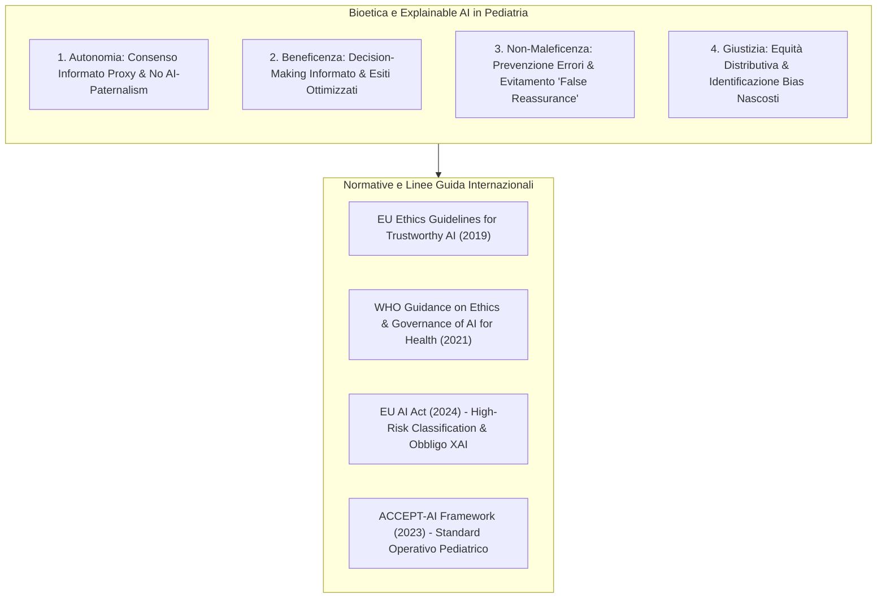
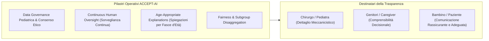

# ACCEPT-AI and Ethical Frameworks in Pediatric AI

**Summary**: Disamina dei principi bioetici (autonomia, beneficenza, non-maleficenza, giustizia), delle linee guida internazionali (EU Trustworthy AI, OMS) e degli obblighi regolatori vincolanti (EU AI Act, framework ACCEPT-AI) che impongono la spiegabilità (XAI) e la supervisione umana nell'intelligenza artificiale applicata all'infanzia.
**Sources**: Verhoeven, Bouisaghouane & Hulscher (2026) - `a-2702-1843.pdf`; Muralidharan et al. (2023); Beauchamp & Childress (2001)
**Last updated**: 2026-08-27
---

## I Quattro Principi di Bioetica Applicati all'IA Pediatrica

La trasposizione dei quattro pilastri bioetici classici di **Beauchamp & Childress** nel contesto dell'intelligenza artificiale pediatrica evidenzia come l'Explainable AI (XAI) non sia un'opzione accessoria, bensì un **obbligo etico fondante**:

### 1. Autonomia e Rifiuto dell'AI-Paternalism
- Nella medicina pediatrica, l'autonomia è complessa: i pazienti sono spesso incapaci di esprimere un consenso autonomo a causa dell'età, delegando le decisioni ai genitori o tutori legali.
- **Rischio di AI-Paternalism**: L'adozione di algoritmi opachi (*black-box*) rischia di sovrapporre un paternalismo algoritmico al tradizionale paternalismo medico, escludendo i genitori e i pazienti dal ragionamento clinico.
- **Ruolo dell'XAI**: Fornire spiegazioni comprensibili e calibrate permette al clinico di spiegare chiaramente le basi diagnostico-terapeutiche alla famiglia, salvaguardando il diritto all'autodeterminazione e al consenso informato.

### 2. Beneficenza
- Promuovere attivamente il miglior interesse e la salute del bambino.
- L'XAI consente ai medici di interpretare i fattori di rischio identificati dal modello, adattando la pianificazione chirurgica e il percorso terapeutico alle specificità biologiche del singolo paziente.

### 3. Non-Maleficenza (*Primum Non Nocere*) e Rischio di Falsa Rassicurazione
- La trasparenza algoritmica è essenziale per individuare allucinazioni, errori di classificazione e bias nei modelli prima che si traducano in danni fisici o evolutivi.
- **Il rischio di Falsa Rassicurazione (*False Reassurance*)**: Verhoeven et al. (2026) sottolineano un pericolo paradossale: spiegazioni XAI eccessivamente banali, iper-semplificate o parziali possono generare un falso senso di sicurezza nell'operatore, inducendolo ad accettare output errati o ingannevoli. Le spiegazioni devono pertanto mantenere il giusto livello di complessità e rigore scientifico.

### 4. Giustizia ed Equità Distributiva
- I benefici dell'innovazione tecnologica devono essere accessibili a tutti i bambini senza discriminazioni demografiche, geografiche o socioeconomiche.
- L'XAI smaschera eventuali disparità prestazionali (ad esempio se un modello di diagnosi precoce è meno accurato su neonati prematuri o su specifiche etnie).

---

## Il Quadro Normativo Internazionale

### 1. EU Ethics Guidelines for Trustworthy AI (2019)
Definiscono i 7 requisiti cardinali per sistemi di IA affidabili:
1. Azione e sorveglianza umana (*Human agency and oversight*);
2. Robustezza tecnica e sicurezza (*Technical robustness and safety*);
3. Privacy e governance dei dati (*Privacy and data governance*);
4. Trasparenza e spiegabilità (*Transparency*);
5. Diversità, non discriminazione ed equità (*Diversity, non-discrimination and fairness*);
6. Benessere sociale e ambientale (*Societal and environmental well-being*);
7. Responsabilità e rendicontabilità (*Accountability*).

### 2. WHO Guidance on AI for Health (2021)
Focalizzata su 6 principi operativi per la salute globale: tutela dell'autonomia, sicurezza ed efficacia, equità, trasparenza e spiegabilità, responsabilità, sostenibilità e reattività alle esigenze dei sistemi sanitari.

### 3. European Union AI Act (In vigore da Agosto 2024)
- **Classificazione ad Alto Rischio (*High-Risk AI Systems*)**: I sistemi di IA impiegati come dispositivi medici diagnostici o terapeutici ricadono nella categoria di rischio massimo.
- **Obbligatorietà Giuridica dell'XAI**: L'AI Act impone vincoli legali stringenti agli sviluppatori e agli enti sanitari:
  - Garanzia di trasparenza architetturale;
  - Obbligo di interpretabilità e giustificabilità delle decisioni cliniche supportate da IA;
  - Meccanismi obbligatori di supervisione umana (*human oversight*).
- Di fatto, l'Explainable AI cessa di essere una mera "buona pratica" tecnica e diventa un **requisito di conformità legale vincolante**.

---

## Il Framework ACCEPT-AI per la Pediatria

Il framework **ACCEPT-AI** (*Recommendations for the use of pediatric data in artificial intelligence and machine learning*, Muralidharan et al., 2023) costituisce il punto di riferimento operativo specifico per la sanità infantile:

### Elementi Cardine di ACCEPT-AI
1. **Continuous Human Oversight**: Nessuna decisione terapeutica o chirurgica pediatrica può essere totalmente automatizzata; il giudizio umano supervisionato rimane vincolante.
2. **Age-Appropriate Explanations**: La spiegazione algoritmica deve essere modulata a seconda del destinatario:
   - *Livello Tecnico-Clinico*: per chirurghi, anestesisti e pediatri (pesi, gradienti, intervalli di confidenza).
   - *Livello Caregiver*: per genitori e tutori (ragioni della raccomandazione, alternative, rischi).
   - *Livello Paziente*: per bambini e adolescenti (linguaggio semplice, accessibile, che riduca l'ansia perioperatoria).
3. **Valutazione Disaggregata dei Sottogruppi**: Monitoraggio continuo delle performance su finestre evolutive ristrette (es. 0-28 giorni, 1-12 mesi, 1-5 anni, 6-12 anni, 13-18 anni).

---

## Pagine Correlate

- [[verhoeven-et-al-2026]]: Sintesi dell'articolo di revisione su Explainable AI e bioetica pediatrica.
- [[xai-in-pediatric-surgery]]: Metodologie di XAI applicate alle discipline chirurgiche infantili.
- [[pediatric-ai-bias-and-vulnerabilities]]: Bias algoritmico, campionamento WEIRD e vulnerabilità dello sviluppo.
- [[pediatric-xai-benchmarking]]: Standardizzazione e benchmark per la validazione di fedeltà e sicurezza.
- [[ai-research-ethics]]: Principi generali di etica della ricerca e governance computazionale.
- [[three-layer-governance-framework]]: Modello di governance multilivello per l'integrazione clinica dell'IA.
- [[etica-privacy-bias-ia-clinica]]: Etica, riservatezza dei dati e non discriminazione nell'IA medica.
