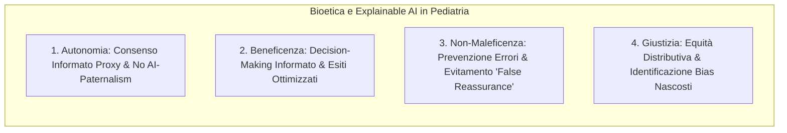

# ACCEPT-AI and Ethical Frameworks in Pediatric AI

## Definizione Operativa

L'applicazione dell'Intelligenza Artificiale (IA) in ambito pediatrico richiede un'integrazione rigorosa tra i pilastri bioetici classici e i moderni framework di governance tecnologica. Il concetto centrale è quello di **IA Affidabile (Trustworthy AI)**, che impone la trasparenza (Explainable AI - XAI) e la supervisione umana continua come requisiti inderogabili per garantire la sicurezza del paziente pediatrico e il rispetto dei diritti fondamentali.

L'adozione di standard come il framework **ACCEPT-AI** permette di tradurre questi principi etici in prassi operative, focalizzate sulla protezione delle fasce d'età vulnerabili e sulla prevenzione di distorsioni algoritmiche (*bias*).

## Evidenze dalla Letteratura

### I Quattro Principi di Bioetica Applicati all'IA Pediatrica

La trasposizione dei quattro pilastri bioetici di **Beauchamp & Childress** nel contesto dell'intelligenza artificiale pediatrica evidenzia come la spiegabilità (XAI) sia un obbligo etico fondante:

1.  **Autonomia**: Rifiuto dell'AI-Paternalism. È necessario evitare che l'opacità algoritmica sostituisca il ragionamento clinico. L'XAI funge da strumento di supporto al consenso informato proxy, permettendo ai tutori di comprendere le logiche decisionali.
2.  **Beneficenza**: Utilizzo dei modelli per interpretare i fattori di rischio specifici del singolo bambino, ottimizzando i percorsi terapeutici.
3.  **Non-Maleficenza**: Prevenzione del rischio di *False Reassurance*. Verhoeven et al. (2026) evidenziano che spiegazioni iper-semplificate possono indurre un falso senso di sicurezza nell'operatore clinico.
4.  **Giustizia**: Necessità di monitorare le disparità prestazionali del modello su diverse fasce evolutive ed etnie.

### Quadro Normativo Internazionale
*   **EU Ethics Guidelines for Trustworthy AI (2019)**: Definisce i 7 requisiti cardinali, tra cui trasparenza, supervisione umana e accountability.
*   **WHO Guidance on AI for Health (2021)**: Enfatizza la necessità di sistemi etici, sicuri ed eque per la salute globale.
*   **EU AI Act (2024)**: Classifica i sistemi IA usati in ambito diagnostico/terapeutico come "ad alto rischio", rendendo l'XAI e la supervisione umana vincoli legali obbligatori.

### Il Framework ACCEPT-AI
Il framework **ACCEPT-AI** (*Recommendations for the use of pediatric data in artificial intelligence and machine learning*, Muralidharan et al., 2023) introduce:
*   **Continuous Human Oversight**: Nessuna decisione terapeutica pediatrica può essere totalmente automatizzata.
*   **Age-Appropriate Explanations**: Spiegazioni graduate in base al destinatario (clinico, genitore, paziente).
*   **Valutazione Disaggregata dei Sottogruppi**: Monitoraggio specifico per le diverse finestre evolutive.

**Riferimenti Bibliografici:**

*   Beauchamp, T. L., & Childress, J. F. (2001). *Principles of Biomedical Ethics*.
*   Muralidharan, et al. (2023). *Recommendations for the use of pediatric data in artificial intelligence and machine learning (ACCEPT-AI framework)*.
*   Verhoeven, T., Bouisaghouane, A., & Hulscher, J. (2026). *Explainable AI in Pediatric Ethics* (riferimento al file `a-2702-1843.pdf`).

## Relazioni

- [[verhoeven-et-al-2026]]: Sintesi dell'articolo di revisione su Explainable AI e bioetica pediatrica.
- [[xai-in-pediatric-surgery]]: Metodologie di XAI applicate alle discipline chirurgiche infantili.
- [[pediatric-ai-bias-and-vulnerabilities]]: Bias algoritmico, campionamento WEIRD e vulnerabilità dello sviluppo.
- [[pediatric-xai-benchmarking]]: Standardizzazione e benchmark per la validazione di fedeltà e sicurezza.
- [[ai-research-ethics]]: Principi generali di etica della ricerca e governance computazionale.
- [[three-layer-governance-framework]]: Modello di governance multilivello per l'integrazione clinica dell'IA.
- [[etica-privacy-bias-ia-clinica]]: Etica, riservatezza dei dati e non discriminazione nell'IA medica.
