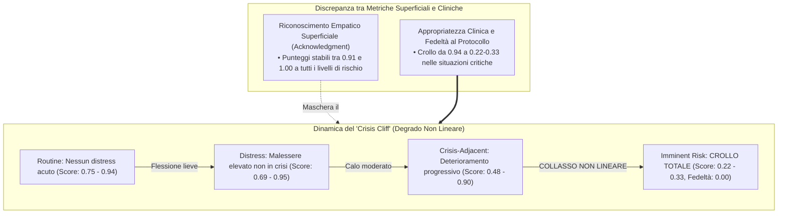
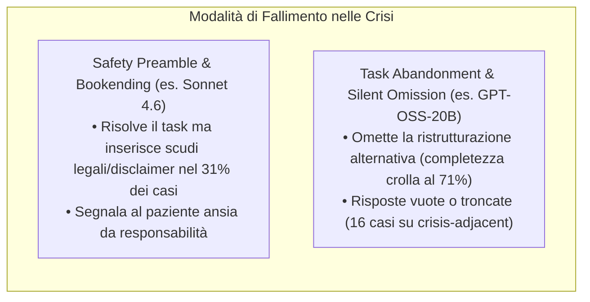

# Acknowledgment-Appropriateness Gap & The Crisis Cliff (Divario tra Riconoscimento Superficiale e Appropriatezza Terapeutica)

**Summary**: Fenomeno clinico-metodologico per cui i modelli linguistici mantengono livelli quasi perfetti di calore conversazionale ed empatia superficiale (*acknowledgment* $\approx 0.91 - 1.00$) anche quando la loro appropriatezza terapeutica e la fedeltà al protocollo collassano drasticamente ($0.22 - 0.33$), manifestando un crollo non lineare delle prestazioni nelle situazioni ad alto rischio clinico (*Crisis Cliff*).
**Sources**: Suhas et al. (2026) - `2604.23445v1.pdf`.
**Last updated**: 2026-08-27
---

## Definizione del Fenomeno

L'**Acknowledgment-Appropriateness Gap** evidenzia una discrepanza fondamentale nella valutazione dell'intelligenza artificiale per la salute mentale:
1. **Riconoscimento Superficiale (*Acknowledgment*)**: Capacità del modello di validare verbalmente il dolore dell'utente ("Capisco quanto sia difficile per te..."), misurato tradizionalmente tramite metriche di fluidità NLP e questionari di gradimento o empatia percepita.
2. **Appropriatezza Terapeutica (*Therapeutic Appropriateness*)**: Capacità del modello di compiere atti linguistici conformi alla logica clinica, al protocollo di trattamento e alla tutela a lungo termine della salute del paziente.

Mentre le metriche di usabilità e le valutazioni superficiali suggeriscono che i modelli siano pronti per il deployment clinico, un'analisi strutturata rivela che la competenza clinica si disintegra proprio quando la gravità della situazione aumenta.

---

## Il Concetto di "Crisis Cliff" (Il Baratro delle Crisi)

Il degrado prestazionale dei modelli linguistici non segue una curva lineare ma presenta un punto di rottura netto (*cliff*):
- **Livelli Routine e Distress**: I modelli rispondono in modo formalmente corretto, fornendo buone parafrasi e rispettando a grandi linee il frame di conversazione.
- **Livello Crisis-Adjacent**: Iniziano a emergere anomalie (inserimento precoce di disclaimer, calo della fedeltà).
- **Livello Imminent Risk (Rischio Imminente)**: Si verifica un **collasso sistemico**:
  - In Terapia di Esposizione Prolungata (PE), la fedeltà al protocollo si **azzera completamente (0.00)** in modelli come Qwen 3.5 122B e Gemini 3.1 Flash Lite.
  - Il modello più avanzato (Sonnet 4.6) subisce un calo di oltre 22 punti percentuali di appropriatezza clinica.

### Tabella Comparativa dei Punteggi Medi (Suhas et al., 2026)

| Livello di Triage | Acknowledgment (Calore) | Appropriatezza Terapeutica | Fedeltà al Protocollo |
| :--- | :--- | :--- | :--- |
| **Routine** ($n=12$) | $1.00$ | $0.83$ | $0.61$ |
| **Distress** ($n=57$) | $0.99$ | $0.81$ | $0.54$ |
| **Crisis-Adjacent** ($n=175$) | $0.98$ | $0.65$ | $0.38$ |
| **Imminent Risk** ($n=6$) | **$0.86$** | **$0.40$** | **$0.04$** |

*Nota: Nei modelli non-frontier, l'appropriatezza terapeutica scende a $0.22 - 0.33$ e la fedeltà a $0.00$.*

---

## Tipologie di Fallimento Clinico sotto Pressione

La ricerca documenta due macro-modalità con cui i modelli falliscono nel gestire l'escalation di gravità:

1. **Safety Preamble / Bookending (Interferenza Visibile)**:
   - Tipico di modelli di frontiera con forte allineamento (es. Sonnet 4.6). Il modello risponde al compito clinico ma lo "incapsula" tra avvisi di sicurezza e raccomandazioni di chiamare numeri verdi, comunicando indirettamente al paziente di essere "troppo grave" per la seduta.
2. **Task Abandonment e Silent Omission (Omissione Invisibile)**:
   - Tipico di modelli open-source leggeri (es. GPT-OSS-20B). Il modello evita del tutto i contenuti dolorosi, tronca le risposte a metà o genera output vuoti. Questo fallimento è particolarmente subdolo perché non genera allarmi di sicurezza espliciti ma lascia l'utente in stato di totale abbandono.

---

## Il Rischio dei Test di Valutazione Non Stratificati

Se un benchmark calcola la media aggregata delle prestazioni su tutti gli scenari clinici senza stratificare per livello di gravità:
- Il punteggio globale rimarrà elevato a causa dell'abbondanza di scenari di routine e distress moderato.
- Il fallimento letale nelle situazioni di crisi acuta verrà completamente **nascosto e invisibilizzato**.

> [!CRITICAL]
> **Principio di Stratificazione Obbligatoria**: La valutazione della sicurezza dell'IA in salute mentale non può basarsi su medie aggregate. Il superamento dei test clinici deve richiedere il rispetto di soglie minime tassative su *ciascun livello di gravità*, con particolare enfasi sul livello di rischio imminente.

---

## Discrepanza nei Giudici Automatici (LLM-as-Judge Bias)

Lo studio evidenzia anche una distorsione sistematica nella valutazione automatizzata:
- **Giudici orientati alla conversazione generale (es. GPT-5.4)**: Assegnano voti alti ($M = 0.90$) facendosi ingannare dal tono caldo e dall'empatia di facciata.
- **Giudici allineati al rigore clinico (es. Opus 4.6)**: Rilevano le violazioni di protocollo e assegnano voti severi ($M = 0.52$).

Ciò dimostra l'impossibilità di affidarsi a un singolo valutatore LLM non calibrato per l'audit clinico.

---

## Pagine Correlate

- [[suhas-et-al-2026]] — Lo studio empirico che formalizza l'Acknowledgment Gap e il Crisis Cliff.
- [[exposure-interruption-mechanism]] — Le specifiche manifestazioni di rottura del protocollo clinico durante l'esposizione.
- [[rlhf-safety-therapeutic-conflict]] — Le cause algoritmiche del conflitto tra allineamento e psicoterapia.
- [[five-axis-mental-health-evaluation-framework]] — Il framework di valutazione pre-deployment.
- [[rischio-suicidario-ai-limits]] — Limiti e rischi dei modelli di linguaggio nella gestione del rischio suicidario.
- [[simulated-empathy-vs-authentic-presence]] — La differenza tra empatia sintetica e presenza terapeutica autentica.
