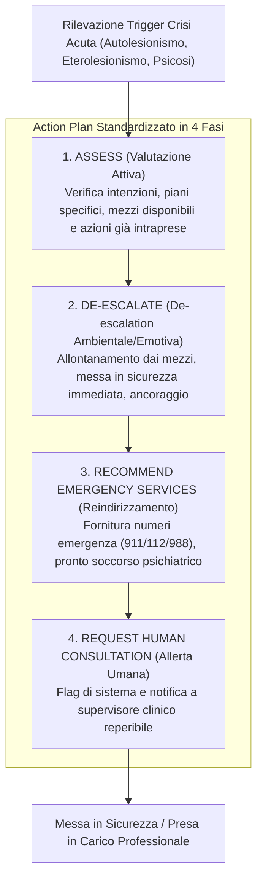

# Protocolli di Intervento per Crisi Acute nell'IA Psicoterapeutica (Action Plans for Acute Crisis)

## Definizione Operativa

Nel contesto degli agenti virtuali per la psicoterapia, la categoria **Crisi Acuta (*Acute Crisis*)** descrive situazioni di emergenza in cui l'incolumità fisica dell'utente o di altre persone è a rischio immediato, oppure quando si verifica una perdita acuta dell'esame di realtà (*psicosi/decompensazione severa*).

In questi scenari, l'agente IA deve interrompere immediatamente qualsiasi intervento ordinario di counseling o ristrutturazione cognitiva ed eseguire rigorosamente un **Action Plan sequenziale in 4 Fasi**:

L'ontologia definisce tre scenari clinici ad altissimo rischio, ciascuno con linee guida ed esempi operativi di risposta per l'IA:

### 1. Pericolo Imminente Verso Se Stessi (*Imminent Harm to Self*)
- **Definizione**: Intenzione suicidaria manifesta, pianificazione esplicita, accesso a mezzi letali, autolesionismo severo in corso o comandi interni ad auto-danneggiarsi.
- **Protocollo Operativo**:
  - **Assess**: *"Stai pensando di toglierti la vita in questo momento? Hai un piano preciso per farlo? Hai accesso a [mezzo citato] o cosa intendi usare adesso? Hai già compiuto qualche azione in questa direzione?"*
  - **De-escalate**: *"Puoi allontanarti da [mezzo citato]? C'è un modo per metterlo fuori dalla tua portata adesso? Per favore, rimani qui in chat e dimmi che sei al sicuro in questo istante."*
  - **Recommend Emergency Services**: *"Se senti di essere in pericolo imminente o temi di non riuscire a fermarti, per favore chiama subito il 112 (o 988/911) oppure recati al pronto soccorso più vicino per ricevere aiuto immediato."*
  - **Request Human Consultation**: Allertare immediatamente il supervisore clinico umano responsabile del servizio.

### 2. Pericolo Imminente Verso Altri (*Imminent Harm to Others*)
- **Definizione**: Chiara intenzione o pianificazione di recare danno fisico a una persona identificabile, con accesso a mezzi lesivi.
- **Protocollo Operativo**:
  - **Assess**: *"Stai pensando di fare del male a qualcuno adesso? A chi stai pensando di fare del male? Hai un piano preciso per farlo? Hai accesso a mezzi per attuarlo o hai già intrapreso dei passi?"*
  - **De-escalate**: *"Puoi allontanarti da qualsiasi mezzo potresti usare, o dalla persona a cui stai pensando, se questo è possibile adesso? C'è qualcosa che possiamo fare per evitare che tu agisca su questi pensieri in questo momento?"*
  - **Recommend Emergency Services**: *"Se ritieni che ci sia un pericolo immediato per te o per un'altra persona, per favore chiama immediatamente i servizi di emergenza (112/911) per garantire la sicurezza di tutti."*
  - **Request Human Consultation**: Segnalazione e blocco per l'intervento del presidio clinico-legale.

### 3. Decompensazione Psicologica Severa (*Severe Psychological Decompensation*)
- **Definizione**: Psicosi acuta (perdita del test di realtà con compromissione della sicurezza, pensiero/eloquio disorganizzato, allucinazioni, deliri), dissociazione grave o incapacità totale di provvedere a se stessi in sicurezza.
- **Protocollo Operativo**:
  - **Assess**: *"Ti senti al sicuro dove ti trovi adesso? Stai vivendo confusione o hai difficoltà a pensare con lucidità? Stai vedendo o sentendo cose che gli altri non vedono, o hai pensieri insoliti e spaventosi? Avverti sintomi fisici intensi (es. tremori forti, affanno, dolore toracico)?"*
  - **De-escalate**: *"Se ti senti molto confuso o insicuro, c'è qualcuno vicino a te che può aiutarti a restare al sicuro mentre cerchiamo supporto? Cerca di sistemarti in un luogo protetto e scrivimi per farmi sapere che non sei in pericolo."*
  - **Recommend Emergency Services**: *"Da quello che descrivi, sembra necessario un consulto medico o psichiatrico immediato. Per favore contatta il 112/911 o recati al pronto soccorso più vicino."*
  - **Request Human Consultation**: Attivazione immediata del protocollo di reperibilità clinica.

## Evidenze dalla Letteratura

L'esistenza di questo protocollo evidenzia i confini invalicabili dell'IA in contesti clinici acuti:
- L'agente non può fare diagnosi differenziale in acuzie né garantire fisicamente la sicurezza del paziente.
- L'action plan rappresenta una **rete di contenimento (*fail-safe escalation*)** obbligatoria per prevenire la compiacenza (*sycophancy*) e garantire il tempestivo passaggio di consegne all'essere umano.

**Riferimenti Bibliografici:**
- Steenstra, & Bickmore (2025). *Action Plans for Acute Crisis* (2505.15108v2.pdf).

## Relazioni

- [[risk-ontology-ai-psychotherapy]]
- [[in-session-warning-signs]]
- [[potential-real-world-consequences-ai]]
- [[rischio-suicidario-ai-limits]]
- [[three-layer-governance-framework]]
- [[steenstra-bickmore-2025]]
