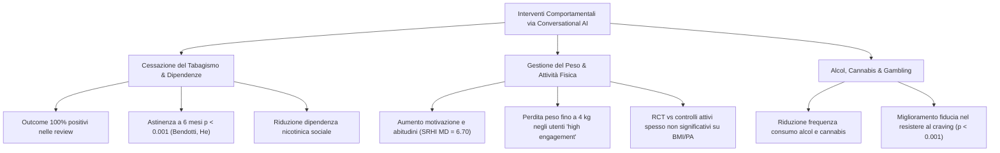

# Behavioral Change, Addiction Cessation, and Lifestyle Interventions via Conversational AI

## Definizione Operativa
L'applicazione di agenti conversazionali basati su intelligenza artificiale per promuovere la modifica di comportamenti a rischio, favorire la cessazione delle dipendenze (tabagismo, alcol, sostanze, gioco d'azzardo) e stimolare l'adozione di stili di vita salutari (attività fisica, dieta equilibrata, igiene del sonno, gestione del peso) attraverso tecniche di colloquio motivazionale, automonitoraggio e rinforzo comportamentale (Huynh et al., 2026; Bendotti et al., 2023).
- **Utilità CBT:** Implementazione automatizzata di diari di consumo/craving, identificazione dei trigger ambientali ed emotivi, pianificazione di attività piacevoli e padroneggianti (*behavioral activation*), gestione dell'urgenza (*urge surfing*) e prevenzione delle ricadute.

---

## Evidenze Cliniche per Ambito di Intervento

### 1. Cessazione del Fumo: Il Dominio con Massima Efficacia Univoca
L'umbrella review di Huynh et al. (2026) evidenzia che l'assistenza alla cessazione del fumo è **l'unico ambito clinico** in cui tutte le revisioni sistematiche e meta-analisi con dati direzionali hanno riportato esiti **esclusivamente positivi**:
- **Meta-Analisi di Bendotti et al. (2023)**: I partecipanti assegnati agli interventi con chatbot AI presentano una probabilità statisticamente superiore di mantenere l'astinenza a 6 mesi rispetto ai gruppi di controllo ($p < 0.001$).
- **Meta-Analisi di He et al. (2023)**: Sintesi di 6 studi controllati che conferma l'incremento significativo dei tassi di astinenza a lungo termine ($p < 0.001$) e l'efficacia nei disegni pre-post.
- **Meccanismi Funzionali**: Riduzione dei sintomi di astinenza e della dipendenza nicotinica sociale, incremento dell'autoefficacia e prontezza al cambiamento già dopo 1 settimana di utilizzo (Aggarwal et al., 2023; Xu, 2021).

### 2. Uso di Sostanze e Gioco d'Azzardo
- **Alcol e Cannabis**: L'applicazione *Minder* e moduli specifici di *Woebot* hanno dimostrato riduzioni significative nella frequenza delle occasioni di consumo di alcol e cannabis, con un incremento statisticamente solido della fiducia nel resistere agli impulsi ($p < 0.001$; Aggarwal et al., 2023; Casu, 2024).
- **Disturbo da Gioco d'Azzardo**: Il chatbot standalone *GAMEBOT2* ha prodotto tassi di astinenza dal gioco d'azzardo significativamente più elevati rispetto alle cure abituali (*usual care*), con un chiaro gradiente dose-risposta (outcome migliori negli utenti intensivi; Casu, 2024).

### 3. Promozione di Stili di Vita Salutari e Gestione del Peso
- **Aderenza e Modifica delle Abitudini**: Il 75% degli studi primari analizzati da Chew (2022) riporta effetti positivi su dieta e attività fisica. L'indice di forza delle abitudini (*Self-Report Habit Index*) risulta significativamente superiore nei gruppi trattati con feedback positivo (*MD* = 6.70, 95% CI 3.47–9.93; Noh et al., 2023).
- **Paradosso dell'Engagement**: Negli utenti che interagiscono attivamente con il chatbot, si riscontrano perdite di peso significative (fino a 4 kg, $p = 0.001$; Noh et al., 2023).
- **Eterogeneità nei Trial Controllati (RCT)**: Nei confronti controllati con gruppi di lista d'attesa o interventi attivi alternativi, le differenze su parametri biometrici duraturi (riduzione del BMI, pressione arteriosa sistolica/diastolica, introito calorico totale) risultano spesso statisticamente non significative (*MD* peso a 12 settimane = −0.9 kg, 95% CI −2.43 a 0.63; Noh et al., 2023; Xu, 2021).

---

## Fattori Chiave di Successo per gli Interventi Comportamentali
1. **Feedback Contestuale e Personalizzato**: L'invio di notifiche proattive e promemoria sincronizzati con i momenti di vulnerabilità dell'utente (es. orari di picco del craving) massimizza l'impatto.
2. **Supporto Empatico e Assenza di Giudizio**: Gli utenti riportano minore timore del giudizio sociale interagendo con un agente artificiale per comportamenti stigmatizzanti (es. dipendenze, disordini alimentari).
3. **Gamification e Behavioral Nudges**: L'integrazione di micro-obiettivi giornalieri e rinforzi visivi favorisce la persistenza d'uso oltre le prime quattro settimane.

---

## Riferimenti Bibliografici
- Huynh, A. L., Roy, T. J., Jackson, K. N., Lee, A. G., Liaw, W., & Hossain, M. M. (2026). Applications of artificial intelligence-based conversational agents in healthcare: A systematic umbrella review. *International Journal of Medical Informatics*, 207, 106204.
- Aggarwal, A., Tam, C. C., Wu, D., Li, X., & Qiao, S. (2023). Artificial Intelligence–Based Chatbots for Promoting Health Behavioral Changes: Systematic Review. *Journal of Medical Internet Research*, 25, e40789.
- Bendotti, H., Lawler, S., Chan, G. C. K., Gartner, C., Ireland, D., & Marshall, H. M. (2023). Conversational artificial intelligence interventions to support smoking cessation: A systematic review and meta-analysis. *Digital Health*, 9.
- Chew, H. S. J. (2022). The Use of Artificial Intelligence-Based Conversational Agents (Chatbots) for Weight Loss: Scoping Review and Practical Recommendations. *JMIR Medical Informatics*, 10(4), e32578.
- Noh, E., Won, J., Jo, S., Hahm, D. H., & Lee, H. (2023). Conversational Agents for Body Weight Management: Systematic Review. *Journal of Medical Internet Research*, 25, e42238.

---

## Relazioni
- [[huynh-et-al-2026]]
- [[healthcare-conversational-agents]]
- [[conversational-agents-mental-health]]
- [[chronic-disease-monitoring-adherence]]
- [[augmented-psychotherapy]]
