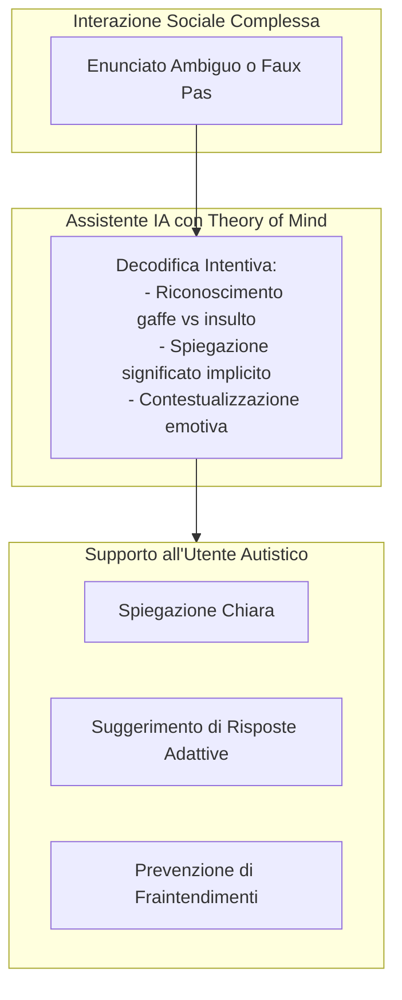

# Strumenti di IA Assistiva per la Comunicazione nello Spettro Autistico

## Definizione Operativa
L'applicazione dei Large Language Models (LLM) come tecnologie assistive per persone nello spettro autistico (ASC) mira a fornire supporto nell'interpretazione di contesti sociali ambigui, nella decodifica di intenzioni non letterali (come ironia, gaffe o doppi sensi) e nella mediazione comunicativa. Il razionale clinico si basa sulla necessità di mitigare le difficoltà intrinseche all'ASC nella comunicazione sociale e nell'interazione reciproca (APA, 2013), come l'interpretazione letterale delle espressioni, la fatica nell'attribuire rapidamente stati mentali agli interlocutori e il rischio di fraintendimenti relazionali. Le persone autistiche, spesso mostrando interesse per contesti digitali strutturati, possono trovare in questi sistemi ausili efficaci e rassicuranti (Jaliaawala & Khan, 2020).

## Evidenze dalla Letteratura
Le ricerche indicano diverse potenzialità e sfide per l'implementazione di questi strumenti:
- **Decodificatore Sociale Real-Time**: Analisi di testi o trascrizioni per chiarire le intenzioni sottostanti.
- **Ambiente di Simulazione e Training Protetto**: Piattaforme per l'allenamento sociale guidato in scenari sicuri.
- **Traduzione Pragmatica Bidirezionale**: Supporto alla formulazione di messaggi che rispettino le convenzioni neurotipiche senza perdere l'autenticità espressiva.

Tuttavia, le evidenze (Holl-Etten et al., 2026) sottolineano limitazioni critiche:
- **Eccesso di Hedging / Incertezza**: L'uso di espressioni probabilistiche ("forse", "probabilmente") nel 30–42% dei casi può aumentare il dubbio dell'utente.
- **Cecità Non Verbale**: L'IA testuale non percepisce tono di voce, prosodia o linguaggio del corpo.
- **Rischio di Dipendenza**: Necessità di un design orientato all'empowerment per evitare la dipendenza eccessiva nelle scelte relazionali.

**Riferimenti Bibliografici:**
- APA (2013). *Diagnostic and Statistical Manual of Mental Disorders*.
- Holl-Etten et al. (2026). *Evidenze sperimentali sull'uso di LLM nell'autismo*.
- Jaliaawala & Khan (2020). *Technology in Autism Spectrum Condition*.

## Relazioni

- [[holl-etten-et-al-2026]]
- [[applied-theory-of-mind-llm]]
- [[epistemic-markers-in-ai]]
- [[social-vignettes-benchmarking]]
- [[ai-mental-health-vulnerable-populations]]
- [[conversational-agents-mental-health]]
- [[simulazione-pazienti-ai]]
