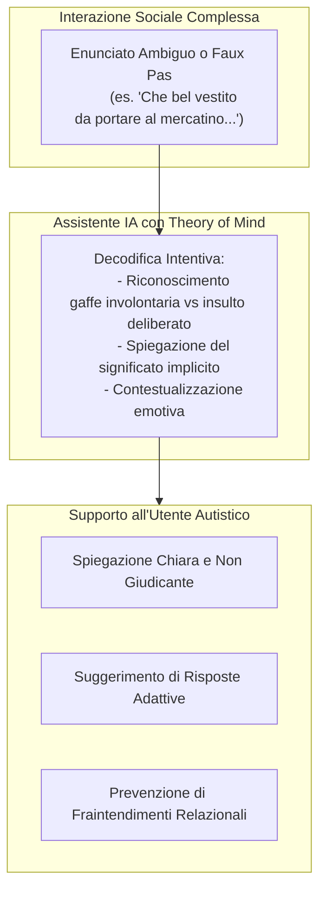

# Strumenti di IA Assistiva per la Comunicazione nello Spettro Autistico

**Summary**: Applicazione dei Large Language Models come tecnologie assistive per supportare persone nello spettro autistico (ASC) nell'interpretazione di contesti sociali ambigui, decodifica di intenzioni non letterali (ironia, gaffe, doppi sensi) e mediazione comunicativa.
**Sources**: `2601.06032v1.pdf`
**Last updated**: 2026-08-27
---

## Razionale Clinico e Bisogni Assistivi

Il disturbo dello spettro autistico (Autism Spectrum Condition, ASC) è caratterizzato da atipicità persistenti nella comunicazione sociale e nell'interazione reciproca (APA, 2013). Tra le sfide quotidiane più frequenti emergono:
- Interpretazione letterale di espressioni metaforiche, sarcastiche o ironiche.
- Difficoltà nel rilevare violazioni involontarie di norme sociali (*faux pas*).
- Fatica nell'attribuire rapidamente stati mentali, credenze e intenzioni agli interlocutori in situazioni sociali dinamiche.
- Rischio di isolamento, fraintendimenti relazionali ed esperienze di vittimizzazione/bullismo in contesti lavorativi o scolastici.

Poiché le persone autistiche mostrano frequentemente un elevato interesse per la tecnologia e un ambiente digitale strutturato risulta spesso rassicurante e privo del sovraccarico sensoriale/sociale tipico delle interazioni dirette (Jaliaawala & Khan, 2020), i sistemi basati su Large Language Models ([[large-language-models]]) si candidano come efficaci ausili per la mediazione e l'apprendimento sociale.

---

## Opportunità e Funzionalità Assistive

1. **Decodificatore Sociale Real-Time**: Possibilità di analizzare testi scritti (email, chat, messaggi) o dialoghi trascritti per chiarire le intenzioni sottostanti degli interlocutori (*"La persona ha fatto questa battuta senza intenzione malevola; non ricordava il dettaglio X"*).
2. **Ambiente di Simulazione e Training Protetto**: Piattaforme per l'allenamento sociale guidato, in cui l'utente può esplorare scenari interattivi, comprendere le reazioni altrui e sperimentare diverse strategie comunicative senza timore del giudizio.
3. **Traduzione Pragmatica Bidirezionale**: Supporto alla formulazione di messaggi che rispettino le convenzioni neurotipiche senza snaturare l'autenticità espressiva della persona autistica.

---

## Sfide Critiche e Requisiti di Design

Le evidenze sperimentali (Holl-Etten et al., 2026) hanno fatto emergere limitazioni essenziali da considerare per la sicurezza e l'efficacia clinica:

| Criticità | Descrizione del Problema | Requisito di Mitigazione |
| :--- | :--- | :--- |
| **Eccesso di Hedging / Incertezza** | L'LLM formula spiegazioni probabilistiche (*"forse", "probabilmente"*) nel 30–42% dei casi, aumentando il dubbio anziché chiarire. | Prompt design orientato alla spiegazione univoca, chiara e diretta (evitando ambiguità ipotetiche). |
| **Cecità Non Verbale** | L'IA testuale non percepisce tono di voce, prosodia, postura o mimica facciale, fondamentali nella pragmatica reale. | Integrazione multimodale (audio, video) e consapevolezza esplicita dei limiti del canale testuale. |
| **Rischio di Dipendenza o Eterodirezione** | Rischio che l'utente dipenda eccessivamente dall'IA per ogni micro-scelta relazionale. | Progettazione maieutica volta all'empowerment e all'autonomia decisionale a lungo termine. |

---

## Related pages
- [[holl-etten-et-al-2026]]
- [[applied-theory-of-mind-llm]]
- [[epistemic-markers-in-ai]]
- [[social-vignettes-benchmarking]]
- [[ai-mental-health-vulnerable-populations]]
- [[conversational-agents-mental-health]]
- [[simulazione-pazienti-ai]]
