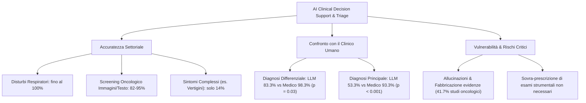

# AI in Clinical Decision Support and Diagnostic Triage

## Definizione Operativa
L'impiego di agenti conversazionali e modelli linguistici di intelligenza artificiale per supportare il ragionamento clinico, eseguire il triage sintomatologico, formulare ipotesi diagnostiche differenziali, valutare rischi genetici/oncologici e suggerire opzioni terapeutiche o ulteriori indagini strumentali (Huynh et al., 2026; Car et al., 2020).
- **Utilità CBT e Clinica:** Standardizzazione della raccolta anamnestica preliminare (*medical history taking*), somministrazione di scale diagnostiche validate e screening predittivo di comorbidità prima dell'incontro con il clinico umano.

---

## Performance Diagnostica ed Evidenze della Letteratura

### 1. Eterogeneità dell'Accuratezza Diagnostica
Dall'umbrella review di Huynh et al. (2026) emerge una marcata disparità di accuratezza a seconda della complessità del dominio clinico:
- **Alte Prestazioni in Domini Circoscritti**:
  - Screening oncologico mammario (*Harshitha bot*): 95% di accuratezza nel differenziare immagini normali e tumorali (Xu, 2021).
  - Triage di patologie respiratorie: accuratezza fino al 100% (Car et al., 2020).
  - Predizione di rischio genetico (*GIA*, *BRCA Founder Chatbot*): tasso di identificazione di varianti patogenetiche del 9.0% (95% CI 5.2–15.0%) e incremento significativo delle conoscenze pre-test (Webster et al., 2023).
- **Basse Prestazioni in Sintomi Aspecifici o Complessi**:
  - Triage di sintomi labirintici o vertigini: accuratezza ridotta fino al 14% (Car et al., 2020).

### 2. Confronto tra Grandi Modelli Linguistici (LLM) e Medici Umani
- **Diagnosi Differenziale e Principale**: Negli studi comparativi (es. Moya-Salazar et al., 2024), i modelli generici come ChatGPT-3 hanno registrato prestazioni diagnostiche significativamente inferiori rispetto ai medici:
  - *Diagnosi Differenziale*: 83.3% (ChatGPT) vs 98.3% (Medici), $p = 0.03$.
  - *Diagnosi Principale*: 53.3% (ChatGPT) vs 93.3% (Medici), $p < 0.001$.
- **Vignette Cliniche e Piani Terapeutici**: In ambito otorinolaringoiatrico e oncologico (Lechien et al., 2024; Chen et al., 2025), GPT-4 ha raggiunto tra il 47% e il 79% di accuratezza nelle diagnosi primarie, ma solo tra il 10% e il 29% nell'indicazione corretta degli esami diagnostici supplementari, manifestando una tendenza alla sovra-prescrizione (*over-investigation*).

### 3. Allucinazioni, Bias e Sicurezza del Paziente
- **Tasso di Errori e Allucinazioni**: Nel 41.7% degli studi inclusi nella review oncologica di Chen et al. (2025) sono stati documentati bias clinici, omissioni critiche o allucinazioni fattuali (fabbricazione di citazioni bibliografiche o linee guida inesistenti).
- **Percezione del Rischio**: L'utilizzo di chatbot non supervisionati per l'auto-diagnosi è ritenuto prematuro e ad alto rischio di danno (*risk of harm*) dai pazienti stessi, mentre l'uso per consigli informativi generali o triage logistico è ampiamente accettato (Liu et al., 2023).

---

## Linee Guida per l'Integrazione Clinica
1. **Presidio Human-in-the-Loop Obbligatorio**: I sistemi di IA devono fungere esclusivamente da supporto consultivo (*second opinion* o triage preparatorio), demandando la validazione formale e la responsabilità terapeutica al medico/psicoterapeuta.
2. **Architetture RAG e Modelli Biomedici Specializzati**: Riduzione delle allucinazioni mediante l'ancoraggio a ontologie mediche certificate (es. SNOMED-CT, MeSH) e database clinici verificati.
3. **Trasparenza Algoritmica verso il Paziente**: Esplicitazione dei limiti del sistema e divieto di decisioni cliniche autonome da parte dell'agente conversazionale.

---

## Riferimenti Bibliografici
- Huynh, A. L., Roy, T. J., Jackson, K. N., Lee, A. G., Liaw, W., & Hossain, M. M. (2026). Applications of artificial intelligence-based conversational agents in healthcare: A systematic umbrella review. *International Journal of Medical Informatics*, 207, 106204.
- Chen, D., Avison, K., Alnassar, S., Huang, R. S., & Raman, S. (2025). Medical accuracy of artificial intelligence chatbots in oncology: a scoping review. *The Oncologist*, 30, oyaf038.
- Lechien, J. R., & Rameau, A. (2024). Applications of ChatGPT in Otolaryngology–Head Neck Surgery: A State of the Art Review. *Otolaryngology - Head and Neck Surgery*.
- Moya-Salazar, J., Salazar, C. R., Delzo, S. S., et al. (2024). After a few months, what are the uses of OpenAI's ChatGPT in medicine? A Scopus-based systematic review. *Electronic Journal of General Medicine*, 21(2), em573.
- Webster, E. M., Ahsan, M. D., Perez, L., et al. (2023). Chatbot Artificial Intelligence for Genetic Cancer Risk Assessment and Counseling: A Systematic Review and Meta-Analysis. *JCO Clinical Cancer Informatics*, 7, e2300123.

---

## Relazioni
- [[huynh-et-al-2026]]
- [[healthcare-conversational-agents]]
- [[human-in-the-reasoning]]
- [[digital-therapeutic-alliance]]
- [[ai-research-ethics]]
- [[clinical-fidelity-assessment]]
