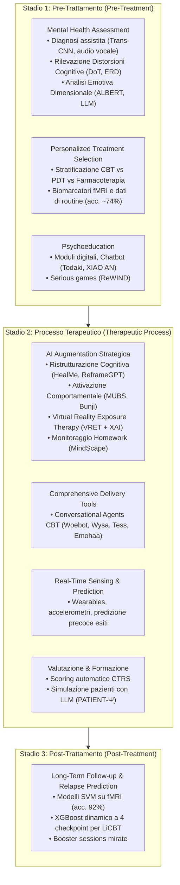

# AI-Enhanced Cognitive Behavioral Therapy (CBT Potenziata dall'Intelligenza Artificiale)

## Definizione Operativa
L'integrazione sistematica di algoritmi di Intelligenza Artificiale (Machine Learning, Deep Learning, Natural Language Processing, Large Language Models, biosensori indossabili e Virtual Reality) lungo l'intero percorso terapeutico della Terapia Cognitivo-Comportamentale (CBT), articolata in tre macro-stadi sequenziali e interconnessi: **pre-trattamento**, **processo terapeutico** e **post-trattamento** (Jiang et al., 2024).

L'obiettivo dell'AI-Enhanced CBT non è la sostituzione del clinico, bensì l'aumento delle sue capacità (*Augmented Psychotherapy*), l'abbattimento delle barriere di accesso alle cure evidence-based, la personalizzazione idionomica degli interventi e l'ottimizzazione del monitoraggio e della prevenzione delle ricadute.

---

## Architettura Tripartita dell'AI-Enhanced CBT

---

## Evidenze e Dimensioni Cliniche

### 1. Efficienza Clinica e Triage Intelligente
- Riduzione dei tempi di intake e standardizzazione dell'assessment preliminare attraverso strumenti NLP multimodali.
- Identificazione precoce della severità sintomatica e prioritizzazione dei casi ad alto rischio o a rischio di drop-out precoce (Côté-Allard et al., 2022; Vuyyuru et al., 2023).

### 2. Personalizzazione e Cura Adattiva
- Superamento dell'approccio "one-size-fits-all" della digital CBT classica (CCBT/ICBT standardizzata a moduli rigidi).
- Adattamento dinamico dei prompt, delle tecniche di esposizione e dei suggerimenti di ristrutturazione cognitiva basato sullo stato emotivo e sui dati biometrici in tempo reale (Jiang et al., 2024; Sharma et al., 2023b).

### 3. Continuità Assistenziale Extraseduta
- Trasformazione dell'assegnazione e monitoraggio degli homework tramite app con consapevolezza contestuale (*contextual awareness*) come MindScape (Nepal et al., 2024).
- Riduzione della non-compliance, tradizionalmente considerata uno dei primari fattori di fallimento della CBT (Helbig & Fehm, 2004).

---

## Limiti e Sfide Aperte
- **Text-Centricity:** Preponderanza di modelli basati solo su testo; scarsità di pipeline diagnostiche multimodali validate in contesti clinici reali.
- **Rischio di Iper-Patologizzazione:** Necessità di meccanismi di validazione incrociata per evitare falsi positivi nella rilevazione di distorsioni cognitive.
- **Alleanza Terapeutica e Safeguard Etico:** Preservazione della centralità della relazione umana; l'IA opera come co-pilota analitico e interattivo nel modello centauro.

---

## Relazioni
- [[cognitive-distortion-detection]]: Moduli pre-trattamento e di monitoraggio cognitivo.
- [[automated-cognitive-restructuring]]: Algoritmi e modelli di reframing generativo.
- [[treatment-outcome-and-relapse-prediction]]: Predizione di risposta ed esito.
- [[cbt-dialogue-systems-and-tools]]: Agenti conversazionali dedicati.
- [[ctrs-automated-evaluation]]: Valutazione di qualità e fidelity.
- [[simulazione-pazienti-ai]]: Training clinico simulato.
- [[jiang-et-al-2024]]: Studio di review di riferimento.
