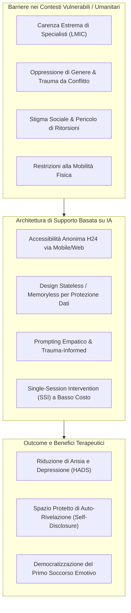

# AI-Driven Mental Health Interventions in Vulnerable & Humanitarian Settings

**Summary**: Quadro metodologico, etico e applicativo per l'implementazione di interventi di salute mentale guidati da agenti intelligenti in contesti umanitari, paesi LMIC e regimi autoritari, caratterizzati da trauma diffuso, violenza di genere, carenza strutturale di specialisti e severo stigma.
**Sources**: Sahab et al. (2025) - `2508.00847v1.pdf`, WHO (2021), Schwartz et al. (2023)
**Last updated**: 2026-08-27
---

## Inquadramento Globale e Divari Assistenziali

Oltre l'80% della popolazione globale affetta da disturbi mentali risiede in **Paesi a Basso e Medio Reddito (*Low- and Middle-Income Countries*, LMICs)**, dove si concentra la maggiore sproporzione tra domanda assistenziale e offerta di servizi clinici qualificati. In scenari di conflitto protratto o sotto regimi teocratici/autoritari (es. Afghanistan post-agosto 2021), le barriere all'accesso alla cura assumono contorni estremi:

1. **Deficit Strutturale di Risorse Umane**: Carenza cronica di psichiatri e psicologi ($<0.3$ professionisti per 100.000 residenti).
2. **Restrizioni Sistemiche di Genere**: Divieto di istruzione, esclusione dal mondo del lavoro e segregazione sociale che moltiplicano la vulnerabilità a traumi complessi e violenza domestica (*Domestic and Family Violence*, DFV).
3. **Stigma Sociale Paralizzante**: Repressione culturale dell'espressione emotiva e timore di ritorsioni o ostracismo in caso di rivelazione di problemi di salute mentale.
4. **Isolamento Fisico e Digitale**: Impossibilità materiale di raggiungere centri clinici per ragioni di sicurezza personale o divieti di movimento autonomo.

---

## Requisiti Architetturali e di Sicurezza per Ambienti ad Alto Rischio

L'esperienza pionieristica di **Sahab et al. (2025)** dimostra che l'implementazione di LLM in popolazioni vulnerabili richiede specifici adattamenti di sistema:

### 1. Architettura Senza Memoria (*Stateless / Memoryless Processing*)
- **Mitigazione del Rischio Politico-Fisico**: In regimi autoritari in cui i dispositivi personali possono essere ispezionati dalle autorità di polizia morale o da familiari abusanti, l'eliminazione della cronologia conversazionale al termine della sessione costituisce una salvaguardia vitale.
- **Prevenzione della Rievocazione Non Controllata**: Evita che l'agente riproponga autonomamente frammenti di esperienze traumatiche passate in assenza di un contenimento clinico continuo.

### 2. Protocolli di Sicurezza Pre-Sessione
- Verifica preliminare che l'utente si trovi in un ambiente fisico sicuro e privato.
- Esplicitazione trasparente della natura artificiale del sistema per evitare proiezioni ingannevoli (*no deception*).
- Istruzioni chiare di non divulgare dati anagrafici o identificativi sensibili.

### 3. Interventi a Sessione Singola (*Single-Session Interventions*, SSI)
- Nei contesti in cui la continuità di connessione o l'accesso ai dispositivi è instabile, l'intervento deve massimizzare il valore terapeutico fin dalla prima interazione (60 minuti), fornendo sollievo immediato, ristrutturazione cognitiva di base e de-escalation dell'ansia acuta.

---

## Sfide Aperte e Direzioni Future

| Dimensione | Sfida Attuale | Soluzione Prospettica |
| :--- | :--- | :--- |
| **Inclusione Linguistica** | Predominanza dei modelli in lingua inglese con esclusione delle fasce non anglofone. | Fine-tuning e adattamento su lingue locali a basse risorse (es. Dari, Pashto, dialetti regionali). |
| **Gestione delle Crisi Acute** | Impossibilità da parte dell'IA di intervenire fisicamente in situazioni di tentato suicidio o violenza imminente. | Integrazione sicura con reti di triage e numeri di emergenza/hotline locali protette. |
| **Durabilità nel Lungo Termine** | Decadimento dei benefici clinici tipico delle SSI oltre le 12 settimane. | Protocolli just-in-time e micro-sessioni periodiche di mantenimento (*digital booster sessions*). |

---

## Related pages
- [[sahab-et-al-2025]]
- [[supportive-listener-prompting]]
- [[language-style-matching-human-ai]]
- [[algorithmic-bias-and-digital-inequalities]]
- [[etica-privacy-bias-ia-clinica]]
- [[stepped-care-ai-integration]]
- [[simulated-therapeutic-alliance]]
- [[conversational-agents-mental-health]]
