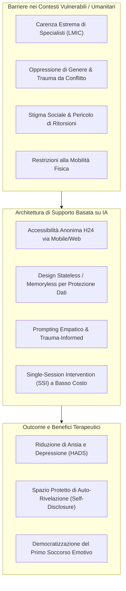

# AI-Driven Mental Health Interventions in Vulnerable & Humanitarian Settings

## Definizione Operativa
Quadro metodologico, etico e applicativo per l'implementazione di interventi di salute mentale guidati da agenti intelligenti in contesti umanitari, paesi LMIC e regimi autoritari, caratterizzati da trauma diffuso, violenza di genere, carenza strutturale di specialisti e severo stigma sociale.

L'obiettivo è fornire supporto psicologico scalabile, accessibile e sicuro in ambienti dove l'assistenza tradizionale risulta inaccessibile.

## Evidenze dalla Letteratura
Oltre l'80% della popolazione globale affetta da disturbi mentali risiede in **Paesi a Basso e Medio Reddito (LMICs)**. Sahab et al. (2025) dimostrano che l'integrazione di LLM in queste popolazioni richiede:

1. **Architettura Stateless/Memoryless**: Per prevenire rischi derivanti dall'ispezione dei dispositivi (autorità/familiari) e ridurre la rievocazione non controllata di traumi.
2. **Interventi a Sessione Singola (SSI)**: Focalizzati su 60 minuti di valore terapeutico immediato (de-escalation dell'ansia, ristrutturazione cognitiva), data l'instabilità delle connessioni e dell'accesso ai dispositivi.
3. **Sicurezza Pre-Sessione**: Verifica della privacy fisica e istruzioni chiare per evitare la divulgazione di dati identificativi.

**Riferimenti Bibliografici:**
- Sahab et al. (2025) - [`2508.00847v1.md`](file:///C:/Users/ANDREA/AI%20Knowledge%20Base/wiki/2508-00847v1.md)
- World Health Organization (WHO), 2021
- Schwartz et al. (2023)

## Relazioni

- [sahab-et-al-2025](../sintesi/sahab-et-al-2025.md)
- [supportive-listener-prompting](concetti/concetti\supportive-listener-prompting.md)
- [language-style-matching-human-ai](concetti/concetti\language-style-matching-human-ai.md)
- [algorithmic-bias-and-digital-inequalities](algorithmic-bias-and-digital-inequalities.md)
- [etica-privacy-bias-ia-clinica](etica-privacy-bias-ia-clinica.md)
- [stepped-care-ai-integration](stepped-care-ai-integration.md)
- [simulated-therapeutic-alliance](simulated-therapeutic-alliance.md)
- [conversational-agents-mental-health](conversational-agents-mental-health.md)

## Riferimenti Bibliografici
- [Da integrare]
