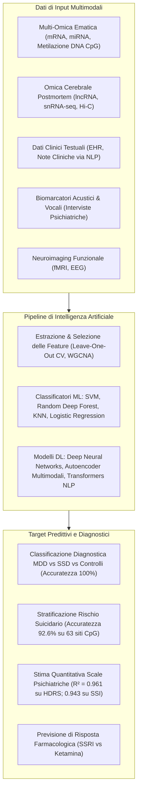

# AI and Multi-Omics for Psychiatric Biomarkers and Risk Prediction (Intelligenza Artificiale e Multi-Omica per Biomarcatori Psichiatrici e Predizione del Rischio)

## Definizione Operativa
L'impiego di modelli di **Machine Learning (ML)**, **Deep Learning (DL)** e **Natural Language Processing (NLP)** per analizzare set di dati biologici e clinici ad altissima dimensionalità—inclusi profili trascrittomici di mRNA e ncRNA, siti di metilazione del DNA (CpG), mappe conformazionali cromatiniche (Hi-C), cartelle cliniche elettroniche (EHR), registrazioni vocali e neuroimaging—al fine di automatizzare la diagnosi precoce del Disturbo Depressivo Maggiore (MDD), quantificare oggettivamente il rischio di suicidio e prevedere la risposta terapeutica personalizzata (Wang & Dwivedi, 2025).

---

## Architettura del Modello Predittivo Multimodale

---

## Modelli di Machine Learning e Performance Validate

### 1. Support Vector Machines (SVM) su Espressione Genica Ematica
- **Classificazione Tripartita (SSD vs MDD vs Controlli)**: Un modello SVM addestrato sui profili di espressione genica nel sangue di pazienti drug-free al primo episodio con depressione sintomatica sub-sindromica (SSD), MDD e controlli sani ha selezionato un pannello di **48 signature geniche che ha raggiunto il 100% di accuratezza diagnostica** (Yi et al., 2012).
- **Pannello Ridotto a 10 Trascritti**: L'applicazione di un classificatore SVM su dati di espressione di RNA ematico pre-selezionati ha fornito una **sensibilità del 90.6% e una specificità del 90.6%** per la diagnosi di MDD; tramite equazione logistica, il modello quantifica la probabilità continua di diagnosi depressiva (Yu et al., 2016).

### 2. Random Deep Forest su Trascrittoma ed Epigenoma nel Rischio Suicidario
- **Integrazione DEGs + Metiloma**: Utilizzando l'algoritmo *Random Deep Forest* con validazione incrociata *Leave-One-Out* su campioni ematici di soggetti con MDD, tentatori di suicidio e controlli, il modello ha ottenuto un'**accuratezza di classificazione del 92.6%** nel distinguere il comportamento suicidario da quello non suicidario (Bhak et al., 2019).
- **Dominanza Epigenetica**: Delle feature più discriminanti selezionate dal modello, **63 feature erano costituite esclusivamente da siti CpG differenzialmente metilati**, dimostrando che la metilazione del DNA periferico possiede un potere predittivo superiore al solo trascrittoma per il rischio suicidario.

### 3. Regressione Predittiva per Scale di Gravità Psichiatrica
L'integrazione di dati omici ematici e modelli di regressione supervisionata ha permesso di stimare i punteggi continui delle principali scale cliniche di valutazione:
- **Hamilton Rating Scale for Depression 17 (HDRS-17)**: $R^2 = 0.961$ (spiegando oltre il 96% della varianza clinica).
- **Scale for Suicide Ideation (SSI)**: $R^2 = 0.943$.

### 4. Machine Learning su lncRNA e mRNA Cerebrali
- Modelli di apprendimento automatico applicati a campioni di cervello postmortem di pazienti con depressione suicidaria, depressione non suicidaria e suicidio non depresso hanno identificato specifici pannelli di lncRNA e mRNA con aree sotto la curva (**AUC elevate**) capaci di discriminare selettivamente la componente suicidaria indipendentemente dalla diagnosi psichiatrica primaria (Peng et al., 2023; Wang & Dwivedi, 2025).

---

## Deep Learning Multimodale ed Elaborazione del Linguaggio Naturale (NLP)

### 1. Integrazione Genomica-Cromatinica (PsychENCODE)
- Architetture di Deep Learning applicate a dati multimodali del consorzio PsychENCODE (dati di conformazione cromatinica Hi-C, varianti SNP genomiche e sequenziamento trascrittomico della dlPFC) hanno rivelato che specifici moduli genici profondamente connessi regolano i processi sinaptici e le cascate immunitarie condivise tra disturbi affettivi e schizofrenia (Gusev et al., 2018).

### 2. Natural Language Processing (NLP) su EHR e Social Media
- **Cartelle Cliniche Elettroniche (EHR)**: Algoritmi di Deep Learning e Transformer elaborano la componente narrativa non strutturata delle note cliniche per rilevare traiettorie longitudinali di rischio suicidario e peggioramento sintomatico (Walsh et al., 2018; Kreimeyer et al., 2017).
- **Screening da Testi Digitali**: Reti neurali sequenziali applicate a contenuti testuali spontanei (social media, diari digitali) identificano marcatori linguistici ed emotivi precoci di depressione con elevata accuratezza (Al Hanai et al., 2018; Quaak et al., 2021).

### 3. Biomarcatori Vocali e Comportamentali
- Algoritmi di machine learning analizzano le registrazioni audio delle interviste psichiatriche, estraendo parametri prosodici (frequenza fondamentale, jitter, shimmer, pause temporali) che correlano oggettivamente con la gravità della sindrome depressiva e la risposta ai farmaci (Birnbaum et al., 2022).

---

## Sfide Metodologiche e Sicurezza Clinica

1. **Rischio di Overfitting e Curse of Dimensionality**: Il numero di feature biologiche ($p \approx 10^4 - 10^6$) supera di gran lunga il numero di campioni clinici ($n \approx 10^2 - 10^3$). È obbligatorio implementare tecniche rigorose di feature selection, regolarizzazione ($L_1 / L_2$), cross-validation esterna e validazione su coorti indipendenti.
2. **Spiegabilità e Black-Box (XAI)**: I modelli di deep learning devono integrare metodi di interpretabilità (SHAP, LIME, WGCNA hub extraction) per permettere al clinico di comprendere quali vie biologiche guidano la decisione dell'algoritmo.
3. **Integrazione con la Valutazione Umana**: I sistemi di AI devono agire come strumenti di supporto decisionale (*Clinical Decision Support Systems - CDSS*) e non come sostituti autonomi del giudizio psichiatrico.

---

## Relazioni nel Knowledge Base
- [[wang-dwivedi-2025]]: Sintesi sistematica della review di riferimento.
- [[multi-omics-depression-suicide]]: Il substrato biologico integrato elaborato dai modelli di AI.
- [[peripheral-blood-biomarkers-and-exosomes-in-mdd]]: Biopsia liquida ed esosomi come fonti di dati per modelli ML.
- [[treatment-outcome-and-relapse-prediction]]: Predizione dell'esito clinico basata su modelli computazionali.
- [[ai-clinical-decision-support]]: Sistemi di supporto alle decisioni cliniche.
- [[rischio-suicidario-ai-limits]]: Limiti e rischi dei modelli linguistici nella gestione del suicidio.
