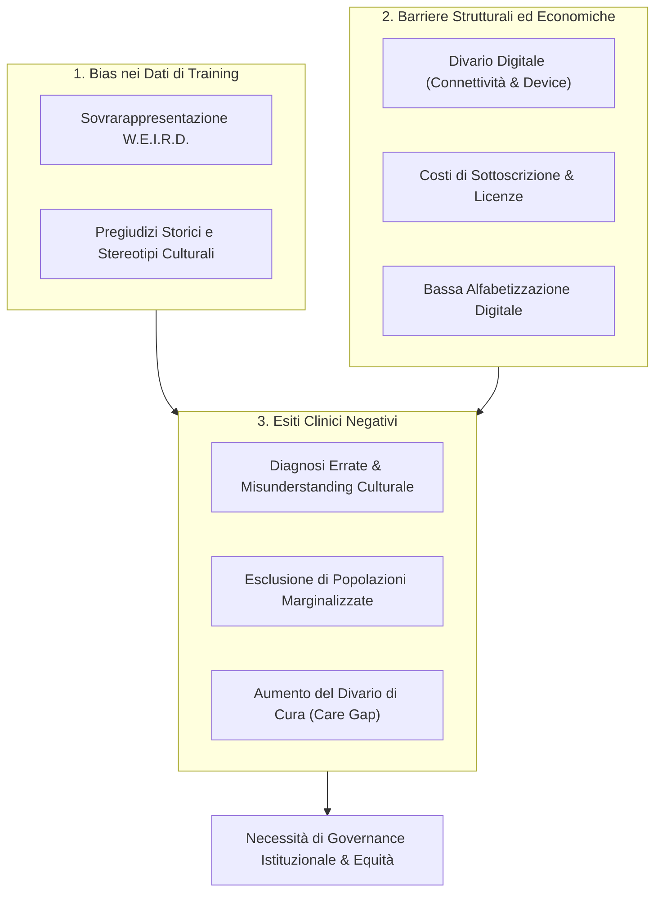

# Algorithmic Bias and Digital Inequalities in Mental Health

**Summary**: Disamina dei rischi di amplificazione delle disuguaglianze socio-economiche, culturali e cliniche derivanti da bias nei dataset di addestramento (sovrarappresentazione WEIRD), barriere di connettività e divario di alfabetizzazione digitale nei servizi di salute mentale basati su IA.
**Sources**: Erdemir & Sumbas (2026) - `10.1177_00469580261438322.pdf`
**Last updated**: 2026-08-27
---

## Il Rischio di Amplificazione delle Disuguaglianze

Sebbene l'intelligenza artificiale sia spesso promossa come leva fondamentale per la democratizzazione dell'accesso alle cure psicologiche, la letteratura evidenzia che, in assenza di una governance mirata, l'implementazione tecnologica rischia di perpetuare e amplificare le disuguaglianze preesistenti a livello clinico e strutturale.

---

## Tipologie di Bias e Barriere

### 1. Bias Algoritmico e Campionamento W.E.I.R.D.
- I modelli di linguaggio e gli algoritmi di machine learning sono prevalentemente addestrati su corpora testuali provenienti da popolazioni **W.E.I.R.D.** (*Western, Educated, Industrialized, Rich, Democratic*).
- **Conseguenze cliniche**:
  - Imposizione implicita di modelli concettuali occidentali della sofferenza psichica e del benessere.
  - Incapacità di riconoscere manifestazioni somatiche o idiomi culturali specifici del disagio in minoranze etniche.
  - Sottostima o sovrastima del rischio clinico in gruppi marginalizzati a causa di stereotipi linguistici nei dati storici.

### 2. Barriere Economiche e Divario di Connettività
- L'accesso agli strumenti più avanzati e sicuri di IA generativa è frequentemente subordinato a canoni di abbonamento (*paywall*) e a requisiti hardware elevati.
- Le fasce di popolazione a basso reddito e le comunità rurali o isolate, che presentano i tassi più elevati di bisogni inevasi di salute mentale, rischiano di rimanere escluse o di avere accesso solo a modelli a basso costo non validati e privi di salvaguardie di sicurezza.

### 3. Divario di Alfabetizzazione Digitale (*Digital Health Literacy*)
- L'utilizzo efficace e critico degli strumenti digitali richiede competenze tecnologiche e metacognitive per interpretare i suggerimenti dell'IA, riconoscere le allucinazioni e tutelare la propria privacy.
- Soggetti con limitata scolarizzazione o anziani possono incorrere in un uso ingenuo o disfunzionale degli agenti conversazionali.

---

## Raccomandazioni di Policy e Mitigazione
1. **Validazione Multiculturale Obbligatoria**: Richiedere che ogni strumento clinico di IA sia testato e calibrato specificamente su popolazioni demograficamente e linguisticamente eterogenee prima del deployment su larga scala.
2. **Sistemi Multilingue e Inclusivi**: Sviluppare modelli addestrati nativamente su diverse lingue e contesti culturali, evitando la mera traduzione automatica di paradigmi anglosassoni.
3. **Modelli di Accesso Sovvenzionato e Sanità Pubblica**: Promuovere investimenti del servizio sanitario pubblico per garantire l'accesso equo e gratuito a piattaforme digitali sicure per le fasce vulnerabili.

---

## Related pages
- [[erdemir-sumbas-2026]]
- [[three-layer-governance-framework]]
- [[stepped-care-ai-integration]]
- [[technical-vulnerabilities-llm-counseling]]
- [[ai-research-ethics]]
- [[ai-literacy-in-academia]]
