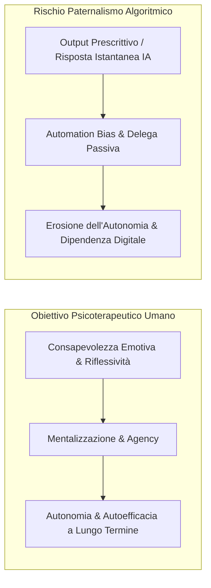

# Paternalismo Algoritmico e Autonomia del Paziente nell'IA Clinica

## Definizione Operativa

Il **paternalismo algoritmico (*algorithmic paternalism*)** in salute mentale descrive la dinamica per cui sistemi di intelligenza artificiale (chatbot psicoterapeutici, strumenti di monitoraggio predittivo, algoritmi di classificazione diagnostica) assumono un ruolo direttivo o prescrittivo sulle decisioni del paziente, riducendone la capacità di autodeterminazione, l'autoefficacia introspettiva e l'autonomia decisionale.

A differenza dell'alleanza terapeutica umana, orientata a promuovere l'autonomia del paziente e l'elaborazione dei conflitti, l'interazione con agenti di calcolo automatizzati può indurre una delega passiva e acritica verso l'output della macchina (*automation bias*).

## Evidenze dalla Letteratura

Nella revisione sistematica di Kandeel et al. (2026) e nella letteratura empirica correlata emergono pattern comportamentali critici:

1. **Delega Inconsapevole delle Decisioni Chiave**: Nei trial clinici su chatbot (es. **Woebot**), circa il **25% dei partecipanti ha delegato decisioni personali e relazionali critiche** all'agente conversazionale, ignorando i disclaimer (Darcy et al., 2021).
2. **Erosione della Sicurezza Diagnostica dei Clinici**: Gli specialisti manifestano una riduzione della fiducia nel proprio giudizio clinico intuitivo (*reduced diagnostic confidence*) quando l'IA diverge dalla loro valutazione (Topol, 2019).
3. **Paternalismo Predittivo dai Wearable**: Notifiche biometriche predittive possono indurre profezie che si auto-avverano, portando il paziente a conformare i propri stati soggettivi all'indicatore della macchina.

### Il Divario di Alfabetizzazione Sanitaria Digitale
Il rischio è amplificato dalle disuguaglianze socio-sanitarie (Dzangare & Gulu, 2025):
- **Popolazione Anziana**: 60% dei pazienti fatica a distinguere consigli umani da IA.
- **Basso Livello di Scolarizzazione**: 40% degli utenti non decodifica la spiegabilità (XAI), accettando acriticamente il software.

**Riferimenti Bibliografici:**

*   Kandeel et al. (2026) - `ai-v5-e84305.pdf`
*   Topol, E. (2019). *Deep Medicine*.
*   Darcy, A., et al. (2021).
*   Dzangare, T., & Gulu, M. (2025).
*   Arya, V., et al. (2020).
*   Torous, J., et al. (2021).

## Relazioni

- [[kandeel-et-al-2026]]
- [[gdpr-governance-mental-health-ai]]
- [[fast-food-psychotherapy]]
- [[sycophantic-mirroring]]
- [[calibrated-mismatches]]
- [[simulated-empathy-vs-authentic-presence]]
- [[human-in-the-reasoning]]
- [[cross-cultural-bias-and-fairness-audits-ai]]
- [[explainable-mental-disorder-diagnosis]]
